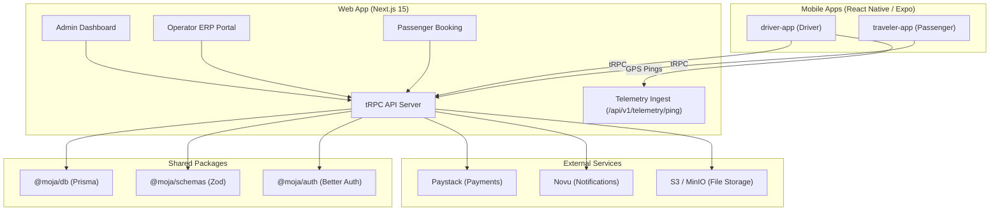

# Architecture

## 1. Monorepo Overview

Moja Ride is a **multi-application, two-sided marketplace and ERP platform** built as a service-oriented monorepo using **Turborepo** and **pnpm**.

The system connects intercity passengers with bus transportation companies across Côte d'Ivoire via:
1. **Aggregator / Operator / Admin Portal (`apps/web`)** — Next.js 15 App Router, React 19, Tailwind CSS 4, shadcn/ui, tRPC, Better Auth.
2. **Traveler Mobile App (`apps/traveler-app`)** — React Native, Expo SDK 56, NativeWind, tRPC client.
3. **Driver Mobile App (`apps/driver-app`)** — React Native, Expo SDK 56, NativeWind, Background GPS Telemetry, Offline QR Scanner.
4. **Shared Package Layer (`packages/*`)** — Database client (Prisma), schemas (Zod), theme tokens, auth helpers, UI primitives, TypeScript configs.

---

## 2. Directory Layout

```
moja-buss/
├── CONTEXT_SYSTEM.md            # CDD ecosystem protocol (read first)
├── AGENTS.md / CLAUDE.md        # Universal agent rules
├── memory.md                    # Active session memory
│
├── context/                     # Master platform context
│   ├── project-overview.md
│   ├── architecture.md          # ← this file
│   ├── build-plan.md
│   ├── progress-tracker.md
│   ├── code-standards.md
│   ├── library-docs.md
│   ├── ui-tokens.md / ui-rules.md / ui-registry.md
│   ├── domain-specs/            # Auth, Payments, Blog, Banking specs
│   ├── services/                # Third-party SDK docs (Paystack, Novu, etc.)
│   ├── plans/                   # Active feature plans (from /architect)
│   └── audits/                  # Active feature audits (delete when resolved)
│
├── apps/
│   ├── web/                     # Next.js web app + tRPC server
│   │   ├── AGENTS.md
│   │   ├── context/             # Web-specific: overview, ui-registry, trpc-map
│   │   ├── app/                 # Next.js App Router routes
│   │   ├── trpc/                # tRPC routers and procedures
│   │   ├── features/            # Feature-scoped UI and business logic
│   │   └── server/              # Telemetry WS server, cron jobs
│   │
│   ├── traveler-app/            # Passenger Expo mobile app
│   │   ├── AGENTS.md
│   │   ├── context/             # Traveler-specific: overview, ui-registry
│   │   ├── app/                 # Expo Router routes
│   │   └── features/            # Feature-scoped mobile components
│   │
│   └── driver-app/              # Driver Expo mobile app
│       ├── AGENTS.md
│       ├── context/             # Driver-specific: overview, ui-registry
│       ├── app/                 # Expo Router routes
│       └── features/            # Onboarding wizard, shift, telemetry
│
└── packages/
    ├── db/                      # Prisma schema, migrations, client factory
    ├── schemas/                 # Shared Zod validation schemas
    ├── auth/                    # Better Auth client/server shared utilities
    ├── ui/                      # Shared shadcn/ui primitive components
    ├── theme/                   # Brand tokens, colors, typography
    ├── shared/                  # Common helpers (dates, currency, formatting)
    ├── types/                   # Cross-package TypeScript interfaces
    ├── config/                  # Shared Biome/Tailwind configs
    └── typescript/              # Shared tsconfig base files
```

---

## 3. Data Flow



---

## 4. Tech Stack Reference

| Layer | Technology |
| :--- | :--- |
| Web Framework | Next.js 15 (App Router), React 19 |
| Mobile Framework | Expo SDK 56, React Native, Expo Router |
| API Layer | tRPC v11 |
| Database | PostgreSQL via Prisma 7 |
| Cache | Redis (ioredis) — optional pub/sub |
| Auth | Better Auth (passwordless OTP, organization plugin) |
| Validation | Zod 4 |
| Styling (Web) | Tailwind CSS 4, shadcn/ui |
| Styling (Mobile) | NativeWind |
| Notifications | Novu SDK + Transactional Outbox |
| File Storage | MinIO / S3 (private + public buckets) |
| Monorepo | Turborepo 2.x + pnpm 10 |
| Linting | Biome |

---

## 5. Architectural Invariants (Non-Negotiable)

1. **DB Access Exclusivity** — Prisma (`getPrismaClient()`) may only be called from server-side tRPC routers, Next.js API routes, or standalone cron scripts. Never in client components or mobile apps.
2. **Procedure Validation** — Every tRPC mutation and query input must be validated with a Zod schema.
3. **Multi-Tenancy Scoping** — Every operator query/mutation must be scoped to the authenticated operator's `companyId`. Cross-company reads are only permitted for `SUPER_ADMIN`.
4. **Driver Role Isolation** — Drivers have `UserRole.DRIVER`. They must never receive operator ERP permissions. Operator association is via `DriverAffiliation`, not role elevation.
5. **Transactional Outbox** — Notification events (cancellations, refunds, delays, verification outcomes) must be written to `NotificationOutbox` inside the same `$transaction` as the core mutation. Never call `novu.trigger()` directly in a user-facing handler.
6. **Presigned Private Storage** — Driver and operator compliance documents live in private S3 buckets. Access is granted only via short-lived presigned URLs (5-minute TTL) minted server-side with namespace guards.
