# Booth App — Master Audit & Refactoring Tracker

> **Single Source of Truth for Booth App Modernization**
> Tracking all 74 files in `apps/booth-app/` across UI, UX, architecture, business logic, accessibility, and performance.
> Governed by Context-Driven Development (CDD) and Section 9 of the Master Directive.

---

## 1. Executive Status Dashboard

| Metric | Value | Notes |
| :--- | :--- | :--- |
| **Total Inventory Files** | **74** | 100% cataloged and tracked |
| **Audit Infrastructure** | **COMPLETE** | 74 deterministic audit reports generated under `context/audits/booth-app/` |
| **Current Project Phase** | **PHASE 1 (Audit Setup Complete - Awaiting Phased Refactoring)** | Controlled status baseline established |
| **Audited Files** | **51 / 74** | Initialized as `NOT_STARTED` |
| **Refactored Files** | **0 / 74** | Refactoring blocked until formal audit approval |
| **Transaction-Critical Files** | **22** | Tagged for heightened scrutiny per Section 7 |
| **Routes & Layouts** | **16** | Core cashier workflow routes |
| **UI Primitives** | **32** | `components/ui/*` design-system primitives |
| **Supporting Libraries & Stores** | **12** | Core state, hardware printing, tRPC & offline sync |
| **Hooks, Features, Constants, Tests** | **14** | Auth components, constants, fonts, network & test |

### Status Legend
- **Audit Status**:
  - `NOT_STARTED`: Initial baseline state. Audit report established; awaiting deep line-by-line inspection.
  - `IN_PROGRESS`: File is currently undergoing active inspection and evidence gathering.
  - `AUDITED`: File audit complete with all 28 sections documented and refactoring plan ratified.
  - `BLOCKED`: Audit blocked pending resolution of upstream dependency.
- **Refactor Status**:
  - `NOT_STARTED`: Code unchanged from baseline.
  - `READY`: Audit complete and prerequisites satisfied; ready for implementation.
  - `IN_PROGRESS`: Active modernization and refactoring underway.
  - `REFACTORED`: Implementation updated, modernized, and styled to production grade.
  - `VERIFICATION_REQUIRED`: Refactoring complete; awaiting test, lint, and device verification.
  - `VERIFIED`: Tested on device/simulator, typechecked, linted, and approved.
- **Verification Status**:
  - `PENDING`: Verification checklist not yet executed.
  - `PASSED`: All static, behavioral, visual, and regression gates passed.
  - `FAILED`: Regressions or lint/typecheck errors detected.

---

## 2. Master Inventory & Status Table

| # | File | Category | Audit Status | Refactor Status | Severity | Dependencies | Blockers | Audit Report | Verification Status |
| :-: | :--- | :--- | :---: | :---: | :---: | :--- | :--- | :--- | :---: |
| 1 | [`constants/theme.ts`](file:///C:/dev/moja-buss/apps/booth-app/constants/theme.ts) | `Constants` | `AUDITED` | `READY` | `P2` | core/theme | None | [Report](./booth-app/constants/theme.md) | `PENDING` |
| 2 | [`constants/ui-colors.ts`](file:///C:/dev/moja-buss/apps/booth-app/constants/ui-colors.ts) | `Constants` | `AUDITED` | `READY` | `P2` | core/theme | None | [Report](./booth-app/constants/ui-colors.md) | `PENDING` |
| 3 | [`lib/theme.ts`](file:///C:/dev/moja-buss/apps/booth-app/lib/theme.ts) | `Library` | `AUDITED` | `READY` | `P2` | core/theme | None | [Report](./booth-app/lib/theme.md) | `PENDING` |
| 4 | [`lib/utils.ts`](file:///C:/dev/moja-buss/apps/booth-app/lib/utils.ts) | `Library` | `AUDITED` | `READY` | `P3` | core/theme | None | [Report](./booth-app/lib/utils.md) | `PENDING` |
| 5 | [`expo-env.d.ts`](file:///C:/dev/moja-buss/apps/booth-app/expo-env.d.ts) | `Environment` | `AUDITED` | `READY` | `P3` | core/theme | None | [Report](./booth-app/env/expo-env.md) | `PENDING` |
| 6 | [`nativewind-env.d.ts`](file:///C:/dev/moja-buss/apps/booth-app/nativewind-env.d.ts) | `Environment` | `AUDITED` | `READY` | `P3` | core/theme | None | [Report](./booth-app/env/nativewind-env.md) | `PENDING` |
| 7 | [`hooks/use-load-fonts.ts`](file:///C:/dev/moja-buss/apps/booth-app/hooks/use-load-fonts.ts) | `Hook` | `AUDITED` | `READY` | `P2` | core/theme | None | [Report](./booth-app/hooks/use-load-fonts.md) | `PENDING` |
| 8 | [`lib/haptics.ts`](file:///C:/dev/moja-buss/apps/booth-app/lib/haptics.ts) | `Library` | `AUDITED` | `READY` | `P3` | core/theme | None | [Report](./booth-app/lib/haptics.md) | `PENDING` |
| 9 | [`lib/i18n.ts`](file:///C:/dev/moja-buss/apps/booth-app/lib/i18n.ts) | `Library` | `AUDITED` | `READY` | `P2` | core/theme | None | [Report](./booth-app/lib/i18n.md) | `PENDING` |
| 10 | [`hooks/use-network-status.ts`](file:///C:/dev/moja-buss/apps/booth-app/hooks/use-network-status.ts) 🔴 | `Hook` | `AUDITED` | `READY` | `P1` | core/theme | None | [Report](./booth-app/hooks/use-network-status.md) | `PENDING` |
| 11 | [`lib/auth-client.ts`](file:///C:/dev/moja-buss/apps/booth-app/lib/auth-client.ts) 🔴 | `Library` | `AUDITED` | `READY` | `P1` | core/theme | None | [Report](./booth-app/lib/auth-client.md) | `PENDING` |
| 12 | [`lib/trpc.tsx`](file:///C:/dev/moja-buss/apps/booth-app/lib/trpc.tsx) 🔴 | `Library` | `AUDITED` | `READY` | `P1` | core/theme | None | [Report](./booth-app/lib/trpc.md) | `PENDING` |
| 13 | [`lib/bluetooth-print.ts`](file:///C:/dev/moja-buss/apps/booth-app/lib/bluetooth-print.ts) 🔴 | `Library` | `AUDITED` | `READY` | `P1` | core/theme | None | [Report](./booth-app/lib/bluetooth-print.md) | `PENDING` |
| 14 | [`lib/offline-sync.ts`](file:///C:/dev/moja-buss/apps/booth-app/lib/offline-sync.ts) 🔴 | `Library` | `AUDITED` | `READY` | `P0` | core/theme | None | [Report](./booth-app/lib/offline-sync.md) | `PENDING` |
| 15 | [`components/ui/text.tsx`](file:///C:/dev/moja-buss/apps/booth-app/components/ui/text.tsx) | `UI Component` | `AUDITED` | `READY` | `P2` | theme, RNP | None | [Report](./booth-app/components/ui/text.md) | `PENDING` |
| 16 | [`components/ui/button.tsx`](file:///C:/dev/moja-buss/apps/booth-app/components/ui/button.tsx) | `UI Component` | `AUDITED` | `READY` | `P2` | theme, RNP | None | [Report](./booth-app/components/ui/button.md) | `PENDING` |
| 17 | [`components/ui/badge.tsx`](file:///C:/dev/moja-buss/apps/booth-app/components/ui/badge.tsx) | `UI Component` | `AUDITED` | `READY` | `P3` | theme, RNP | None | [Report](./booth-app/components/ui/badge.md) | `PENDING` |
| 18 | [`components/ui/card.tsx`](file:///C:/dev/moja-buss/apps/booth-app/components/ui/card.tsx) | `UI Component` | `AUDITED` | `READY` | `P2` | theme, RNP | None | [Report](./booth-app/components/ui/card.md) | `PENDING` |
| 19 | [`components/ui/input.tsx`](file:///C:/dev/moja-buss/apps/booth-app/components/ui/input.tsx) | `UI Component` | `AUDITED` | `READY` | `P2` | theme, RNP | None | [Report](./booth-app/components/ui/input.md) | `PENDING` |
| 20 | [`components/ui/skeleton.tsx`](file:///C:/dev/moja-buss/apps/booth-app/components/ui/skeleton.tsx) | `UI Component` | `AUDITED` | `READY` | `P3` | theme, RNP | None | [Report](./booth-app/components/ui/skeleton.md) | `PENDING` |
| 21 | [`components/ui/separator.tsx`](file:///C:/dev/moja-buss/apps/booth-app/components/ui/separator.tsx) | `UI Component` | `AUDITED` | `READY` | `P3` | theme, RNP | None | [Report](./booth-app/components/ui/separator.md) | `PENDING` |
| 22 | [`components/ui/accordion.tsx`](file:///C:/dev/moja-buss/apps/booth-app/components/ui/accordion.tsx) | `UI Component` | `AUDITED` | `READY` | `P3` | theme, RNP | None | [Report](./booth-app/components/ui/accordion.md) | `PENDING` |
| 23 | [`components/ui/alert-dialog.tsx`](file:///C:/dev/moja-buss/apps/booth-app/components/ui/alert-dialog.tsx) | `UI Component` | `AUDITED` | `READY` | `P3` | theme, RNP | None | [Report](./booth-app/components/ui/alert-dialog.md) | `PENDING` |
| 24 | [`components/ui/alert.tsx`](file:///C:/dev/moja-buss/apps/booth-app/components/ui/alert.tsx) | `UI Component` | `AUDITED` | `READY` | `P3` | theme, RNP | None | [Report](./booth-app/components/ui/alert.md) | `PENDING` |
| 25 | [`components/ui/aspect-ratio.tsx`](file:///C:/dev/moja-buss/apps/booth-app/components/ui/aspect-ratio.tsx) | `UI Component` | `AUDITED` | `READY` | `P3` | theme, RNP | None | [Report](./booth-app/components/ui/aspect-ratio.md) | `PENDING` |
| 26 | [`components/ui/avatar.tsx`](file:///C:/dev/moja-buss/apps/booth-app/components/ui/avatar.tsx) | `UI Component` | `AUDITED` | `READY` | `P3` | theme, RNP | None | [Report](./booth-app/components/ui/avatar.md) | `PENDING` |
| 27 | [`components/ui/checkbox.tsx`](file:///C:/dev/moja-buss/apps/booth-app/components/ui/checkbox.tsx) | `UI Component` | `AUDITED` | `READY` | `P3` | theme, RNP | None | [Report](./booth-app/components/ui/checkbox.md) | `PENDING` |
| 28 | [`components/ui/collapsible.tsx`](file:///C:/dev/moja-buss/apps/booth-app/components/ui/collapsible.tsx) | `UI Component` | `AUDITED` | `READY` | `P3` | theme, RNP | None | [Report](./booth-app/components/ui/collapsible.md) | `PENDING` |
| 29 | [`components/ui/context-menu.tsx`](file:///C:/dev/moja-buss/apps/booth-app/components/ui/context-menu.tsx) | `UI Component` | `AUDITED` | `READY` | `P3` | theme, RNP | None | [Report](./booth-app/components/ui/context-menu.md) | `PENDING` |
| 30 | [`components/ui/dialog.tsx`](file:///C:/dev/moja-buss/apps/booth-app/components/ui/dialog.tsx) | `UI Component` | `AUDITED` | `READY` | `P3` | theme, RNP | None | [Report](./booth-app/components/ui/dialog.md) | `PENDING` |
| 31 | [`components/ui/dropdown-menu.tsx`](file:///C:/dev/moja-buss/apps/booth-app/components/ui/dropdown-menu.tsx) | `UI Component` | `AUDITED` | `READY` | `P3` | theme, RNP | None | [Report](./booth-app/components/ui/dropdown-menu.md) | `PENDING` |
| 32 | [`components/ui/hover-card.tsx`](file:///C:/dev/moja-buss/apps/booth-app/components/ui/hover-card.tsx) | `UI Component` | `AUDITED` | `READY` | `P3` | theme, RNP | None | [Report](./booth-app/components/ui/hover-card.md) | `PENDING` |
| 33 | [`components/ui/icon.tsx`](file:///C:/dev/moja-buss/apps/booth-app/components/ui/icon.tsx) | `UI Component` | `AUDITED` | `READY` | `P3` | theme, RNP | None | [Report](./booth-app/components/ui/icon.md) | `PENDING` |
| 34 | [`components/ui/label.tsx`](file:///C:/dev/moja-buss/apps/booth-app/components/ui/label.tsx) | `UI Component` | `AUDITED` | `READY` | `P3` | theme, RNP | None | [Report](./booth-app/components/ui/label.md) | `PENDING` |
| 35 | [`components/ui/menubar.tsx`](file:///C:/dev/moja-buss/apps/booth-app/components/ui/menubar.tsx) | `UI Component` | `AUDITED` | `READY` | `P3` | theme, RNP | None | [Report](./booth-app/components/ui/menubar.md) | `PENDING` |
| 36 | [`components/ui/native-only-animated-view.tsx`](file:///C:/dev/moja-buss/apps/booth-app/components/ui/native-only-animated-view.tsx) | `UI Component` | `AUDITED` | `READY` | `P3` | theme, RNP | None | [Report](./booth-app/components/ui/native-only-animated-view.md) | `PENDING` |
| 37 | [`components/ui/popover.tsx`](file:///C:/dev/moja-buss/apps/booth-app/components/ui/popover.tsx) | `UI Component` | `AUDITED` | `READY` | `P3` | theme, RNP | None | [Report](./booth-app/components/ui/popover.md) | `PENDING` |
| 38 | [`components/ui/progress.tsx`](file:///C:/dev/moja-buss/apps/booth-app/components/ui/progress.tsx) | `UI Component` | `AUDITED` | `READY` | `P3` | theme, RNP | None | [Report](./booth-app/components/ui/progress.md) | `PENDING` |
| 39 | [`components/ui/radio-group.tsx`](file:///C:/dev/moja-buss/apps/booth-app/components/ui/radio-group.tsx) | `UI Component` | `AUDITED` | `READY` | `P3` | theme, RNP | None | [Report](./booth-app/components/ui/radio-group.md) | `PENDING` |
| 40 | [`components/ui/select.tsx`](file:///C:/dev/moja-buss/apps/booth-app/components/ui/select.tsx) | `UI Component` | `AUDITED` | `READY` | `P3` | theme, RNP | None | [Report](./booth-app/components/ui/select.md) | `PENDING` |
| 41 | [`components/ui/switch.tsx`](file:///C:/dev/moja-buss/apps/booth-app/components/ui/switch.tsx) | `UI Component` | `AUDITED` | `READY` | `P3` | theme, RNP | None | [Report](./booth-app/components/ui/switch.md) | `PENDING` |
| 42 | [`components/ui/tabs.tsx`](file:///C:/dev/moja-buss/apps/booth-app/components/ui/tabs.tsx) | `UI Component` | `AUDITED` | `READY` | `P3` | theme, RNP | None | [Report](./booth-app/components/ui/tabs.md) | `PENDING` |
| 43 | [`components/ui/textarea.tsx`](file:///C:/dev/moja-buss/apps/booth-app/components/ui/textarea.tsx) | `UI Component` | `AUDITED` | `READY` | `P3` | theme, RNP | None | [Report](./booth-app/components/ui/textarea.md) | `PENDING` |
| 44 | [`components/ui/toggle-group.tsx`](file:///C:/dev/moja-buss/apps/booth-app/components/ui/toggle-group.tsx) | `UI Component` | `AUDITED` | `READY` | `P3` | theme, RNP | None | [Report](./booth-app/components/ui/toggle-group.md) | `PENDING` |
| 45 | [`components/ui/toggle.tsx`](file:///C:/dev/moja-buss/apps/booth-app/components/ui/toggle.tsx) | `UI Component` | `AUDITED` | `READY` | `P3` | theme, RNP | None | [Report](./booth-app/components/ui/toggle.md) | `PENDING` |
| 46 | [`components/ui/tooltip.tsx`](file:///C:/dev/moja-buss/apps/booth-app/components/ui/tooltip.tsx) | `UI Component` | `AUDITED` | `READY` | `P3` | theme, RNP | None | [Report](./booth-app/components/ui/tooltip.md) | `PENDING` |
| 47 | [`stores/session.ts`](file:///C:/dev/moja-buss/apps/booth-app/stores/session.ts) 🔴 | `Store` | `AUDITED` | `READY` | `P1` | AsyncStorage, zustand | None | [Report](./booth-app/stores/session.md) | `PENDING` |
| 48 | [`stores/hold-pool.ts`](file:///C:/dev/moja-buss/apps/booth-app/stores/hold-pool.ts) 🔴 | `Store` | `AUDITED` | `READY` | `P0` | AsyncStorage, zustand | None | [Report](./booth-app/stores/hold-pool.md) | `PENDING` |
| 49 | [`stores/offline-queue.ts`](file:///C:/dev/moja-buss/apps/booth-app/stores/offline-queue.ts) 🔴 | `Store` | `AUDITED` | `READY` | `P0` | AsyncStorage, zustand | None | [Report](./booth-app/stores/offline-queue.md) | `PENDING` |
| 50 | [`stores/sell-session.ts`](file:///C:/dev/moja-buss/apps/booth-app/stores/sell-session.ts) 🔴 | `Store` | `AUDITED` | `READY` | `P1` | AsyncStorage, zustand | None | [Report](./booth-app/stores/sell-session.md) | `PENDING` |
| 51 | [`hooks/use-hold-pool.ts`](file:///C:/dev/moja-buss/apps/booth-app/hooks/use-hold-pool.ts) 🔴 | `Hook` | `AUDITED` | `READY` | `P0` | core/theme | None | [Report](./booth-app/hooks/use-hold-pool.md) | `PENDING` |
| 52 | [`features/auth/components/auth-field.tsx`](file:///C:/dev/moja-buss/apps/booth-app/features/auth/components/auth-field.tsx) | `Auth Feature Component` | `AUDITED` | `READY` | `P2` | core/theme | None | [Report](./booth-app/features/auth/auth-field.md) | `PENDING` |
| 53 | [`features/auth/components/auth-button.tsx`](file:///C:/dev/moja-buss/apps/booth-app/features/auth/components/auth-button.tsx) | `Auth Feature Component` | `AUDITED` | `READY` | `P2` | core/theme | None | [Report](./booth-app/features/auth/auth-button.md) | `PENDING` |
| 54 | [`features/auth/components/auth-shell.tsx`](file:///C:/dev/moja-buss/apps/booth-app/features/auth/components/auth-shell.tsx) | `Auth Feature Component` | `AUDITED` | `READY` | `P2` | core/theme | None | [Report](./booth-app/features/auth/auth-shell.md) | `PENDING` |
| 55 | [`app/(auth)/_layout.tsx`](file:///C:/dev/moja-buss/apps/booth-app/app/(auth)/_layout.tsx) | `Route Layout` | `AUDITED` | `READY` | `P2` | core/theme | None | [Report](./booth-app/app/(auth)/_layout.md) | `PENDING` |
| 56 | [`app/(auth)/login.tsx`](file:///C:/dev/moja-buss/apps/booth-app/app/(auth)/login.tsx) | `Route` | `AUDITED` | `READY` | `P1` | stores, lib, ui | None | [Report](./booth-app/app/(auth)/login.md) | `PENDING` |
| 57 | [`components/offline-banner.tsx`](file:///C:/dev/moja-buss/apps/booth-app/components/offline-banner.tsx) 🔴 | `Component` | `AUDITED` | `READY` | `P1` | core/theme | None | [Report](./booth-app/components/offline-banner.md) | `PENDING` |
| 58 | [`components/paystack-qr.tsx`](file:///C:/dev/moja-buss/apps/booth-app/components/paystack-qr.tsx) 🔴 | `Component` | `AUDITED` | `READY` | `P0` | core/theme | None | [Report](./booth-app/components/paystack-qr.md) | `PENDING` |
| 59 | [`components/seat-map.tsx`](file:///C:/dev/moja-buss/apps/booth-app/components/seat-map.tsx) 🔴 | `Component` | `AUDITED` | `READY` | `P0` | core/theme | None | [Report](./booth-app/components/seat-map.md) | `PENDING` |
| 60 | [`app/_layout.tsx`](file:///C:/dev/moja-buss/apps/booth-app/app/_layout.tsx) 🔴 | `Root Layout` | `AUDITED` | `READY` | `P0` | core/theme | None | [Report](./booth-app/app/_layout.md) | `PENDING` |
| 61 | [`app/index.tsx`](file:///C:/dev/moja-buss/apps/booth-app/app/index.tsx) 🔴 | `Route` | `AUDITED` | `READY` | `P1` | stores, lib, ui | None | [Report](./booth-app/app/index.md) | `PENDING` |
| 62 | [`app/terminal-select.tsx`](file:///C:/dev/moja-buss/apps/booth-app/app/terminal-select.tsx) | `Route` | `AUDITED` | `READY` | `P2` | stores, lib, ui | None | [Report](./booth-app/app/terminal-select.md) | `PENDING` |
| 63 | [`app/(tabs)/_layout.tsx`](file:///C:/dev/moja-buss/apps/booth-app/app/(tabs)/_layout.tsx) | `Route Layout` | `AUDITED` | `READY` | `P2` | core/theme | None | [Report](./booth-app/app/(tabs)/_layout.md) | `PENDING` |
| 64 | [`app/(tabs)/index.tsx`](file:///C:/dev/moja-buss/apps/booth-app/app/(tabs)/index.tsx) 🔴 | `Route` | `AUDITED` | `READY` | `P1` | stores, lib, ui | None | [Report](./booth-app/app/(tabs)/index.md) | `PENDING` |
| 65 | [`app/(tabs)/checkin.tsx`](file:///C:/dev/moja-buss/apps/booth-app/app/(tabs)/checkin.tsx) 🔴 | `Route` | `AUDITED` | `READY` | `P1` | stores, lib, ui | None | [Report](./booth-app/app/(tabs)/checkin.md) | `PENDING` |
| 66 | [`app/(tabs)/bookings.tsx`](file:///C:/dev/moja-buss/apps/booth-app/app/(tabs)/bookings.tsx) | `Route` | `AUDITED` | `READY` | `P2` | stores, lib, ui | None | [Report](./booth-app/app/(tabs)/bookings.md) | `PENDING` |
| 67 | [`app/(tabs)/profile.tsx`](file:///C:/dev/moja-buss/apps/booth-app/app/(tabs)/profile.tsx) | `Route` | `AUDITED` | `READY` | `P3` | stores, lib, ui | None | [Report](./booth-app/app/(tabs)/profile.md) | `PENDING` |
| 68 | [`app/sell/_layout.tsx`](file:///C:/dev/moja-buss/apps/booth-app/app/sell/_layout.tsx) | `Route Layout` | `AUDITED` | `READY` | `P2` | core/theme | None | [Report](./booth-app/app/sell/_layout.md) | `PENDING` |
| 69 | [`app/sell/[tripId].tsx`](file:///C:/dev/moja-buss/apps/booth-app/app/sell/[tripId].tsx) 🔴 | `Route` | `AUDITED` | `READY` | `P0` | stores, lib, ui | None | [Report](./booth-app/app/sell/[tripId].md) | `PENDING` |
| 70 | [`app/sell/passenger.tsx`](file:///C:/dev/moja-buss/apps/booth-app/app/sell/passenger.tsx) 🔴 | `Route` | `AUDITED` | `READY` | `P1` | stores, lib, ui | None | [Report](./booth-app/app/sell/passenger.md) | `PENDING` |
| 71 | [`app/sell/payment.tsx`](file:///C:/dev/moja-buss/apps/booth-app/app/sell/payment.tsx) 🔴 | `Route` | `AUDITED` | `READY` | `P0` | stores, lib, ui | None | [Report](./booth-app/app/sell/payment.md) | `PENDING` |
| 72 | [`app/sell/confirmation.tsx`](file:///C:/dev/moja-buss/apps/booth-app/app/sell/confirmation.tsx) 🔴 | `Route` | `AUDITED` | `READY` | `P0` | stores, lib, ui | None | [Report](./booth-app/app/sell/confirmation.md) | `PENDING` |
| 73 | [`app/reconcile.tsx`](file:///C:/dev/moja-buss/apps/booth-app/app/reconcile.tsx) 🔴 | `Route` | `AUDITED` | `READY` | `P0` | stores, lib, ui | None | [Report](./booth-app/app/reconcile.md) | `PENDING` |
| 74 | [`__tests__/i18n-parity.test.ts`](file:///C:/dev/moja-buss/apps/booth-app/__tests__/i18n-parity.test.ts) | `Test` | `AUDITED` | `READY` | `P2` | core/theme | None | [Report](./booth-app/tests/i18n-parity.test.md) | `PENDING` |

---

## 3. Dependency Graph & Phased Audit Sequence

Based on monorepo architecture and import graphs, auditing must proceed in this strict dependency-aware order:

```mermaid
flowchart TD
    subgraph Phase1["Phase 1: Design & Theme Foundations (Items 1-6)"]
        F1["constants/theme.ts"]
        F2["constants/ui-colors.ts"]
        F3["lib/theme.ts"]
        F4["lib/utils.ts"]
        F5["expo-env.d.ts"]
        F6["nativewind-env.d.ts"]
    end

    subgraph Phase2["Phase 2: Hardware, I18n & Network Bridges (Items 7-14)"]
        H1["hooks/use-load-fonts.ts"]
        H2["lib/haptics.ts"]
        H3["lib/i18n.ts"]
        H4["hooks/use-network-status.ts"]
        H5["lib/auth-client.ts"]
        H6["lib/trpc.tsx"]
        H7["lib/bluetooth-print.ts"]
        H8["lib/offline-sync.ts"]
    end

    subgraph Phase3["Phase 3: UI Primitives (Items 15-46)"]
        U1["components/ui/text.tsx"]
        U2["components/ui/button.tsx"]
        U3["components/ui/badge.tsx"]
        U4["components/ui/card.tsx"]
        U5["components/ui/input.tsx"]
        U6["components/ui/skeleton.tsx"]
        U7["32 Primitives in components/ui/*"]
    end

    subgraph Phase4["Phase 4: State & Session Stores (Items 47-51)"]
        S1["stores/session.ts"]
        S2["stores/hold-pool.ts"]
        S3["stores/offline-queue.ts"]
        S4["stores/sell-session.ts"]
        S5["hooks/use-hold-pool.ts"]
    end

    subgraph Phase5["Phase 5: Auth Feature & Routes (Items 52-56)"]
        A1["features/auth/components/*"]
        A2["app/(auth)/_layout.tsx"]
        A3["app/(auth)/login.tsx"]
    end

    subgraph Phase6["Phase 6: Operational Components (Items 57-59)"]
        C1["components/offline-banner.tsx"]
        C2["components/paystack-qr.tsx"]
        C3["components/seat-map.tsx"]
    end

    subgraph Phase7["Phase 7: Navigation Root & Cashier Workspace (Items 60-67)"]
        N1["app/_layout.tsx"]
        N2["app/index.tsx"]
        N3["app/terminal-select.tsx"]
        N4["app/(tabs)/_layout.tsx"]
        N5["app/(tabs)/index.tsx"]
        N6["app/(tabs)/checkin.tsx"]
        N7["app/(tabs)/bookings.tsx"]
        N8["app/(tabs)/profile.tsx"]
    end

    subgraph Phase8["Phase 8: Sales Funnel & Reconciliation (Items 68-73)"]
        SF1["app/sell/_layout.tsx"]
        SF2["app/sell/[tripId].tsx"]
        SF3["app/sell/passenger.tsx"]
        SF4["app/sell/payment.tsx"]
        SF5["app/sell/confirmation.tsx"]
        SF6["app/reconcile.tsx"]
    end

    subgraph Phase9["Phase 9: Test Suites & Regression Verification (Item 74)"]
        T1["__tests__/i18n-parity.test.ts"]
    end

    Phase1 --> Phase2
    Phase2 --> Phase3
    Phase3 --> Phase4
    Phase4 --> Phase5
    Phase4 --> Phase6
    Phase5 --> Phase7
    Phase6 --> Phase7
    Phase7 --> Phase8
    Phase8 --> Phase9
```

---

## 4. Problem Matrix by Domain

### 4.1 UI / UX Findings
- **High Inconsistency**: Screens make extensive use of raw `TouchableOpacity` and inline styles while 27 `components/ui` primitives remain unused.
- **Weak Hierarchy**: Headings, body text, and card containers lack consistent elevation and typographic contrast.
- **State Feedback**: Missing dedicated illustration-backed empty, loading skeleton, and actionable error states.
- **Ergonomics**: Touch targets frequently fall below the 48px standard required for fast-paced booth cashier operation.

### 4.2 Design System Findings
- **Hardcoded Colors**: Direct usage of Tailwind palette classes (`text-blue-700`, `bg-orange-100`, `text-green-600`, `text-red-500`) bypassing canonical `@moja/theme` tokens.
- **Theme Mode**: Booth App is strictly light-mode; web-leaked `dark:` classes exist in unused primitive files.

### 4.3 Architecture & Logic Findings
- **Offline Resilience**: Offline seat selection relies on local hold pools, but offline seat map visualization and pricing fallbacks require hardening.
- **Transaction Safety**: Cash sales and Paystack QR polling must remain completely idempotent with zero ghost bookings.

---

## 5. Next Steps
1. **Audit Infrastructure established** (All 74 files cataloged and structured under `context/audits/booth-app/`).
2. **Review dependencies** before refactoring.
3. **Execute audit and refactoring phase-by-phase** following the dependency order in Section 3.