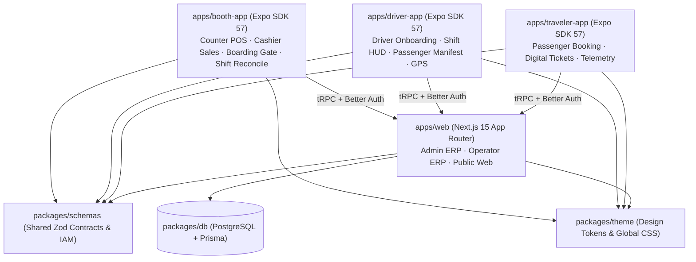
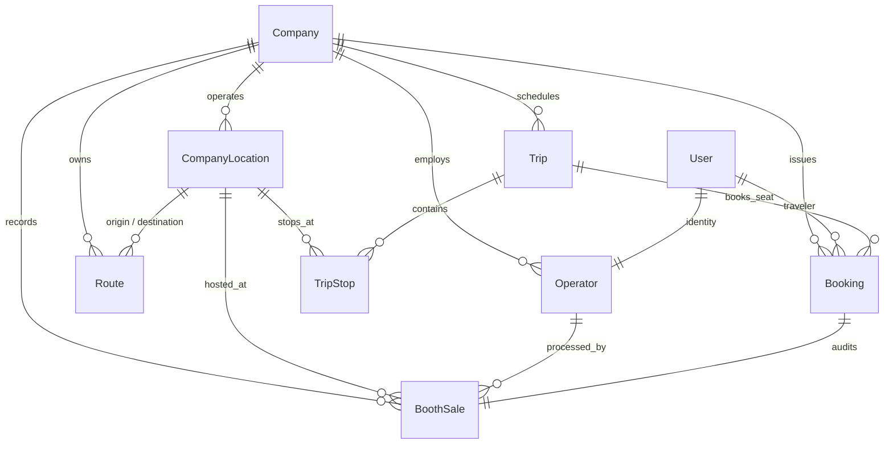
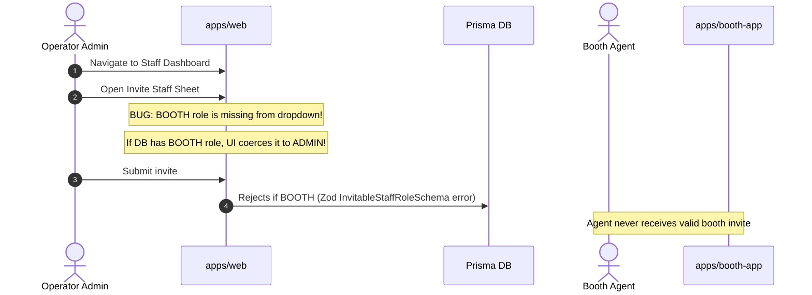
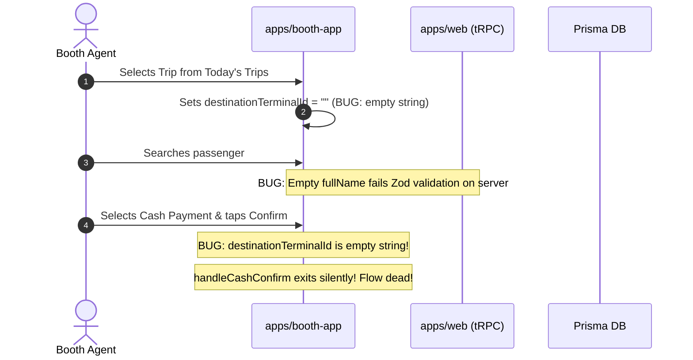

# Module 01: System Map & Monorepo Architecture

> **Audit Context**: Moja Ride Booth Ecosystem  
> **Target Files**: `apps/booth-app/*`, `apps/web/*`, `packages/db/prisma/schema.prisma`, `packages/schemas/src/booth.ts`  
> **Comparative Targets**: `apps/traveler-app/*`, `apps/driver-app/*`  

---

## 1. Monorepo Topology & Role Definition

Moja Ride is a multi-tenant bus ticketing and operations platform tailored for African transport operators (specifically Côte d'Ivoire and broader UEMOA/ECOWAS markets). The monorepo defines four user-facing surfaces:

### The Purported Role of `apps/booth-app`
According to `apps/booth-app/context/overview.md`:
1. **Physical Counter Point of Sale (POS)**: Fast walk-up cash and Paystack mobile money ticket issuance at bus terminals.
2. **Passenger Boarding Gate Check-In**: High-speed camera scanning of traveler QR tokens.
3. **Bluetooth Thermal Receipt Printing**: Immediate ESC/POS printing of paper tickets.
4. **Offline Resilience & Pre-Acquired Seat Hold Pool**: Uninterrupted sales during power cuts or 4G drops in Abidjan terminals.
5. **Shift Reconciliation**: End-of-day cash handover summaries for cashier and treasury staff.

---

## 2. Monorepo Architectural Invariants & Violation Matrix

Moja Ride architecture establishes strict invariants documented in `context/architecture.md` and `context/code-standards.md`. Below is the audit comparison across mobile applications:

| Invariant / Standard | Golden Standard (`apps/traveler-app`) | Golden Standard (`apps/driver-app`) | Audit Status (`apps/booth-app`) |
| :--- | :--- | :--- | :--- |
| **Directory Organization** | Feature-driven (`features/auth`, `features/booking`, `features/tickets`) | Feature-driven (`features/auth`, `features/trips`, `features/offers`) | **Violation**: Monolithic screens in `app/` and `app/sell/`, loose stores in `stores/`. No `features/` directory. |
| **Component Architecture** | 32 shadcn-compliant primitives built on `@rn-primitives/*` with `components.json` | Reusable UI library with tokens and shared primitives | **Violation**: 5 ad-hoc hand-rolled components; missing `@rn-primitives/*`, missing `components.json`. |
| **Theme & Style Consistency** | Strictly uses `@moja/theme/tokens` and `NAV_THEME` with custom root tokens | Aligned with `NAV_THEME` and Tailwind v4 | **Violation**: Inconsistent tokens; defines ad-hoc `constants/theme.ts` aliases; screens bypass theme. |
| **Auth Client Configuration** | `@better-auth/expo` with `emailOTPClient`, `phoneNumberClient`, `inferAdditionalFields` | `@better-auth/expo` with `emailOTPClient`, `phoneNumberClient` | **Violation**: Only registers base `expoClient`; lacks `emailOTPClient` and `phoneNumberClient`. Attempts disabled password auth. |
| **Trusted Origins Registration** | Registered in `APP_SCHEMES = ["traveler-app://"]` | Registered in `APP_SCHEMES = ["driver-app://"]` | **Violation**: `mojabooth://` NOT registered in `apps/web/lib/trusted-origins.ts`. Blocked in production. |
| **TypeScript Isolation** | Fully self-contained types; does not traverse web app boundaries | Fully self-contained types | **Violation**: `tsconfig.json` paths alias `"@/*": ["./*", "../web/*"]`, pulling web compiler errors into mobile typecheck. |
| **Haptic Feedback Mapping** | Contextual haptics per interaction level | Contextual haptics for driving HUD | **Violation**: Haptics called, but triggered before operations succeed, or in empty stubs. |
| **Internationalization (i18n)** | Complete parity tests (`__tests__/i18n-parity.test.ts`), verified fr/en keys | High-parity localized strings | **Violation**: Zero tests; corrupted UTF-8 mojibake in `fr.json`; legacy `"MoovMove"` branding in `en.json`. |

---

## 3. Database Entity Map & Relational Topology

The database models supporting the booth ecosystem are defined in `packages/db/prisma/schema.prisma`:

### Relational Findings & Entity Flaws:
1. **`BoothSale` (Lines 3169–3225)**:
   - 1:1 with `Booking` via `bookingId` unique constraint.
   - Includes `cashAmountXOF` (nullable), `paystackRef` (nullable), `wasOffline`, `walkedUpPassenger`, `passengerAccountCreated`, `hasConflict`, and `conflictDetails`.
   - **Flaw**: `BoothSale` does NOT store an immutable currency snapshot or exchange rate.
   - **Flaw**: `BoothSale` relies on `staffId: Operator.id`, but there is no FK linking an `Operator` to an assigned `CompanyLocation` (terminal).
2. **Missing Operator Terminal Scoping**:
   - In `schema.prisma:772–822`, `Operator` links only to `User` and `Company`. There is no `assignedTerminalId` or `terminals CompanyLocation[]` relation.
   - Any booth agent can choose *any* terminal belonging to the company at boot time, bypassing terminal-level cash accountability.
3. **`CompanyLocation` Terminal Promotion (`schema.prisma:1149–1220`)**:
   - Locations are promoted to terminals via `isTerminal: Boolean`.
   - Routes reference `originTerminalId` and `destTerminalId`.
   - Trips link to terminals through `TripStop.terminalId`.
4. **`StaffInvitation` (`schema.prisma:2263–2278`)**:
   - `role StaffRole @default(OPERATIONS)`
   - `permissions String[] @default([])`
   - **Fatal Gap**: Database supports `StaffRole.BOOTH` (line 219), but validation schemas in `packages/schemas` prevent operators from ever issuing a `BOOTH` role invitation.

---

## 4. Cross-System Data Flows

### A. Terminal Onboarding Flow (Intended vs Realized)

### B. Ticket Sale & Sync Flow (The Broken Reality)

