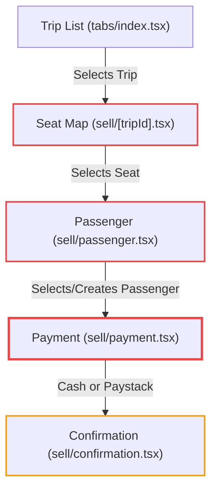
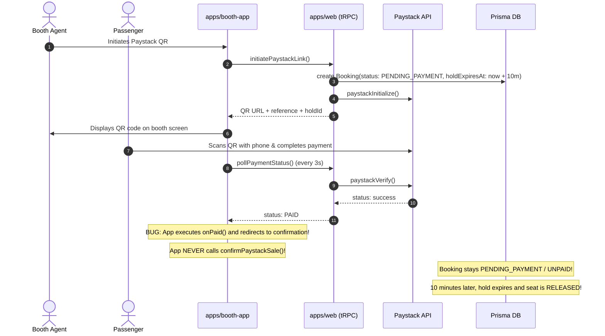

# Module 05: Sales Journey & Offline Resilience Engine

> **Audit Context**: Ticketing POS Workflow, Cash/Paystack Processing, Seat Map Interaction, Offline Hold Pool & Sync  
> **Target Files**: `apps/booth-app/app/sell/*`, `apps/booth-app/stores/*`, `apps/booth-app/lib/offline-sync.ts`, `apps/booth-app/hooks/use-hold-pool.ts`, `apps/booth-app/hooks/use-network-status.ts`  

---

## 1. End-to-End Sales Lifecycle (Happy Path vs Broken Reality)



### Stage 1: Trip Selection & Missing Route Metadata
- In `app/(tabs)/index.tsx`, each trip card displays origin terminal → destination terminal.
- However, when navigating to `/sell/[tripId]`, the route parameter is passed as:
  ```typescript
  router.push({ pathname: "/sell/[tripId]", params: { tripId: item.id } });
  ```
  **Omission**: The destination terminal ID (`destStop.terminalId`) is never forwarded.

### Stage 2: Seat Map & Terminal State Corruption (P0 Blocker)
- In `app/sell/[tripId].tsx:93`:
  ```typescript
  setTerminals(terminal.id, ""); // <-- DESTINATION TERMINAL IS EMPTY STRING
  ```
- The code does not query the destination terminal from `seatMap` or `tripStops`. It hardcodes `""`.

### Stage 3: Passenger Search & Creation Validation Crash (P1 Critical)
- In `app/sell/passenger.tsx:68–72`:
  ```typescript
  const result = await lookupMutation.mutateAsync({
    email: searchQuery.trim(),
    fullName: "", // <-- FAILS Zod min(2) validation
    phone: undefined,
  });
  ```
- **Error Triggered**: `[{"code":"too_small","minimum":2,"type":"string","inclusive":true,"exact":false,"message":"String must contain at least 2 character(s)","path":["fullName"]}]`
- In West Africa, 90%+ of passengers book tickets with a phone number (e.g., `0701020304`). If an agent enters a phone number in `searchQuery`, `z.string().email()` also rejects the input. **Passenger search is 100% unusable.**

### Stage 4: Payment Confirmation Silent Abort (P0 Blocker)
In `app/sell/payment.tsx`:
```typescript
async function handleCashConfirm() {
  const { tripId, passengerId, passengerName, passengerEmail } = sellSession;
  if (
    !tripId ||
    !passengerId ||
    !passengerName ||
    !passengerEmail ||
    !sellSession.terminalId ||
    !sellSession.destinationTerminalId // <-- EMPTY STRING EVALUATES TO FALSY!
  ) {
    return; // <-- SILENT EARLY EXIT! ZERO FEEDBACK!
  }
  ...
}
```
**Fatal Execution Failure**: Because `sellSession.destinationTerminalId` is `""`, both `handleCashConfirm()` and `handlePaystackInitiate()` return immediately. The button produces a haptic tap, but nothing happens. The cashier cannot proceed.

---

## 2. Paystack Mobile Money & The Ghost Booking Bug (P0 Blocker)

If the destination terminal bug is bypassed, Paystack payment processing introduces a catastrophic financial defect:



### Forensic Code Analysis:
In `apps/booth-app/app/sell/payment.tsx:273–282`:
```typescript
onPaid={() => {
  BoothFeedback.paymentSuccess();
  router.replace({
    pathname: "/sell/confirmation",
    params: {
      bookingId: paystackData.holdId,
      passengerEmail: sellSession.passengerEmail,
    },
  });
}}
```
The client completely forgets to call:
```typescript
trpc.booth.confirmPaystackSale.mutateAsync({
  holdGroupId: paystackData.holdId,
  paystackReference: paystackData.reference,
  terminalId: sellSession.terminalId,
  passengerId: sellSession.passengerId,
  passengerEmail: sellSession.passengerEmail,
  passengerName: sellSession.passengerName,
  ...
})
```
### Real-World Business Impact:
1. Passenger's bank account or mobile wallet (Wave / Orange Money / MTN) is debited.
2. The cashier hands the passenger a physical confirmation or boarding pass.
3. The server database still marks the booking as unpaid and temporary.
4. After 10 minutes, the server-side cron or clean-up job expires the booking, and another customer books the exact same seat on `traveler-app`.
5. Two passengers arrive for the same seat on the bus. Massive customer dispute at boarding gate.

---

## 3. Offline Hold Pool & Sync Engine Deep-Dive

The offline architecture is intended to support cash ticket sales when internet access drops. It consists of three stores:
1. `stores/hold-pool.ts`: Pre-acquired seat holds (90-minute TTL).
2. `stores/offline-queue.ts`: Local queue of completed cash transactions awaiting sync.
3. `stores/sell-session.ts`: Transient state of the current sale wizard.

### Flaws in Offline Hold Acquisition (`use-hold-pool.ts`)
1. **Hardcoded Allocation**: Pre-acquires exactly 5 seats per trip (`count: 5`). For busy peak hours, 5 seats is exhausted within 3 minutes of power loss.
2. **Sentinel Name Collision**: Holds are created with passenger name `BOOTH_POOL_HOLD`. If an agent consumes a hold offline, but reconnects after 91 minutes, `createCashSale` checks:
   ```typescript
   where: {
     id: input.holdId,
     passengerName: POOL_HOLD_SENTINEL,
     holdExpiresAt: { gt: new Date() },
   }
   ```
   The hold is rejected as expired, the cash sale fails to sync, and the passenger who paid cash holds an invalid ticket.

### The Conflict Reporting Bug (`offline-sync.ts`)
In `apps/booth-app/lib/offline-sync.ts:114–118`:
```typescript
await reportUrbanConflict({
  tripId,
  boothSaleIds: entries.map((e) => e.holdId), // <-- BUG: HOLD ID PASSED INSTEAD OF SALE ID
  excessCount: entries.length,
});
```
In `apps/web/trpc/routers/booth.ts:1176–1182`:
```typescript
await tx.boothSale.updateMany({
  where: { id: { in: input.boothSaleIds }, companyId: ctx.companyId },
  data: { hasConflict: true, ... },
});
```
Because `e.holdId` (a `Booking.id`) never matches `BoothSale.id`, the query updates **0 rows**. The conflict flags are never saved, and managers receive blank alerts.

---

## 4. False Offline Triggering on Cellular Networks

In `apps/booth-app/hooks/use-network-status.ts:20`:
```typescript
isOnline: !!(state.isConnected && state.isInternetReachable),
```
On Android devices operating on Orange CI or MTN CI cellular networks, `state.isInternetReachable` starts as `null` or remains `null` when background DNS probes are delayed. 
- In JavaScript, `!!(true && null) === false`.
- The hook reports `isOnline: false` even when full 4G internet connectivity is active and tRPC calls would succeed.
- The app forcibly enters offline mode, preventing online seat map lookups and Paystack transactions.
