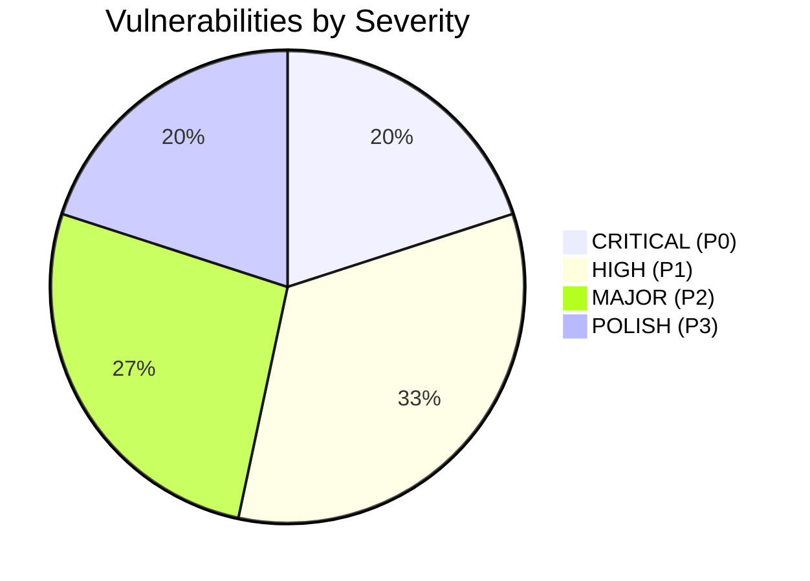

# Moja Ride — Comprehensive Financial, Checkout, Trips & Ledger Ecosystem Audit

**Audit Date:** September 11, 2026  
**Target Market & Currency:** Côte d'Ivoire / WAEMU (UEMOA) — Franc CFA (`XOF`), Zero-Decimal Integer Arithmetic  
**Payment Gateways:** Paystack (Mobile Money: Wave, MTN, Orange, Moov; Cards: Visa, Mastercard)  
**Core Financial Accounting:** Immutable Double-Entry Ledger Engine (`packages/db/src/services/AccountingEngine.ts`)  
**Audit Scope:** End-to-end audit of Trips, Search (`apps/web` & `apps/traveler-app`), Booking Holds, Quote Math, Paystack Checkout, Moja Wallet, Promo Credits, Convenience Fee waiving & absorption, Operator Schedule Pricing, Commission Tiering, Cancellation & Refunds, and Double-Entry Invariants.

---

## Executive Summary

Moja Ride operates a digital transport marketplace connecting intercity and urban bus travelers with bus operators in Côte d'Ivoire. The platform is designed around strict financial accounting principles: zero-decimal integer arithmetic (`XOF`), double-entry ledger bookkeeping ($\sum \text{Debits} \equiv \sum \text{Credits}$), row-level concurrency locking (`SELECT ... FOR UPDATE`), and escrow-backed operator payouts.

However, an end-to-end investigation of the codebase and actual user transaction flows uncovered **critical mathematical, architectural, and user-experience flaws** across the checkout, ledger, discount, and mobile apps.

Most notably, this audit explains the exact root cause of the bug reported:
> **User Symptom:** Trip Fare: 1,000 XOF, Convenience fee: 25 XOF. The user has 5,000 Promo Credits. The dialog shows Fare = 1,000 XOF and Credits = -1,025 XOF, button displays `Confirm Free Booking (0 XOF)`. Clicking it crashes with:  
> `Journal validation failed: Σ Debit (1025) != Σ Credit (1000)`

### The Root Cause in Brief
1. When a booking is paid or fully covered without card (via Promo Credits or Wallet), the convenience fee is supposed to be waived. But during quote generation, `waiveConvenienceFee` is evaluated under `paymentMethod === "WALLET"` while the frontend default is `"PAYSTACK"`.
2. As a consequence, the discount engine calculates credit coverage against the **provisional charge with fee** ($1,000 + 25 = 1,025 \text{ XOF}$), consuming $1,025$ promo credits.
3. When the user confirms, the zero-cash condition routes to `confirmFromWallet()`, which automatically sets `convenienceFeeXOF: 0` and posts Credits: Operator Net ($950$) + Commission ($50$) = $1,000 \text{ XOF}$. But it calls `appendPromoLedgerEntries()` with `creditAppliedXOF: 1025`.
4. Result: Total Debits = $1,025 \text{ XOF}$ (User Promo Credits), Total Credits = $1,000 \text{ XOF}$ (Operator + Commission). The double-entry ledger rejects the transaction with `Σ Debit (1025) != Σ Credit (1000)`!

Beyond this specific crash, our audit exposed systemic vulnerabilities across **Promo-to-Convenience leakage, partial promo credit coverage math, operator schedule creation economics, mobile traveler app desynchronization, and cancellation cash arbitrage**.

---

## Audit Index & Module Structure

The audit is organized into the following numbered modules in `context/audits/comprehensive-financial-checkout-audit/`:

| File | Title | Scope & Description |
| :--- | :--- | :--- |
| [**01-system-and-financial-map.md**](./01-system-and-financial-map.md) | System & Financial Topology | Chart of Accounts, Normal Balances, Money In / Money Out Flow, Operator Escrow & Commission Engine. |
| [**02-root-cause-journal-validation-failure.md**](./02-root-cause-journal-validation-failure.md) | Deep Root Cause: Journal Validation Failure | Complete mathematical breakdown of the 1,025 vs 1,000 debit/credit mismatch on zero-cash and wallet checkout. |
| [**03-checkout-pricing-promo-wallet-matrix.md**](./03-checkout-pricing-promo-wallet-matrix.md) | Checkout, Promo & Wallet Matrix | Detailed edge-case matrix: full promo, partial promo, wallet + promo, direct card, fee waiving rules. |
| [**04-schedules-pricing-and-business-model.md**](./04-schedules-pricing-and-business-model.md) | Schedules, Fares & Business Model | How operators create schedules, set segment fares, platform commission tiers, distance calculations, and platform take-rate. |
| [**05-cross-platform-audit-web-vs-mobile.md**](./05-cross-platform-audit-web-vs-mobile.md) | Cross-Platform Audit (Web, Dashboards & Traveler App) | Parity and divergence across `apps/web/search`, `apps/web/dashboard/bookings`, and `apps/traveler-app/features/search`. |
| [**06-cancellations-refunds-and-arbitrage.md**](./06-cancellations-refunds-and-arbitrage.md) | Cancellations, Refunds & Arbitrage | Cash vs Promo refund splits, offline voucher leakage, and escrow clawbacks. |
| [**07-findings-catalog.md**](./07-findings-catalog.md) | Severity-Ranked Findings Catalog (P0–P3) | Actionable inventory of all identified bugs, business model flaws, and vulnerabilities. |
| [**08-remediation-roadmap.md**](./08-remediation-roadmap.md) | Remediation Roadmap & Implementation Guide | Exact TypeScript/SQL code patches and refactoring steps for zero-defect financial integrity. |

---

## Key Findings Highlights

### 1. P0: Double-Entry Ledger Crash on Free/Zero-Cash Booking (`Σ Debit != Σ Credit`)
* **Impact:** 100% of users attempting to use available promo credits to book a free ticket encounter a hard 500 error; booking fails, promo credits remain locked in `RESERVED` status until hold expiry.
* **Mechanism:** Quote evaluates with `convenienceFeeXOF = 25`, absorbing $1,025$ in promo credits. `confirmFromWallet` zeroes out the convenience fee, crediting only $1,000$ to platform and operator, but debits $1,025$ from passenger promo credits.

### 2. P0: Convenience Fee Subsidy Drain via Promo Credits
* **Impact:** Marketing promo credits (intended to subsidize bus seats) are erroneously spent paying platform convenience fees. When convenience fees are waived for wallet/zero-cash users, this creates a phantom delta of $25$ XOF that breaks ledger balance or burns customer credits unfairly.
* **Mechanism:** `buildChargeQuote()` in `auto-apply.ts` calculates `provisionalChargeXOF = postDiscountSubtotalXOF + convenienceFeeXOF - feeDiscountXOF`, and caps `creditAppliedXOF` against `provisionalChargeXOF` instead of `postDiscountSubtotalXOF`.

### 3. P0: Partial Promo Credit + Convenience Fee Split Breakdown
* **Impact:** If a trip is $1,000$ XOF, fee is $25$ XOF, and user has $1,000$ Promo Credits:
  * In card mode: User expects to pay $25$ XOF. Paystack cannot process charges under $100$ XOF in production without gateway failure or massive fee ratio loss.
  * In wallet mode: Convenience fee is waived, so ticket is $1,000$ XOF - $1,000$ credit = $0$ XOF. But because initial quote assumed Paystack, the user is presented with conflicting fee totals and broken button state.

### 4. P1: Mobile Traveler App Checkout Desynchronization
* **Impact:** In `apps/traveler-app/features/search/components/passenger-form-sheet.tsx`, the mobile app does not utilize `resolveCheckoutPayable` or properly pass `waiveConvenienceFee` during quote requests. If `isZeroCash` is true, it falls back to a hardcoded wallet check with `subtotalBaseXOF`, rejecting users whose wallet balance is $0$ even though promo credits fully cover the trip!

### 5. P1: Operator-Funded Discount Absorbed by Platform
* **Impact:** When an operator configures a promotional discount code funded by the operator, `PricingSnapshot` updates `operatorNetXOF` downward, but during Paystack checkout, the ledger debits Paystack Clearing for the discounted price while crediting operator receivable without the offsetting promo contra entry, causing platform cash clearing deficit.
