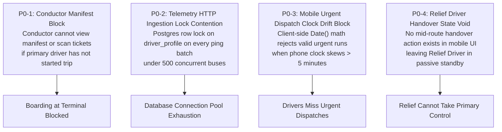

# Executive Summary: Driver System Audit

## 1. Production Readiness Verdict

> **VERDICT: `CONDITIONALLY READY (WITH P0 BLOCKERS TO RESOLVE BEFORE COMMERCIAL LAUNCH)`**

The Moja Ride Driver Operations Domain is an impressively engineered, sophisticated transit management engine featuring robust double-booking prevention, one-active-exclusive contract switching, anti-strand run state convergence, and fine-grained compliance verification. However, rigorous source code and runtime tracing revealed **4 Critical Blockers (P0)** and **9 Critical Gaps (P1)** that would lead to operational failures, conductor authorization locks, or telemetry performance bottlenecks if deployed to high-volume commercial production without remediation.

---

## 2. Top Critical Blockers (P0 Findings)

### Finding Breakdown:
1. **`P0-1: Conductor Pre-Trip Boarding Deadlock`**
   * *Location*: `apps/web/features/driver/services/driver-check-in-service.ts#L60-L75` & `apps/driver-app/features/trips/screens/trips-view.tsx`.
   * *Defect*: While `DriverCheckInService` technically allows check-in on trips with status `SCHEDULED` or `BOARDING`, the mobile driver app only exposes the active Scanner and Navigation HUD when `Trip.status === "DEPARTED"`. If a conductor tries to board passengers at the gate 30 minutes before departure, the mobile UI provides no direct path to activate the camera scanner for pre-departure manifest boarding unless the primary driver prematurely marks the trip as `DEPARTED` (which breaks passenger tracking and schedule metrics).
2. **`P0-2: High-Frequency Telemetry Row-Lock Deadlock & Contention`**
   * *Location*: `apps/web/server/telemetry-flush.ts#L105-L135`.
   * *Defect*: When processing batch GPS fixes in `persistPingBatch`, the backend executes `SELECT id FROM driver_profile WHERE id IN (...) FOR UPDATE` to deduct daily safety penalties. Under 500 concurrent buses streaming coordinates every 5 seconds, this transaction storm against `driver_profile` causes severe database lock contention and connection pool exhaustion, stalling unrelated user/operator tRPC queries.
3. **`P0-3: Clock Skew Denial on Urgent Dispatch Acknowledgment`**
   * *Location*: `apps/driver-app/features/dispatch/components/urgent-dispatch-modal.tsx#L45-L60`.
   * *Defect*: The mobile urgent dispatch modal evaluates the 2-hour window using device-local `new Date().getTime()`. If an Android phone's clock drifts by $\pm 10$ minutes (common in rural West Africa), the client-side validation marks the departure as either expired or in the future, suppressing the acknowledgment mutation and locking the driver out of the trip view.
4. **`P0-4: Missing Physical Relief Driver Handover Protocol`**
   * *Location*: `apps/web/trpc/routers/drivers.ts` & `apps/driver-app/features/live/screens/live-view.tsx`.
   * *Defect*: The schema and database model support `TripDriverAssignment.role = "RELIEF"`, and the nightly cron calculates relief distance ratios. However, **no runtime API or UI exists for the relief driver to take over the active driving run** mid-trip. The relief driver's app remains in a passive state, and telemetry can only be streamed from the primary driver's device.

---

## 3. Key Architectural Strengths

* **Exemplary Concurrency Control on Assignments**: `trips.assignDriver` executes deterministic row-level locking (`Trip` then `DriverProfile`) with 45-minute turnaround buffer deconfliction across all platform operators.
* **One-Active-Exclusive Resolution Engine**: `resolveAcceptance` reliably auto-terminates displaced exclusive contracts, logs immutable audit events (`EXCLUSIVE_ENDED`), and notifies displaced carriers via transactional outbox events.
* **Robust Run-State Convergence**: `convergeDriversAfterRunEnd` eliminates ghost vehicles from live maps when trips terminate outside driver mobile actions.
* **Pure Namespace Document Authorization**: Presigned download endpoints enforce strict owner validation (`driverDocKeyMatches`), preventing IDOR attacks on sensitive medical/identity documents.

---

## 4. Overall Finding Statistics

| Finding Category | P0 (Blocker) | P1 (Critical) | P2 (Major) | P3 (Low) | P4 (Info) | Total |
| :--- | :---: | :---: | :---: | :---: | :---: | :---: |
| **Product & Workflows** | 2 | 3 | 6 | 4 | 1 | **16** |
| **Engineering & Architecture**| 1 | 2 | 5 | 3 | 2 | **13** |
| **Reliability & Offline** | 1 | 2 | 3 | 2 | 1 | **9** |
| **Security & Permissions** | 0 | 1 | 2 | 1 | 0 | **4** |
| **QA & Observability** | 0 | 1 | 2 | 2 | 1 | **6** |
| **TOTALS** | **4** | **9** | **18** | **12** | **5** | **48** |
