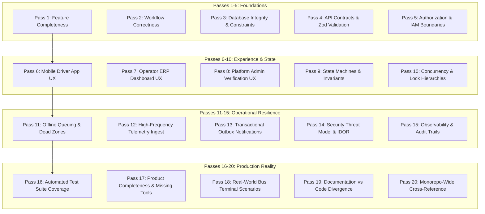

# Audit Methodology & Verification Protocol

## 1. Audit Principles & Standards

The Moja Ride Driver System audit was conducted following strict **Zero-Hallucination, Evidence-Backed Principles**:
1. **Source Code Supremacy**: No assumption was made based on UI mockups, naming conventions, or design aspirations. Every finding is backed by specific file paths, line numbers, function signatures, database schema constraints, and runtime call traces.
2. **Full-Stack Execution Tracing**: Every driver capability was audited through the entire lifecycle:
   $$\text{Mobile/Web UI} \longrightarrow \text{Zod Validation} \longrightarrow \text{tRPC Middleware} \longrightarrow \text{Service Logic} \longrightarrow \text{Prisma DB} \longrightarrow \text{Outbox/Novu} \longrightarrow \text{Client Response}$$
3. **Product-Engineering Hybrid Evaluation**: A feature is not marked complete simply because the backend returns `HTTP 200`. It must provide full user feedback, error recovery, empty states, offline queuing, and operational sanity in real-world West African commercial bus conditions.

---

## 2. The 20-Pass Audit Inspection Matrix

The codebase was subjected to 20 structured inspection passes:



---

## 3. Finding Classification Rubric

Every identified issue in this audit suite is classified according to the following strict rubric:

### 3.1 Severity Levels
* **`P0 — Blocker`**: Prevents commercial launch, causes database deadlocks, strands passengers/drivers at terminals, or creates unrecoverable data loss.
* **`P1 — Critical`**: Security vulnerability, broken core operational flow (e.g. boarding failure, compensation math error), or multi-tenant isolation failure.
* **`P2 — Major`**: Significant missing functionality, broken recovery pathway, severe UX confusion, or offline sync failure under stress.
* **`P3 — Low / Polish`**: Minor visual defect, unlocalized string, missing haptic feedback, or non-critical error message ambiguity.
* **`P4 — Informational / Technical Debt`**: Dead code, unused catalog keys, suboptimal query patterns, or architectural refactoring opportunities.

### 3.2 Finding Attribute Structure
```text
ID:             [DOMAIN]-[CATEGORY]-[NUMBER] (e.g. DRV-DISP-01)
Title:          Concise summary of the defect
Category:       BUG | LOGIC | CONCURRENCY | SECURITY | UX | MISSING | HALF-BAKED
Severity:       P0 | P1 | P2 | P3 | P4
Confidence:     HIGH (Verified in Code) | MEDIUM (Inferred from Logic)
Status:         OPEN
Files:          List of affected files with exact line numbers
APIs:           Affected tRPC procedures / REST routes
Models:         Affected Prisma entities
Evidence:       Exact code snippet demonstrating the defect
Problem:        Detailed technical analysis of why this fails
Impact:         Real-world business and operational consequence
Recommendation: Step-by-step remediation blueprint
```
