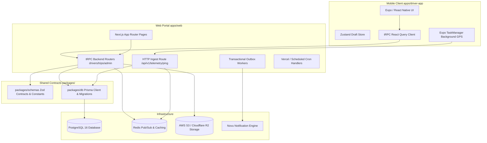

# Engineering Audit: Architecture & System Boundaries

## 1. System Architecture Overview

The Driver Operations Domain is structured as a layered, multi-package monorepo under Turborepo.

---

## 2. Architectural Violations & Concerns

### 2.1 Direct Postgres Row Locks on High-Frequency Hot Path
* **Violation**: `apps/web/server/telemetry-flush.ts` performs transactional `SELECT ... FOR UPDATE` row locks on `driver_profile` inside the high-frequency telemetry ingestion loop.
* **Architectural Smell**: The hot ingest path (handling thousands of pings per minute) is coupled to relational ACID transactions with write locks.
* **Fix**: Ingest raw pings as append-only records; aggregate daily safety penalty caps asynchronously in background micro-batches or defer to nightly crons.

### 2.2 Dual-Layer Verification Status Inconsistencies
* **Observation**: Both `DriverProfile.verificationStatus` and `DriverCompanyAffiliation.isVerified` exist.
* **Architectural Risk**: If an admin suspends a driver globally (`DriverProfile.verificationStatus = "SUSPENDED"`), old affiliations may retain `isVerified = true`.
* **Remediation**: In all assignment and procedure checks, `DriverProfile.verificationStatus` must be the sole authoritative source of truth.
