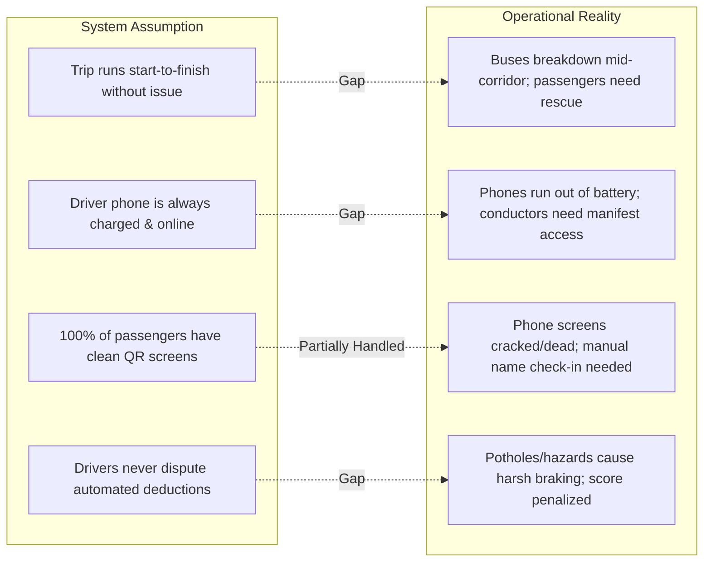

# Product Audit: Real-World Operational Gaps

This document examines real-world operational challenges encountered by commercial bus operators in Côte d'Ivoire that are unaddressed by the current system design.

---

## 1. Operational Reality vs. System Assumptions

---

## 2. Detailed Gap Analysis

### 2.1 Roadside Breakdown & Passenger Transfer
* **Scenario**: An intercity coach breaks down on the highway between Tiassalé and Yamoussoukro. The operator dispatches a rescue coach.
* **Product Gap**: The system has no concept of a "Rescue Trip" or "Passenger Transfer". Dispatchers cannot migrate the stranded manifest to a new bus without manually creating separate bookings for 50 passengers.

### 2.2 Shared Device / Dead Phone Workaround
* **Scenario**: The primary driver's phone battery dies mid-journey.
* **Product Gap**: The driver cannot transfer live navigation or GPS streaming to the conductor's phone without logging out and re-authenticating via SMS OTP on the second device.

### 2.3 Cash-on-Board / Walk-Up Passengers
* **Scenario**: Rural waypoints have walk-up passengers who pay cash directly to the conductor.
* **Product Gap**: Conductor cannot issue walk-up tickets or add unreserved passengers to the official manifest from the mobile app.

### 2.4 Multi-Language Regional Operational Realities
* **Scenario**: Many commercial drivers in West Africa are more fluent in spoken French / Dioula than formal written terms.
* **Product Gap**: No audio prompts or simplified large-icon modes for high-stress driving moments.
