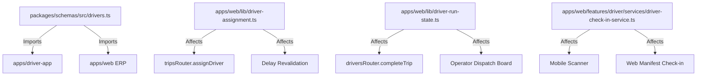

# QA Audit: High-Coupling & Regression Risk Zones

## 1. Regression Risk Map

The following core modules exhibit high coupling across multiple workflows:

---

## 2. Critical Regression Zones

1. **`packages/schemas/src/drivers.ts`**: Altering enums (`DriverStatus`, `LicenseCategory`) or constants (`DRIVER_TURNAROUND_BUFFER_MINUTES`) directly affects mobile UI, web ERP, backend assignment engines, and database migrations.
2. **`apps/web/lib/driver-run-state.ts`**: Modifying `convergeDriversAfterRunEnd` risks resurrecting the "ghost bus" defect on live maps if edge cases are omitted.
