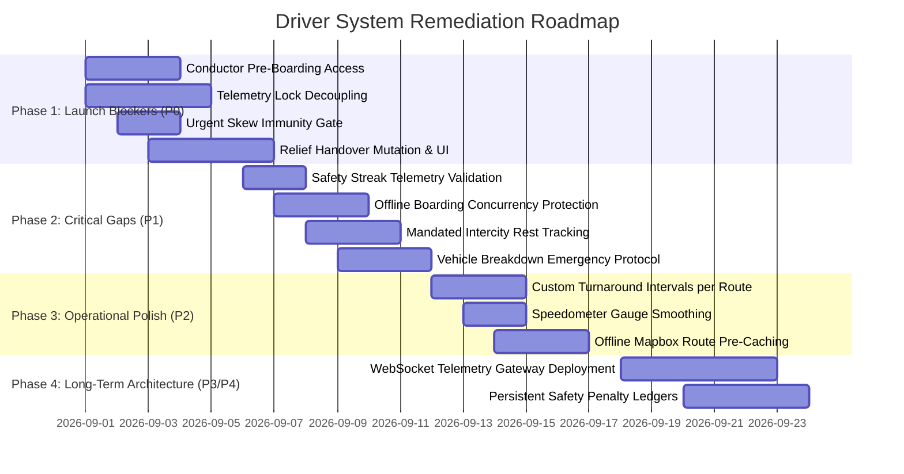

# Driver Operations Domain — Prioritized Remediation Roadmap

## 1. Roadmap Overview & Phased Execution

To achieve commercial launch readiness, remediation must be executed in 4 structured phases:

---

## 2. Phase 1: Launch Blockers (P0 — Fix Before Production)

| Task ID | Item & Target Solution | Affected Files | Effort Estimate |
| :--- | :--- | :--- | :---: |
| **`FIX-P0-01`** | **Decouple Conductor Pre-Boarding from Trip `DEPARTED` Status** Update `apps/driver-app/features/trips/screens/trips-view.tsx` to display an "Open Boarding Scanner" button on trips with status `SCHEDULED` or `BOARDING` for assigned conductors and primary drivers. | `apps/driver-app/features/trips/screens/trips-view.tsx`, `apps/driver-app/features/scanner/screens/scanner-view.tsx` | 2 days |
| **`FIX-P0-02`** | **Decouple High-Frequency Telemetry Ingest from Postgres Row Locks** Refactor `persistPingBatch` in `apps/web/server/telemetry-flush.ts` to write raw pings without acquiring `SELECT ... FOR UPDATE` locks on `driver_profile`. Move daily penalty capping calculations into an asynchronous Redis buffer or defer to the nightly reconciliation cron. | `apps/web/server/telemetry-flush.ts`, `apps/web/app/api/v1/telemetry/ping/route.ts` | 3 days |
| **`FIX-P0-03`** | **Server-Authoritative Time Check for Urgent Dispatch Modal** Refactor `apps/driver-app/features/dispatch/components/urgent-dispatch-modal.tsx` and `UrgentDispatchGate.tsx` to calculate countdown timers relative to the server-provided `departureDate` and `serverNow` timestamp, eliminating client clock drift vulnerabilities. | `apps/driver-app/components/urgent-dispatch-gate.tsx`, `apps/driver-app/features/dispatch/components/urgent-dispatch-modal.tsx` | 1 day |
| **`FIX-P0-04`** | **Implement Mid-Route Relief Driver Handover Protocol** Create tRPC mutation `drivers.handoverTripControl({ tripId, reliefDriverProfileId })`. Add "Take Wheel" / "Handover Control" button in `live-view.tsx`, transferring active `currentTripId` and minting a fresh telemetry dispatch token for the relief driver. | `apps/web/trpc/routers/drivers.ts`, `apps/driver-app/features/live/screens/live-view.tsx` | 3 days |

---

## 3. Phase 2: Critical Gaps (P1 — Fix Immediately After)

1. **`FIX-P1-01: Safety Streak Telemetry Gate`**: Update `reconcile-driver-stats` cron in `apps/web/lib/telemetry-reconcile.ts` to assert that completed trips contain $> 0$ valid GPS fixes before counting toward clean-streak recovery credits.
2. **`FIX-P1-02: Offline Boarding Concurrency Protection`**: Update `DriverCheckInService.batchSync` to use `SELECT ... FOR UPDATE` on `Booking` and reject sync items where `Booking.boardedAt` is already set by a prior physical scan.
3. **`FIX-P1-03: Mandated Rest Stop Logging`**: Add `drivers.logRestBreak({ shiftId, durationMinutes })` tRPC mutation and a "Log Mandated Rest" action in the mobile live HUD.
4. **`FIX-P1-04: Emergency Breakdown & Replacement Protocol`**: Add `EMERGENCY_BREAKDOWN` reason to delay reporting that enqueues high-priority `operator-vehicle-breakdown` outbox alerts with exact GPS coordinates.

---

## 4. Phase 3: Operational Polish (P2)

* **`FIX-P2-01`**: Allow operators to configure custom turnaround buffers per route in `Route` model (defaulting to 45 min).
* **`FIX-P2-02`**: Implement low-pass exponential moving average filter on `SpeedometerGauge` to eliminate needle jitter.
* **`FIX-P2-03`**: Pre-cache Mapbox route polylines in `AsyncStorage` when driver views assigned trip details before departure.

---

## 5. Phase 4: Long-Term Infrastructure (P3 / P4)

* Deploy dedicated WebSocket telemetry gateway in `apps/web` to replace HTTP batch polling for active highway buses.
* Create dedicated `DriverSafetyPenalty` ledger table to preserve lifetime penalty history across 180-day telemetry pruning cycles.
