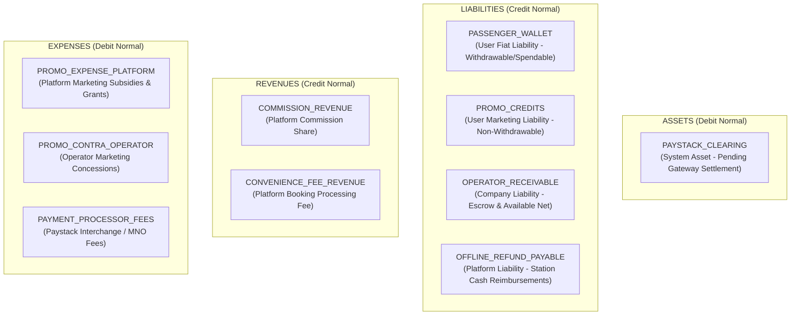
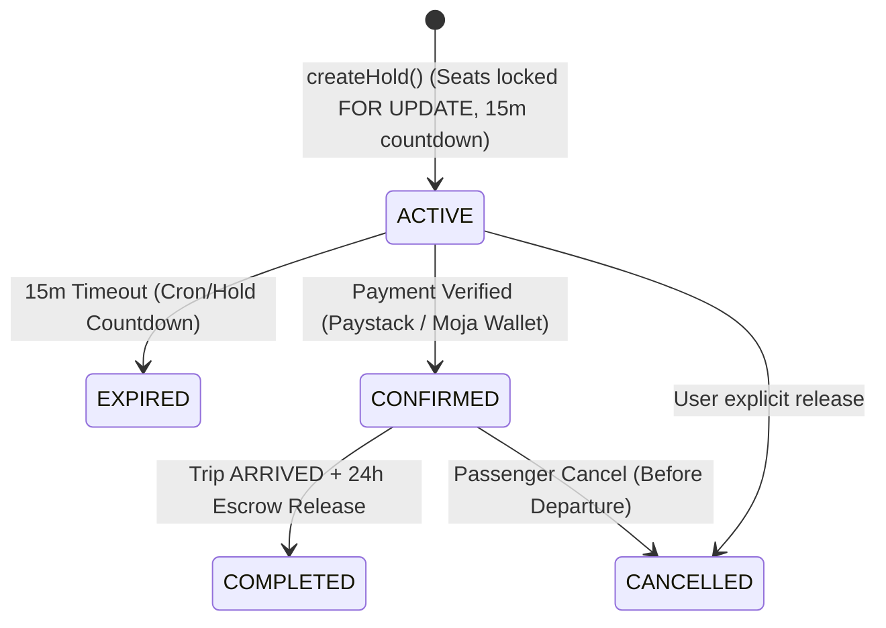
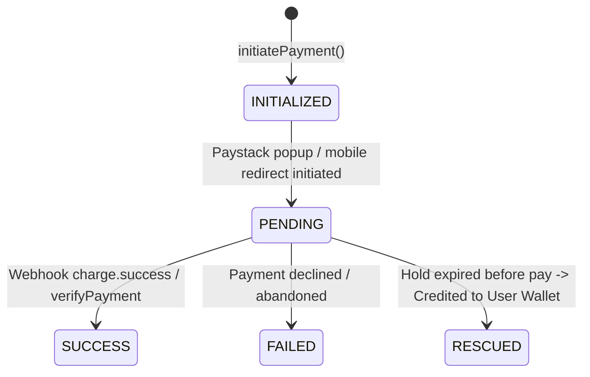
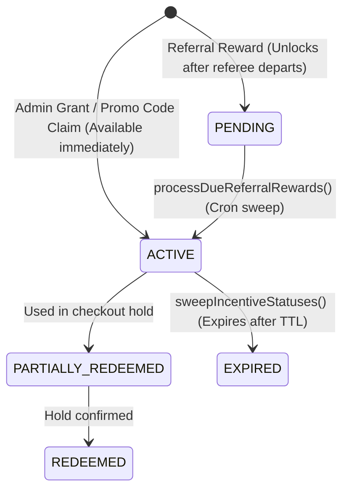
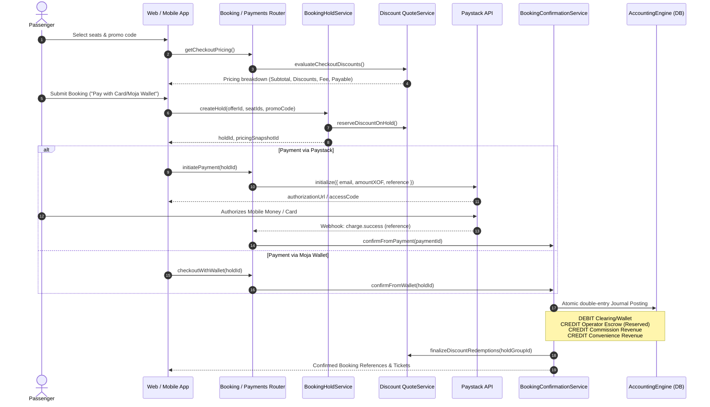

# System Architecture & Financial Flow Map

## 1. Chart of Accounts (Double-Entry Ledger)

All accounts are modeled in [`FinancialAccount`](file:///C:/dev/moja-buss/packages/db/prisma/schema.prisma#L1917) and managed via [`FinancialAccountService`](file:///C:/dev/moja-buss/packages/db/src/services/FinancialAccountService.ts).

---

## 2. Double-Entry Invariant Rules

For every entry posted via [`AccountingEngine.commit()`](file:///C:/dev/moja-buss/packages/db/src/services/AccountingEngine.ts#L119):

$$\sum \text{Debits} \equiv \sum \text{Credits}$$

### Balance Mutation Rules:
- **ASSET / EXPENSE**:
  $$\Delta \text{Balance} = +\text{Debit} - \text{Credit}$$
- **LIABILITY / REVENUE / EQUITY**:
  $$\Delta \text{Balance} = +\text{Credit} - \text{Debit}$$

### Account Balances:
- `postedBalance`: Total historical balance committed.
- `availableBalance`: Spendable/withdrawable balance.
- `reservedBalance`: Escrowed balance (e.g. operator earnings held until 24h post-arrival).

---

## 3. End-to-End Financial State Machines

### 3.1 Booking & Hold Lifecycle

### 3.2 External Payment & Webhook Lifecycle

### 3.3 Promo Credit Lot Lifecycle

---

## 4. End-to-End Payment Flow Sequence

