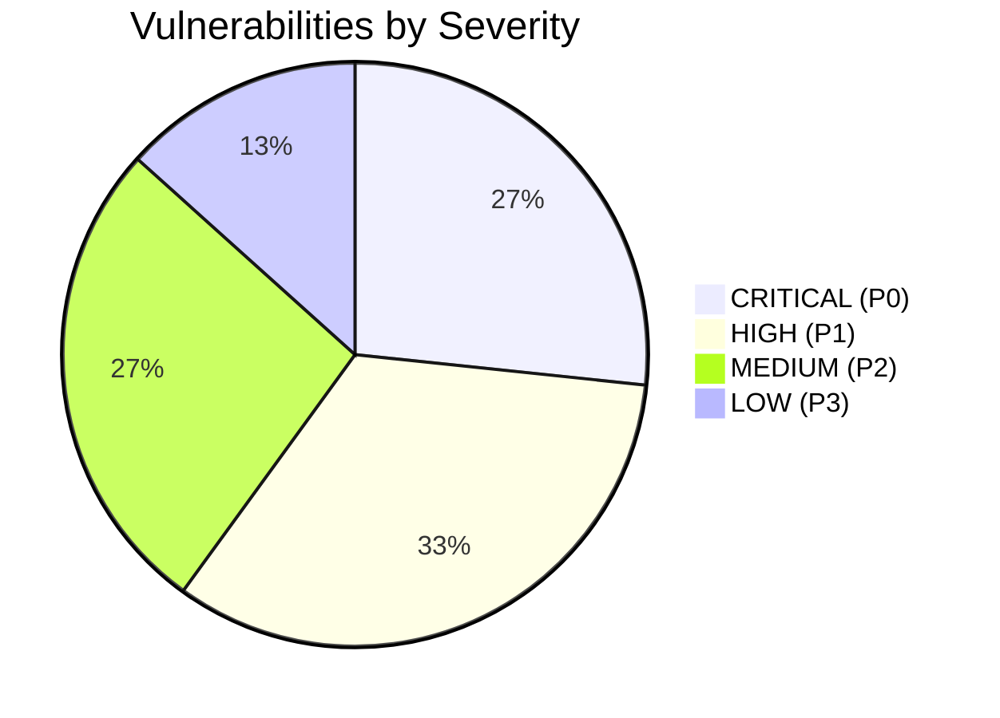

# Financial & Checkout Ecosystem Audit Report (Moja Ride)

**Target Region:** Côte d'Ivoire (UEMOA / CFA Franc `XOF` Economy)  
**Payment Gateway:** Paystack (Mobile Money: Wave, MTN, Orange, Moov; Cards: Visa, Mastercard)  
**Core Financial Accounting:** Double-Entry Ledger System (`packages/db/src/services/AccountingEngine.ts`)  
**Audit Scope:** Moja Wallet, Promo Credits, Trip Discount Coupons, Promo Credit Coupons, Checkout Pricing, Webhooks, Double-Entry Ledger, Cancellations, Refunds, and Escrow Clearance.

---

## Executive Summary

This document presents the findings of an end-to-end architectural, security, and logical audit of Moja Ride's financial and checkout ecosystem. The platform facilitates intercity and urban bus ticketing in Côte d'Ivoire, taking a percentage commission and convenience fee while routing net ticket revenues to transport operators via an escrow release mechanism.

While the system implements robust double-entry constraints (Debits = Credits validation, row-level locking via `SELECT ... FOR UPDATE`, and zero-decimal XOF integer arithmetic), several **critical logical bugs and architectural vulnerabilities** were identified. The most dangerous vulnerabilities allow:
1. **Promo-to-Cash Money Laundering / Arbitrage**: Cancelling a booking partially paid with non-withdrawable promotional marketing credits issues a 100% refund in **real withdrawable fiat wallet cash** at the expense of operator receivables and platform commissions.
2. **Silent Platform Treasury Drain via Operator-Funded Discounts**: Operator-funded discount coupons fail to reduce the credited operator receivable in Paystack booking confirmations, forcing the platform to absorb 100% of operator discounts from its fiat bank clearing accounts.
3. **Double-Spend & Phantom Credit in Wallet Top-Up / Orphan Rescues**: Missing database-enforced unique constraints on `businessIdempotencyKey` combined with pre-transaction checks allow concurrent webhooks and user verifications to double-credit top-up amounts.
4. **Checkout Form Bypassing Wallet & Free Bookings**: The search drawer checkout form unconditionally forces Paystack checkout even when "Wallet" or "Free Booking (0 XOF)" is selected, causing 0 XOF failures and preventing direct wallet payments.
5. **Ledger Discrepancies on Offline Refund Voids & Promo Expirations**: Expired credit lots and voided offline cash refunds leave permanent unreversed liability and contra balances in the double-entry ledger.

---

## Audit Index & Deliverables

| Document | Description |
| :--- | :--- |
| [**01-system-map.md**](./01-system-map.md) | Chart of accounts, double-entry balance mechanics, state machines, and sequence diagrams. |
| [**02-checkout-payments-audit.md**](./02-checkout-payments-audit.md) | Deep-dive audit into Checkout, Paystack integration, Webhooks, and Currency Arithmetic. |
| [**03-discounts-promos-audit.md**](./03-discounts-promos-audit.md) | Deep-dive audit into Coupons, Auto-Apply Campaigns, Promo Credits, and Referral Engines. |
| [**04-refunds-cancellations-audit.md**](./04-refunds-cancellations-audit.md) | Deep-dive audit into Cancellations, Refunds, Promo Conversions, Escrow, and Offline Fulfilment. |
| [**05-findings-catalog.md**](./05-findings-catalog.md) | Comprehensive catalog of all identified vulnerabilities ranked from **CRITICAL (P0)** to **LOW (P3)**. |
| [**06-remediation-plan.md**](./06-remediation-plan.md) | Step-by-step code-level and architectural remediation roadmap. |

---

## Severity Breakdown & Risk Summary

| Severity | Count | Primary Impact |
| :--- | :---: | :--- |
| **CRITICAL (P0)** | 4 | Direct financial loss, cash laundering/arbitrage, treasury drainage, double-crediting. |
| **HIGH (P1)** | 5 | Checkout blockage on wallet/free orders, coupon redemption exhaustion leaks, unhandled ledger states. |
| **MEDIUM (P2)** | 4 | Ledger drift on expirations/voids, concurrency race on global caps, orphaned reservation leaks. |
| **LOW (P3)** | 2 | Missing idempotency tracking on secondary queries, UX fee display rounding mismatches. |

---

## Core Invariants Inspected

1. **Zero-Decimal Currency Arithmetic (`XOF`)**: All monetary fields are strictly integer amounts in Francs CFA. No floating-point division leaks permitted.
2. **Double-Entry Equilibrium**: For every transaction, $\sum \text{Debits} \equiv \sum \text{Credits}$.
3. **Balance Integrity**: No asset, liability, or revenue account can take an illegal negative balance unless specifically permitted (e.g. clearing/escrow accounts).
4. **Promotion Segregation**: Marketing liabilities (`PROMO_CREDITS`) must remain strictly isolated from real fiat liabilities (`PASSENGER_WALLET`). Non-withdrawable promotional funds must never convert into fiat cash.
5. **Idempotency & Concurrency**: Webhook events, concurrent verification retries, and race conditions must be strictly idempotent under high network concurrency.
