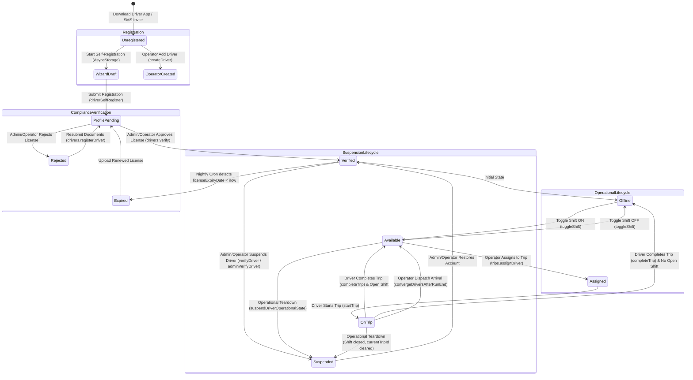
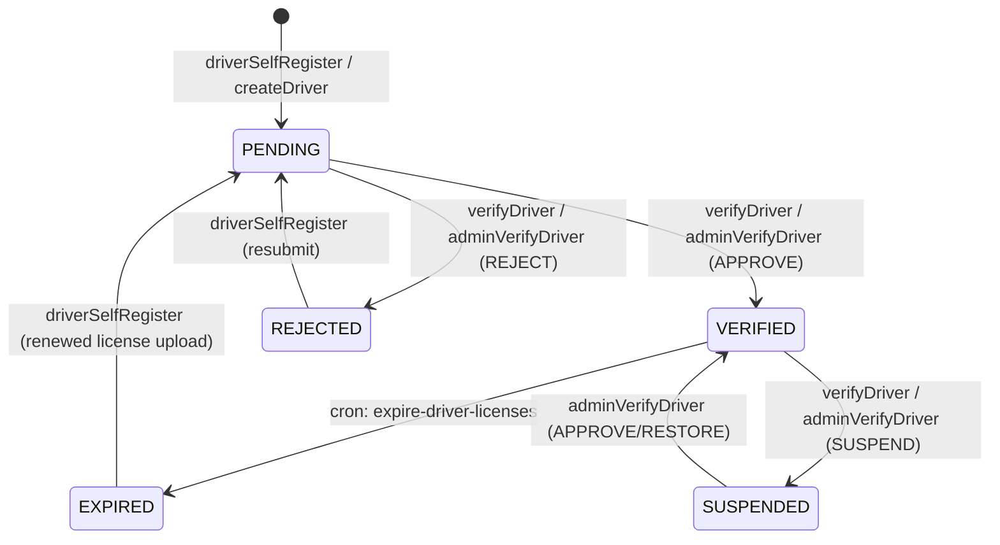
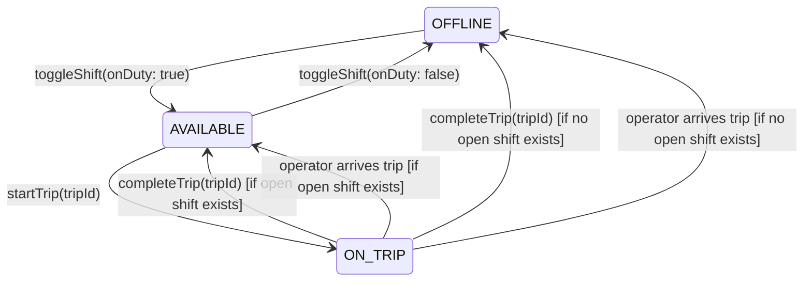

# Driver Identity & Lifecycle State Machines

## 1. Driver Identity Model

A Driver on the Moja Ride platform has a dual-layer identity:
1. **Core Platform Identity (`User`)**: Handled by Better Auth (`packages/db/prisma/schema.prisma#L395-L440`). Stores `id`, `fullName`, `phoneNumber`, `email`, `role = "DRIVER"`, `image`. Drivers authenticate via Phone Number + SMS OTP (`phoneNumberClient` in `apps/driver-app/lib/auth-client.ts`).
2. **Professional Profile (`DriverProfile`)**: 1:1 relation to `User` via `userId` (`packages/db/prisma/schema.prisma#L2287-L2347`). Stores commercial license credentials, platform verification state, operational status, telemetry coordinates, and career reputation metrics.

---

## 2. Comprehensive Driver Lifecycle



---

## 3. Database State Representations

### 3.1 Verification Status (`DriverVerificationStatus`)
Defined in `packages/db/prisma/schema.prisma#L244-L250` and `packages/schemas/src/drivers.ts#L20-L32`:

| Verification Status | Database Enum Value | Meaning & Runtime Permissions |
| :--- | :--- | :--- |
| **Pending** | `PENDING` | Newly created driver. Compliance documents submitted; pending operator or admin review. **Cannot take shifts or start runs** (`canOperateRuns` returns `false`). |
| **Verified** | `VERIFIED` | Driving credentials verified by an operator or platform admin. **Full operational permissions**: can be assigned to trips, toggle duty shifts, start runs, and receive marketplace offers. |
| **Rejected** | `REJECTED` | Compliance document failed inspection. Rejection reason recorded in `rejectionReason`. Driver sees reason in mobile app and can update documents. **Cannot take shifts or start runs**. |
| **Expired** | `EXPIRED` | Driver's commercial license expired (`licenseExpiryDate < now`). Automatically flipped from `VERIFIED` by nightly cron (`/api/cron/expire-driver-licenses`). **Locked from new assignments and shifts**. |
| **Suspended** | `SUSPENDED` | Account suspended by platform admin or operator for disciplinary or safety violations. Middleware restricts driver to read-only access (`driverProcedure` in `apps/web/trpc/init.ts#L327-L334`). |

### 3.2 Live Operational Status (`DriverStatus`)
Defined in `packages/db/prisma/schema.prisma#L235-L242` and `packages/schemas/src/drivers.ts#L8-L19`:

| Status | Enum Value | Operational Meaning |
| :--- | :--- | :--- |
| **Offline** | `OFFLINE` | Driver is off-duty. No active shift logged in `DriverShift`. Not visible as active in fleet live maps. |
| **Available** | `AVAILABLE` | Driver has an active open shift (`DriverShift.endedAt === null`) and is ready for trip dispatch. |
| **On Duty** | `ON_DUTY` | Active on a shift, performing pre-departure duties or resting between proximate legs. |
| **On Trip** | `ON_TRIP` | Currently driving an in-progress trip (`currentTripId !== null`). Actively streaming GPS telemetry. |
| **Resting** | `RESTING` | On break during an active shift (e.g. mandated rest during long-haul intercity route). |
| **Suspended** | `SUSPENDED` | Inactive due to administrative suspension. |

---

## 4. State Transitions & Implementation Triggers

### 4.1 Verification Lifecycle Transitions



| Source State | Target State | Triggering API / Job | Actor / Caller | Preconditions & Validation | Side Effects & Outbox Notifications |
| :--- | :--- | :--- | :--- | :--- | :--- |
| `[*]` | `PENDING` | `drivers.registerDriver` / `drivers.createDriver` | Driver / Operator | Valid name, phone, license number, license expiry date. | If operator-created, generates affiliation. If invite code provided, attaches affiliation. |
| `PENDING` | `VERIFIED` | `drivers.verifyDriver` / `admin.verifyDriver` | Operator / Admin | Driver must have at least one compliance document uploaded (`licenseFrontUrl`, `licenseBackUrl`, or `medicalDocUrl`). | Stamped `verifiedAt = now()`, `verifiedById = user.id`. Enqueues `driver-verification-outcome` outbox event. Driver unlocked for dispatch. |
| `PENDING` | `REJECTED` | `drivers.verifyDriver` / `admin.verifyDriver` | Operator / Admin | `rejectionReason` string supplied. | Stamped `rejectionReason`. Enqueues `driver-verification-outcome` notice with reason to driver. |
| `VERIFIED` | `EXPIRED` | `/api/cron/expire-driver-licenses` | System Cron (Daily) | `licenseExpiryDate < now` AND status is `VERIFIED`. | One-way transition. Enqueues `driver-license-status` (`EXPIRED`) outbox notice to driver and affiliated operators. |
| `VERIFIED` | `SUSPENDED` | `drivers.verifyDriver` / `admin.verifyDriver` | Operator / Admin | Mandatory `rejectionReason` (min 3 chars) when triggered via admin. | Calls `suspendDriverOperationalState` (`apps/web/lib/driver-run-state.ts`): closes open shifts, zeroes earnings accrual, clears `currentTripId`, parks profile at `SUSPENDED`. Enqueues `driver-verification-outcome` notice. |

### 4.2 Operational Run-State Transitions



| Source State | Target State | Triggering API | Preconditions | State Mutations & Side Effects |
| :--- | :--- | :--- | :--- | :--- |
| `OFFLINE` | `AVAILABLE` | `drivers.toggleShift(onDuty: true)` | `verificationStatus === "VERIFIED"`. Multi-affiliation drivers specify `companyId`; single-affiliation defaults to latest hire. | Creates new `DriverShift` with `startedAt = now()`, `endedAt = null`. Updates `DriverProfile.status = "AVAILABLE"`. |
| `AVAILABLE` | `OFFLINE` | `drivers.toggleShift(onDuty: false)` | Driver must not have an active `currentTripId`. | Closes active `DriverShift`: stamps `endedAt = now()`, computes `totalMinutes`. Updates `DriverProfile.status = "OFFLINE"`. |
| `AVAILABLE` / `OFFLINE` | `ON_TRIP` | `drivers.startTrip(tripId)` | Driver is assigned to `tripId` as `PRIMARY`, `RELIEF`, or `CONDUCTOR`. Trip status is `SCHEDULED`, `BOARDING`, or `DELAYED`. Driver is `VERIFIED`. | Updates `Trip.status = "DEPARTED"`, stamps `actualDeparture = now()`. Updates `DriverProfile.status = "ON_TRIP"`, sets `DriverProfile.currentTripId = tripId`. Mints signed telemetry dispatch token (`mintTelemetryDispatchTokenWithCompany`). |
| `ON_TRIP` | `AVAILABLE` / `OFFLINE` | `drivers.completeTrip(tripId)` | Driver holds active `currentTripId === tripId`. | Calls `finalizeTripArrival` (`apps/web/lib/trip-arrival.ts`): updates `Trip.status = "ARRIVED"`, stamps `actualArrival = now()`, stamps `Booking.completedAt = now()` on confirmed bookings. Calls `convergeDriversAfterRunEnd`: clears `currentTripId`, increments `totalTripsCompleted`, sets status to `AVAILABLE` (if open shift) or `OFFLINE` (if no open shift). |
| `ON_TRIP` | `AVAILABLE` / `OFFLINE` | Operator marks arrival on dispatch board (`trips.updateTripStatus`) | Operator has permission `trips:update`. Trip transitions to `ARRIVED` or `CANCELLED`. | Anti-strand convergence: `convergeDriversAfterRunEnd` identifies all drivers with `currentTripId === tripId`, increments `totalTripsCompleted`, clears `currentTripId`, and resets status per open shift status. |

---

## 5. Driver Run-State Anti-Strand Mechanics

The platform enforces the **Never-Strand Invariant** implemented in `apps/web/lib/driver-run-state.ts`:

```typescript
export async function convergeDriversAfterRunEnd(
  db: PrismaClient,
  tripId: string,
): Promise<string[]> {
  const stranded = await db.driverProfile.findMany({
    where: { currentTripId: tripId },
    select: { id: true },
  });
  if (stranded.length === 0) return [];

  const driverIds = stranded.map((d) => d.id);
  const openShifts = await db.driverShift.findMany({
    where: { driverProfileId: { in: driverIds }, endedAt: null },
    select: { driverProfileId: true },
  });
  const onDutyIds = new Set(openShifts.map((s) => s.driverProfileId));
  const offDutyIds = driverIds.filter((id) => !onDutyIds.has(id));

  if (onDutyIds.size > 0) {
    await db.driverProfile.updateMany({
      where: { id: { in: [...onDutyIds] }, currentTripId: tripId },
      data: {
        status: "AVAILABLE",
        currentTripId: null,
        totalTripsCompleted: { increment: 1 },
      },
    });
    await db.driverShift.updateMany({
      where: { driverProfileId: { in: [...onDutyIds] }, endedAt: null },
      data: { tripsCompleted: { increment: 1 } },
    });
  }

  if (offDutyIds.length > 0) {
    await db.driverProfile.updateMany({
      where: { id: { in: offDutyIds }, currentTripId: tripId },
      data: {
        status: "OFFLINE",
        currentTripId: null,
        totalTripsCompleted: { increment: 1 },
      },
    });
  }

  return driverIds;
}
```
