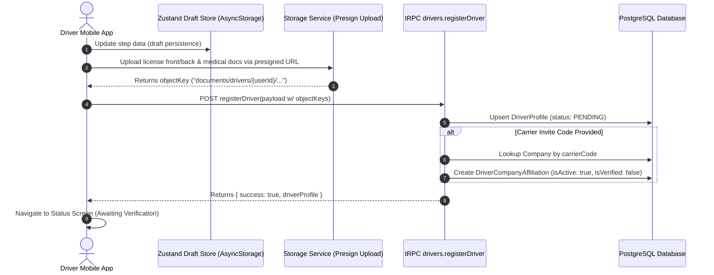
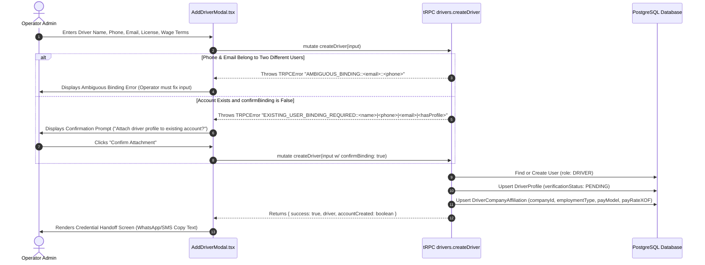

# Driver Registration, Onboarding & Creation Paths

## 1. Onboarding Paths Comparison

Drivers enter the Moja Ride platform through one of two primary pathways:
1. **Driver Self-Registration (Mobile App)**: The driver downloads the mobile app, signs up via Phone SMS OTP, completes a multi-step registration wizard, uploads compliance documents, and optionally enters a carrier invitation code.
2. **Operator Roster Creation (Web ERP Portal)**: An operator administrator adds a driver directly to their company fleet from the Web dashboard (`/dashboard/operator/drivers`), establishing an employment affiliation immediately.

---

## 2. Exhaustive Comparison Matrix

| Architectural Dimension | Path A: Driver Self-Registration (`apps/driver-app`) | Path B: Operator Creation (`apps/web` ERP) |
| :--- | :--- | :--- |
| **Initiator** | Driver on mobile app | Operator Staff with `drivers:create` permission |
| **Primary Entry Point** | `apps/driver-app/app/(auth)/register/index.tsx` | `apps/web/features/operator/components/drivers/add-driver-modal.tsx` |
| **Backend API Route** | `drivers.registerDriver` (`apps/web/trpc/routers/drivers.ts#L1471-L1631`) | `drivers.createDriver` (`apps/web/trpc/routers/drivers.ts#L680-L882`) |
| **Input Schema** | `driverSelfRegisterSchema` (`packages/schemas/src/drivers.ts#L298-L316`) | `createDriverSchema` (`packages/schemas/src/drivers.ts#L92-L115`) |
| **Authentication Flow** | Authenticates first via Phone Number + SMS OTP (`authClient.phoneNumberClient`) before accessing the registration wizard. | Operator creates user account record on behalf of driver, or binds to existing account. |
| **Initial `verificationStatus`** | Always `PENDING` | Always `PENDING` |
| **Initial `DriverProfile.status`**| `OFFLINE` | `OFFLINE` |
| **Company Affiliation** | Optional initially. If `carrierInviteCode` is provided, automatically creates `DriverCompanyAffiliation`. If omitted, driver is independent/unaffiliated until hired via Marketplace. | Immediately creates `DriverCompanyAffiliation` for the operator's `companyId`. |
| **Compliance Documents** | Captured via Expo Camera/Picker; uploaded directly to private storage (`documents/drivers/{userId}/...`) using presigned URLs. | Operator can upload scanned copies, or leave URLs optional for later completion. |
| **Duplicate / Binding Handling** | Tied directly to the authenticated session's `userId`. If user already has a `DriverProfile`, returns existing profile or conflict. | Checks if `email` or `phone` already belongs to an existing `User`. Enforces **Binding Conflict Resolution Protocol** (`EXISTING_USER_BINDING_REQUIRED` / `AMBIGUOUS_BINDING`). |
| **Handoff / Activation** | Driver is already authenticated on the mobile app. | Operator dashboard generates a formatted SMS/WhatsApp handoff text with login instructions for the driver. |
| **Can Receive Trips?** | **No** until verified by an operator or admin. | **No** until verified by the operator via `drivers.verifyDriver` or platform admin via `admin.verifyDriver`. |
| **Can Receive Marketplace Offers?** | **Yes**, once verified and marketplace preference enabled. | **Yes**, once verified and marketplace preference enabled. |

---

## 3. Path A: Mobile Self-Registration Deep Dive

### 3.1 Wizard Flow Architecture
The mobile driver registration wizard is orchestrated across 5 modular screens in `apps/driver-app/app/(auth)/register/`:
* **Step 1: Personal Demographics & Selfie** (`index.tsx`): Full name, phone number, years of commercial driving experience, profile selfie capture.
* **Step 2: Commercial License** (`license.tsx`): License number, License category (`B`, `C`, `D`, `E`), License expiration date, License Front/Back photos.
* **Step 3: Identity & Medical** (`documents.tsx`): National ID number (`nationalIdNumber`), Medical clearance certificate photo (`medicalDocUri`).
* **Step 4: Carrier Association** (`carrier.tsx`): Optional carrier invite code, employment model preference (`EXCLUSIVE_INTERCITY`, `CONTRACTOR_URBAN`, `HYBRID`).
* **Step 5: Submission & Status** (`status.tsx`): Submits full payload to `drivers.registerDriver` and displays review progress.



### 3.2 Draft Persistence (`useDriverRegistrationStore`)
The wizard state is persisted to `AsyncStorage` via Zustand in `apps/driver-app/stores/driver-registration.ts`, allowing drivers to resume registration after app restarts.

---

## 4. Path B: Operator-Created Driver Deep Dive

When an operator adds a driver from the ERP Dashboard (`AddDriverModal.tsx`), the backend must handle cross-tenant identity deduplication and account security.



### 4.1 Binding Conflict Protocol Implementation
Implemented in `apps/web/trpc/routers/drivers.ts#L705-L775`:

1. **Ambiguous Binding Guard**:
   ```typescript
   if (existingUserByEmail && existingUserByPhone && existingUserByEmail.id !== existingUserByPhone.id) {
     throw new TRPCError({
       code: "CONFLICT",
       message: `AMBIGUOUS_BINDING::${maskIdentifier(existingUserByEmail.email)}::${maskIdentifier(existingUserByPhone.phoneNumber)}`,
     });
   }
   ```
2. **Explicit Confirmation Guard**:
   If an existing account is found and `input.confirmBinding !== true`, the procedure throws:
   ```typescript
   throw new TRPCError({
     code: "CONFLICT",
     message: `EXISTING_USER_BINDING_REQUIRED::${maskName(targetUser.fullName)}|${maskIdentifier(targetUser.phoneNumber)}|${maskIdentifier(targetUser.email)}|${targetUser.driverProfile ? "1" : "0"}`,
   });
   ```
3. **Driver Profile Attachment**:
   When confirmed, creates the `DriverProfile` attached to the existing `User`, changes `User.role` to `"DRIVER"` (if not already), and creates the `DriverCompanyAffiliation`.

---

## 5. Credential Handoff & Driver Activation

When an operator adds a driver, no temporary password or insecure credentials are generated. The platform relies on **Passwordless Phone OTP Authentication**:

```text
Moja Ride — Driver onboarding

You have been added to your company's fleet on Moja Ride.
1. Install the “Moja Ride Driver” app.
2. Log in with your phone number +2250700000000 using the SMS verification code.

No password needed. See you on the road!
```

The operator shares this directly via the native Web Share API or Clipboard from `AddDriverModal.tsx#L191-L217`. When the driver logs into the mobile app with that phone number, Better Auth authenticates them, and `driverProcedure` resolves their pre-created `DriverProfile` and company affiliation.
