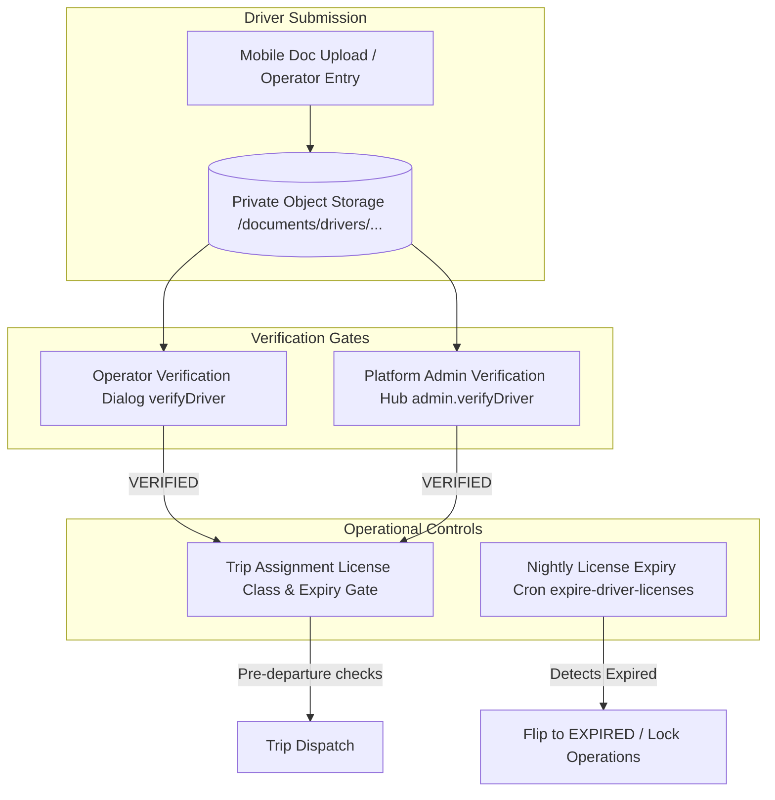

# Compliance Documents, Licensing & Verification

## 1. Professional Licensing & Compliance Architecture

The Moja Ride platform implements strict legal and safety compliance controls modeled on Côte d'Ivoire commercial passenger transport regulations.



---

## 2. Commercial License Categories

The platform represents commercial driving categories via `LicenseCategory` (`packages/db/prisma/schema.prisma#L265-L270` and `packages/schemas/src/drivers.ts#L43-L45`):

```typescript
export const LICENSE_CATEGORIES = ["B", "C", "D", "E"] as const;
export type LicenseCategory = (typeof LICENSE_CATEGORIES)[number];
```

### 2.1 License Hierarchy & Class Ordering
Defined in `packages/schemas/src/drivers.ts#L160-L172`:
```typescript
const LICENSE_ORDER = ["B", "C", "D", "E"] as const;

export function licenseMeetsRequirement(
  driverLicense: string,
  required: string | null | undefined,
): boolean {
  if (!required) return true;
  const di = LICENSE_ORDER.indexOf(driverLicense as (typeof LICENSE_ORDER)[number]);
  const ri = LICENSE_ORDER.indexOf(required as (typeof LICENSE_ORDER)[number]);
  if (di === -1) return false;
  return di >= ri;
}
```

| Category | Vehicle Suitability | Minimum Requirements & Permissions |
| :--- | :--- | :--- |
| **Class B** | Light Passenger Vehicles / Small Vans (<= 8 seats) | Sub-commercial license. Hard-blocked from driving Class D commercial coaches and Intercity bus types. |
| **Class C** | Medium Goods Vehicles | Heavy vehicle license. Cannot operate commercial passenger coaches without D classification. |
| **Class D** | **Standard Intercity Commercial Buses & Coaches** (Default) | Standard commercial passenger transport license. Cleared for intercity and urban passenger bus types (`BusType.requiredLicenseCategory === "D"`). |
| **Class E** | Articulated / Heavy High-Capacity Coaches | Highest commercial rating. Satisfies all bus requirements ($E \ge D \ge C \ge B$). |

---

## 3. Compliance Document Management & Security

### 3.1 Document Types & Storage Purposes
Defined in `apps/web/features/driver/lib/driver-doc-access.ts#L16-L31`:

| Document Purpose | Code Identifier | Target Profile Column | Storage Path Segment |
| :--- | :--- | :--- | :--- |
| **License Front** | `driver-license-front` | `DriverProfile.licenseFrontUrl` | `license-front` |
| **License Back** | `driver-license-back` | `DriverProfile.licenseBackUrl` | `license-back` |
| **Medical Clearance**| `driver-medical-doc` | `DriverProfile.medicalDocUrl` | `medical` |
| **Driver Selfie** | `driver-selfie` | User Profile Image | `selfie` |

### 3.2 Private Namespace Path Pattern
All driver compliance documents are stored in private object storage following the deterministic namespace pattern:
```text
documents/drivers/{driverUserId}/{segment}/{fileName}
```

### 3.3 Authorization & Presigned Download Protocol
Device-local `file://` URIs and public raw URLs are prohibited. The backend exposes two presigning endpoints that enforce namespace ownership via `driverDocKeyMatches`:
1. **Operator Presign (`drivers.presignDoc`)**: Implemented in `apps/web/trpc/routers/drivers.ts#L670-L678`. Caller must be an active operator affiliated with the driver's company (`DriverCompanyAffiliation.isActive === true`).
2. **Admin Presign (`admin.presignDoc`)**: Implemented in `apps/web/trpc/routers/admin.ts#L3042-L3047`. Caller must hold admin permission `drivers:verify.read`.

---

## 4. Verification Workflow & Approval Hubs

### 4.1 Operator Compliance Verification (`drivers.verifyDriver`)
* **Endpoint**: `apps/web/trpc/routers/drivers.ts#L1033-L1141`.
* **Required Permission**: `drivers:verify`.
* **Validation Rule**: An operator cannot approve a driver without compliance evidence. If `!driver.licenseFrontUrl && !driver.licenseBackUrl && !driver.medicalDocUrl`, the procedure throws `BAD_REQUEST: "Attach at least one compliance document (licence or medical) before approving this driver."`.
* **State Mutations**: Updates `DriverProfile.verificationStatus = "VERIFIED"`, stamps `verifiedAt = now()`, `verifiedById = user.id`. Updates affiliation `isVerified = true`.

### 4.2 Platform Admin Verification Hub (`admin.verifyDriver`)
* **Endpoint**: `apps/web/trpc/routers/admin.ts#L2915-L3035`.
* **Required Permission**: `drivers:verify.manage`.
* **Actions Supported**: `APPROVE`, `REJECT`, `SUSPEND`.
* **Audit Trail**: Writes an immutable row to `AdminStaffActivityLog` (`action: "DRIVER_VERIFY_APPROVE" | "DRIVER_VERIFY_REJECT" | "DRIVER_VERIFY_SUSPEND"`).
* **Driver Notification**: Inside the database transaction, enqueues `driver-verification-outcome` into the transactional outbox (`enqueueDriverVerificationOutcome` in `apps/web/features/notifications/outbox/driver-compliance.ts#L56-L84`).

---

## 5. Operational Verification Gates & Expiry Lifecycle

### 5.1 License Usability Through Trip Arrival (`isLicenseUsableThrough`)
The platform enforces that a license must remain valid **for the entire duration of the trip**, not just at departure time (`packages/schemas/src/drivers.ts#L185-L191`):

```typescript
export function isLicenseUsableThrough(
  licenseExpiryDate: Date | string | null | undefined,
  throughDate: Date,
): boolean {
  if (!licenseExpiryDate) return true;
  return new Date(licenseExpiryDate).getTime() >= throughDate.getTime();
}
```

During trip assignment (`trips.assignDriver` in `apps/web/trpc/routers/trips.ts#L1852-L1860`):
```typescript
const licenceThrough = trip.estimatedArrival ?? trip.departureDate;
if (!isLicenseUsableThrough(driver.licenseExpiryDate, licenceThrough)) {
  throw new TRPCError({
    code: "BAD_REQUEST",
    message: `Cannot assign driver: their license expires ${driver.licenseExpiryDate ? new Date(driver.licenseExpiryDate).toISOString().slice(0, 10) : "before"} this trip ends (${licenceThrough.toISOString().slice(0, 10)}).`,
  });
}
```

### 5.2 Nightly License Expiry Cron (`/api/cron/expire-driver-licenses`)
Runs daily at 02:00 UTC (`apps/web/app/api/cron/expire-driver-licenses/route.ts`):
1. **Lapsed License Expiration**:
   Queries all `VERIFIED` drivers where `licenseExpiryDate < now()`. Flips `verificationStatus` from `VERIFIED` to `EXPIRED`.
2. **Expiring-Soon Lookahead Warnings**:
   Queries all `VERIFIED` drivers where `licenseExpiryDate` is within 30 days (`now <= licenseExpiryDate < now + 30 days`).
3. **Outbox Notification Fan-out**:
   Enqueues `driver-license-status` notices for drivers and all affiliated operators via `enqueueDriverLicenseStatus`. Self-dedupes using monthly idempotency keys (`driver-license-{kind}-{driverId}-{YYYY-MM}`).
