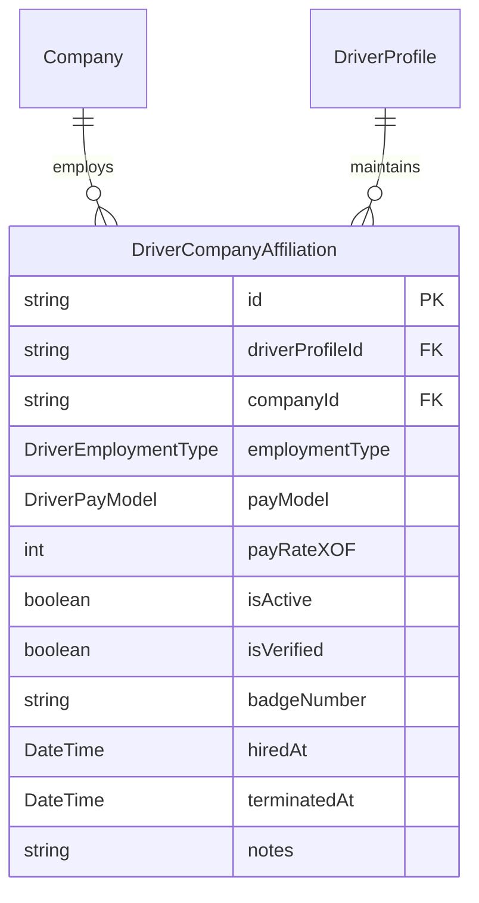
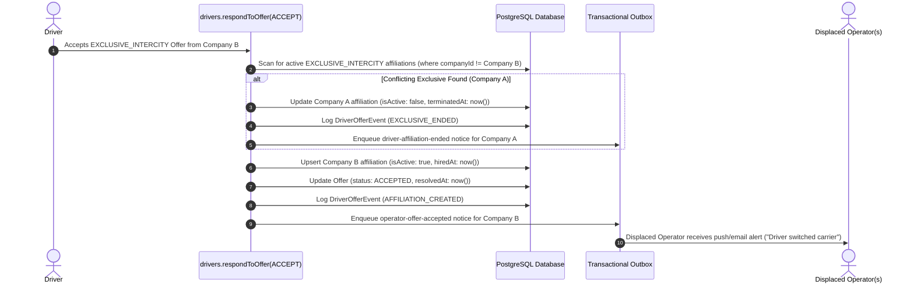

# Driver ↔ Operator Affiliation & Employment Models

## 1. Affiliation Domain Architecture

The legal, operational, and financial relationship between a commercial driver and a bus operating company is represented by the `DriverCompanyAffiliation` entity (`packages/db/prisma/schema.prisma#L2350-L2373`).



---

## 2. Employment Models (`DriverEmploymentType`)

Defined in `packages/db/prisma/schema.prisma#L252-L256` and `packages/schemas/src/drivers.ts#L34-L41`:

```typescript
export const DRIVER_EMPLOYMENT_TYPES = [
  "EXCLUSIVE_INTERCITY",
  "CONTRACTOR_URBAN",
  "HYBRID",
] as const;
export type DriverEmploymentType = (typeof DRIVER_EMPLOYMENT_TYPES)[number];
```

| Employment Type | Operational Constraints & Platform Rules | Permitted Multi-Affiliations | Trip Eligibility |
| :--- | :--- | :--- | :--- |
| **`EXCLUSIVE_INTERCITY`** | Dedicated long-haul passenger coach driver. Subject to the **One-Active-Exclusive Rule**. Full-time commitment to a single carrier. | **Single active carrier only**. Accepting another exclusive offer auto-terminates previous exclusive contracts. | Intercity long-haul routes (`ServiceType === "INTERCITY"`). Soft-warned on Urban routes. |
| **`CONTRACTOR_URBAN`** | Short-distance urban shuttle driver (e.g. Abidjan communal lines). Independent contractor model. | **Multiple concurrent operators permitted**. May hold active affiliations across multiple urban transport operators simultaneously. | Urban routes (`ServiceType === "URBAN"`). **Hard-blocked** from Intercity trips. |
| **`HYBRID`** | Versatile driver operating both urban feeder routes and scheduled intercity runs on demand. | Multiple concurrent operators permitted, subject to operator agreement. | Both `INTERCITY` and `URBAN` routes. |

---

## 3. The One-Active-Exclusive Affiliation Rule

### 3.1 Platform Invariant
To prevent driver abandonment, scheduling chaos, and contractual disputes on long-haul corridors, the platform enforces:
> **A driver may hold at most ONE active `EXCLUSIVE_INTERCITY` affiliation across the entire platform at any given time.**

### 3.2 Automated Conflict Resolution Pipeline
When a driver accepts an `EXCLUSIVE_INTERCITY` offer (or an operator accepts a counteroffer for an exclusive position), the resolution engine executes `resolveAcceptance` (`apps/web/trpc/routers/drivers.ts#L217-L353`):



### 3.3 Concurrency Protection
In `resolveAcceptance`, the upsert operation is guarded against race conditions where two concurrent acceptances race past the conflict sweep:
```typescript
try {
  await tx.driverCompanyAffiliation.upsert({
    where: {
      driverProfileId_companyId: {
        driverProfileId: driver.id,
        companyId: offer.companyId,
      },
    },
    create: { /* ... */ },
    update: { /* ... */ },
  });
} catch (err: unknown) {
  if (err && typeof err === "object" && "code" in err && String((err as { code: unknown }).code) === "P2002") {
    throw new TRPCError({
      code: "CONFLICT",
      message: "A concurrent affiliation change was detected. Please try again.",
    });
  }
  throw err;
}
```

---

## 4. Compensation & Wage Models (`DriverPayModel`)

Defined in `packages/db/prisma/schema.prisma#L258-L263` and `packages/schemas/src/drivers.ts#L47-L53`:

```typescript
export const DRIVER_PAY_MODELS = ["HOURLY", "PER_TRIP", "MONTHLY_SALARY"] as const;
export type DriverPayModel = (typeof DRIVER_PAY_MODELS)[number];
```

Each affiliation stores its contractual compensation parameters:
* `payModel`: Specifies the pay calculation strategy (`HOURLY`, `PER_TRIP`, `MONTHLY_SALARY`).
* `payRateXOF`: The contractual wage in CFA Francs (XOF).
  * For `HOURLY`: Rate per hour (e.g. `3,000` XOF/hr $\rightarrow$ `50` XOF/min).
  * For `PER_TRIP`: Flat payout per completed trip (e.g. `15,000` XOF/trip).
  * For `MONTHLY_SALARY`: Fixed monthly wage (e.g. `250,000` XOF/month $\rightarrow$ amortized daily).

---

## 5. Roster Removal & Re-Hiring Protocol

### 5.1 Removing a Driver from Fleet (`drivers.deleteDriverAffiliation`)
* **Endpoint**: `apps/web/trpc/routers/drivers.ts#L1143-L1231`.
* **Required Permission**: `drivers:delete`.
* **In-Flight Safety Guard**: If the driver is currently on a trip assigned by this company (`currentTripId` points to a trip owned by `ctx.companyId`), the removal is rejected:
  ```typescript
  if (driver.currentTrip && driver.currentTrip.companyId === ctx.companyId) {
    throw new TRPCError({
      code: "BAD_REQUEST",
      message: "Cannot remove driver while they are currently operating an active trip for your company.",
    });
  }
  ```
* **Soft Deletion**: Does not destroy historical records. Updates `DriverCompanyAffiliation.isActive = false`, stamps `terminatedAt = now()`.
* **Notification**: Enqueues `driver-roster-removed` outbox notification (`apps/web/features/notifications/outbox/driver-offers.ts#L318-L342`) alerting the driver.

### 5.2 Re-Hiring Driver
If an operator later re-hires a previously terminated driver (either via `createDriver` or through the Offer Board), the system uses `upsert` on `driverProfileId_companyId`:
* Flips `isActive` to `true`.
* Clears `terminatedAt = null`.
* Updates `hiredAt = now()`.
* Updates notes to record the re-hire event (`"Re-hired via Moja offer ..."`).
