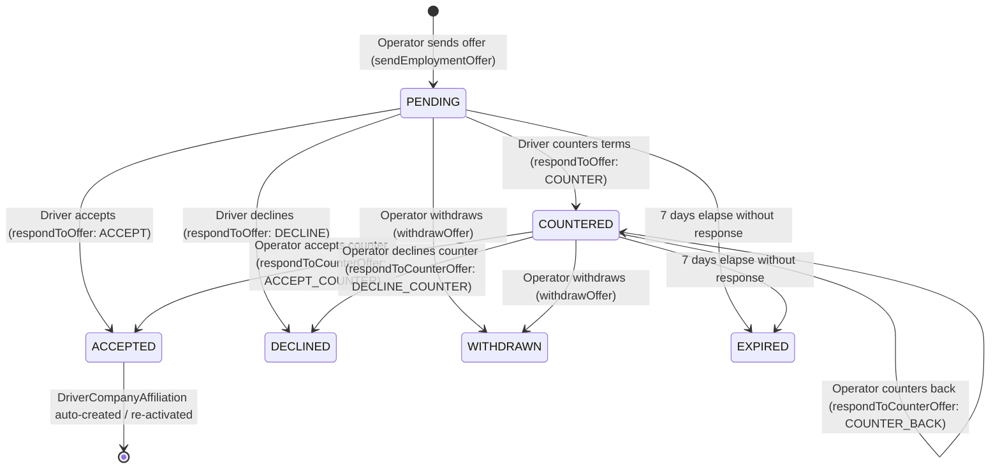
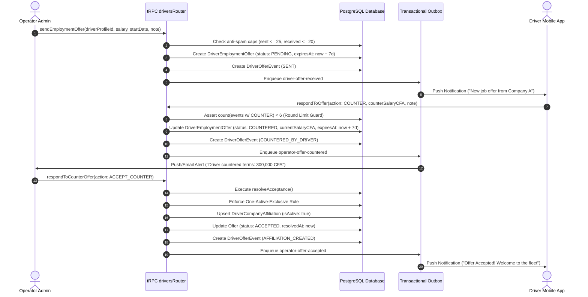

# Driver Marketplace & Employment Offer Board

## 1. Domain Overview

The **Driver Marketplace & Offer Board** replaces informal, unmonitored driver recruiting with a structured, audited negotiation workflow. Operators discover vetted commercial drivers, evaluate trust metrics, and transmit legally structured employment offers. Drivers review, counter, or accept offers on mobile.



---

## 2. Driver Service Preferences (`DriverServicePreference`)

Drivers configure their marketplace visibility via `DriverServicePreference` (`packages/db/prisma/schema.prisma#L2450-L2480`), managed through `drivers.setServicePreference` (`apps/web/trpc/routers/drivers.ts#L2967-L2994`):

| Field | Database Type | Description & Purpose |
| :--- | :--- | :--- |
| `isAvailableForHire` | `Boolean` (default: `false`) | Opt-in toggle. When `true`, driver appears in operator marketplace searches. |
| `preferredType` | `DriverEmploymentType` | Preferred model: `EXCLUSIVE_INTERCITY`, `CONTRACTOR_URBAN`, `HYBRID`. |
| `cityBase` | `String?` | Operating hub city from `CIV_CITY_HUBS` (`"Abidjan"`, `"Bouaké"`, `"Yamoussoukro"`, `"Daloa"`, `"Korhogo"`, `"San-Pédro"`, `"Man"`, `"Gagnoa"`, etc.). |
| `routeExperience` | `String[]` | Corridors the driver has proven experience on (e.g. `["Abidjan-Bouaké", "Abidjan-Yamoussoukro"]`). |
| `bio` | `String? @db.Text` | Professional statement. |
| `isFeatured` | `Boolean` (default: `false`) | Administrative promotion badge for top-tier drivers (capped at 20). |
| `isSuspended` | `Boolean` (default: `false`) | Admin disciplinary suspension from the marketplace. |

---

## 3. Structured Employment Offers (`DriverEmploymentOffer`)

Represented in `packages/db/prisma/schema.prisma#L2486-L2529`:

```prisma
model DriverEmploymentOffer {
  id                 String               @id @default(cuid())
  companyId          String
  driverProfileId    String
  employmentType     DriverEmploymentType @default(EXCLUSIVE_INTERCITY)
  
  // Immutable initial proposal
  initialSalaryCFA   Int
  initialStartDate   DateTime?
  initialNote        String?
  
  // Current effective terms (latest negotiation round)
  currentSalaryCFA   Int
  currentStartDate   DateTime?
  currentNote        String?
  
  status             DriverOfferStatus    @default(PENDING)
  expiresAt          DateTime
  firstViewedAt      DateTime?
  respondedAt        DateTime?
  resolvedAt         DateTime?
  createdById        String?
  
  events             DriverOfferEvent[]
  // ...
}
```

### 3.1 Constants & Business Rules
Defined in `packages/schemas/src/drivers.ts#L496-L502`:
* `MAX_ACTIVE_SENT_OFFERS_PER_COMPANY = 25`: Anti-spam cap on active outgoing offers per operator.
* `MAX_ACTIVE_RECEIVED_OFFERS_PER_DRIVER = 20`: Anti-spam cap on active incoming offers per driver.
* `OFFER_EXPIRY_DAYS = 7`: Rolling expiration window refreshed on every counteroffer (+7 days).
* `MAX_COUNTER_ROUNDS = 6`: Hard limit on counteroffer iterations to prevent infinite negotiation loops.
* `salaryCFASchema`: Minimum `1,000` CFA, Maximum `10,000,000` CFA, integer only.

---

## 4. Multi-Round Negotiation Protocol



---

## 5. Append-Only Offer Event History (`DriverOfferEvent`)

Defined in `packages/db/prisma/schema.prisma#L2534-L2553`:
```prisma
model DriverOfferEvent {
  id          String               @id @default(cuid())
  offerId     String
  eventType   DriverOfferEventType
  actorType   String               // COMPANY | DRIVER | SYSTEM
  actorUserId String?
  salaryCFA   Int?
  startDate   DateTime?
  note        String?              @db.Text
  createdAt   DateTime             @default(now())
}
```

### Event Types (`DriverOfferEventType`):
* `SENT`: Initial proposal created by operator.
* `VIEWED`: Driver opened the offer details on mobile.
* `COUNTERED_BY_DRIVER`: Driver submitted altered salary/dates.
* `COUNTERED_BY_OPERATOR`: Operator submitted counter-terms.
* `ACCEPTED`: Offer accepted (by driver or operator).
* `DECLINED`: Offer declined.
* `WITHDRAWN`: Operator cancelled the offer.
* `EXPIRED`: 7-day rolling window elapsed unanswered.
* `AFFILIATION_CREATED`: Contract finalized; affiliation active.
* `EXCLUSIVE_ENDED`: Displaced operator's affiliation terminated.

---

## 6. Platform Admin Marketplace Governance

Admin controls in `apps/web/trpc/routers/admin.ts#L3050-L3500` require permission `marketplace:manage`:

| Admin Action | Implementation Details | Constraints & Side Effects |
| :--- | :--- | :--- |
| **`FEATURE`** | Promotes driver profile to top of marketplace searches. | Capped at `MAX_FEATURED_DRIVERS = 20`. Enqueues `driver-marketplace-featured` notice. |
| **`UNFEATURE`** | Removes featured status. | Frees slot under the 20-driver cap. |
| **`SUSPEND`** | Disciplinary removal from marketplace (`isSuspended = true`). | **Mandatory reason** (`reason` min 3 chars). Logs to `AdminStaffActivityLog`. Enqueues `driver-marketplace-suspended` notice. Clears featured status. |
| **`RESTORE`** | Re-enables suspended driver in marketplace. | Restores visibility; does not auto-feature. |
