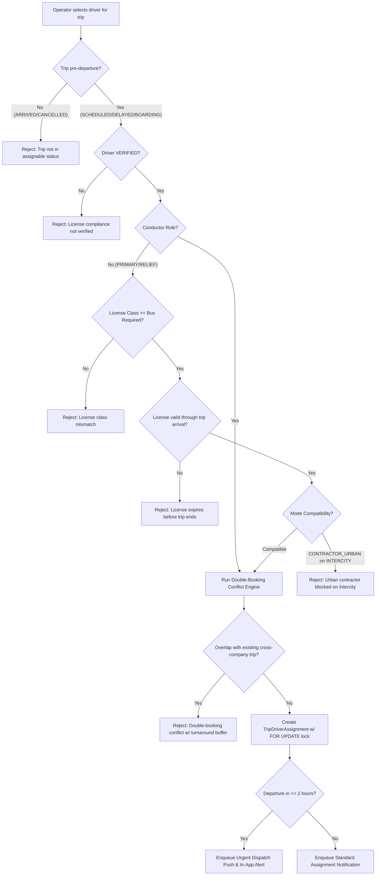

# Trip Assignment, Dispatch & Double-Booking Engine

## 1. Domain Overview

Trip Assignment connects verified drivers to operational departures. The assignment engine enforces multi-operator schedule de-confliction, vehicle license class matching, license expiration boundaries, and urgent dispatch response workflows.



---

## 2. Double-Booking & Conflict Detection Engine

The core scheduling algorithm is implemented in `apps/web/lib/driver-assignment.ts`.

### 2.1 Assignment Interval Calculation (`driverInterval`)
Calculates the operational start and end time for a driver assignment:
```typescript
export function driverInterval(
  departureDate: Date,
  estimatedArrival: Date | null | undefined,
  serviceType: string,
  routeDistanceKm?: number | null,
): { startMs: number; endMs: number } {
  const startMs = new Date(departureDate).getTime();
  const fallbackMinutes =
    serviceType === "URBAN"
      ? URBAN_TRIP_DEFAULT_MINUTES        // 120 minutes (2 hours)
      : INTERCITY_TRIP_DEFAULT_MINUTES;  // 480 minutes (8 hours)
      
  const endMs = estimatedArrival
    ? new Date(estimatedArrival).getTime()
    : routeDistanceKm && routeDistanceKm > 0
      ? startMs + (routeDistanceKm / FALLBACK_EFFECTIVE_SPEED_KMH) * 60 * 60 * 1000 // 35 km/h fallback
      : startMs + fallbackMinutes * 60 * 1000;
      
  return { startMs, endMs };
}
```

### 2.2 Turnaround Buffer Semantics
A mandatory turnaround window of `DRIVER_TURNAROUND_BUFFER_MINUTES = 45` is enforced between assignments (`packages/schemas/src/drivers.ts#L152`):
$$\text{Overlap Condition} \iff (\text{Target}_{\text{start}} < \text{Existing}_{\text{end}} + 45\text{min}) \land (\text{Existing}_{\text{start}} < \text{Target}_{\text{end}} + 45\text{min})$$

### 2.3 Cross-Company Double-Booking Scan (`getDriverTripConflict`)
Scans all active assignments across **all operators** on the platform (`status IN ["SCHEDULED", "BOARDING", "DEPARTED", "DELAYED"]`):
```typescript
const conflict = await getDriverTripConflict(tx, driverProfileId, {
  departureDate: trip.departureDate,
  estimatedArrival: trip.estimatedArrival,
  serviceType: trip.serviceType,
  routeDistanceKm: assignRoute?.distanceKm ?? null,
  excludeTripId: tripId,
});
if (conflict) {
  throw new TRPCError({
    code: "CONFLICT",
    message: `Driver is already booked on "${conflict.routeName}"${conflict.companyName ? ` (${conflict.companyName})` : ""} — busy until ${conflict.busyUntilIso.substring(11, 16)} UTC including turnaround.`,
  });
}
```

---

## 3. Assignment Concurrency & Locking Protocol

To prevent double-assignments when multiple dispatchers operate simultaneously, `trips.assignDriver` (`apps/web/trpc/routers/trips.ts#L1894-L1903`) acquires explicit Postgres row-level locks inside a transaction:
```sql
SELECT id FROM "trip" WHERE id = $tripId FOR UPDATE;
SELECT id FROM "driver_profile" WHERE id = $driverProfileId FOR UPDATE;
```
*Note*: `trips.unassignDriver` follows the exact same lock order (`trip` then `driver_profile`) to prevent deadlocks.

---

## 4. Urgent Dispatch Window & Modal Gate

### 4.1 Urgent Dispatch Classification
Departures occurring within `URGENT_DISPATCH_WINDOW_HOURS = 2` hours are classified as urgent:
$$\text{Urgent} \iff 0 < (\text{DepartureDate} - \text{Now}) \le 120\text{ minutes}$$

### 4.2 Server-Side Acknowledgment (`urgentDispatchAckAt`)
* **Problem Solved**: Earlier client-only acknowledgments stored in AsyncStorage disappeared on app re-install or re-login, causing alarming modals to re-fire repeatedly.
* **Implementation**: `TripDriverAssignment` contains `urgentDispatchAckAt DateTime?` (`packages/db/prisma/schema.prisma#L2387`).
* **Query Exclusion**: `drivers.getMyUrgentDispatches` (`apps/web/trpc/routers/drivers.ts#L3871-L3977`) excludes any assignment where `urgentDispatchAckAt !== null`.
* **Acknowledgment Mutation**: Driver tapping "Accept" or "Decline" calls `drivers.acknowledgeUrgentDispatch` (`apps/web/trpc/routers/drivers.ts#L3979-L4004`), permanently stamping the server row.

### 4.3 Mobile Urgent Dispatch Modal UI
When the driver mobile app mounts (`apps/driver-app/components/urgent-dispatch-gate.tsx`), it polls `drivers.getMyUrgentDispatches` every 60 seconds. If an unacknowledged urgent run exists, it renders the full-screen `UrgentDispatchModal` (`apps/driver-app/features/dispatch/components/urgent-dispatch-modal.tsx`), highlighting:
* Departure countdown timer (e.g. `Départ dans 45 min`).
* Route origin and destination terminals.
* Vehicle registration plate (`Bus Plate`).
* Booked passenger count vs. total seat capacity.

---

## 5. Delay-Induced Conflict Revalidation

When a driver reports a delay (`drivers.reportTripDelay`) or an operator modifies a schedule departure time (`trips.updateTrip`), the departure window shifts. This can cause a previously conflict-free downstream assignment to overlap.

Implemented in `apps/web/trpc/routers/trips.ts#L1108-L1168`:
1. The backend re-runs `getDriverTripConflict` for all drivers on the shifted trip.
2. If a new conflict is detected, it enqueues an `operator-driver-assignment-conflict` outbox event (`enqueueOperatorDriverAssignmentConflict`).
3. The operator receives an immediate high-priority alert with the conflicting route name, company, and new required turnaround time.
