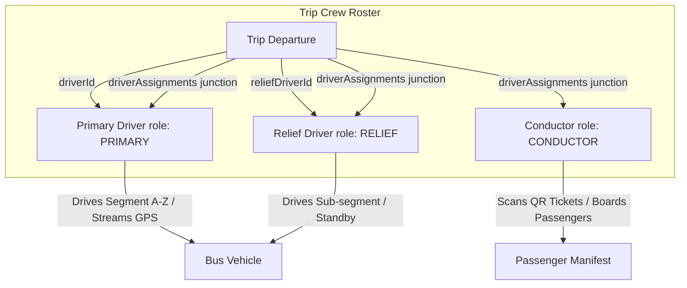

# Crew Model: Primary Driver, Relief Driver & Conductor

## 1. Crew Model Architecture

Commercial bus operations on the Moja Ride platform utilize a three-role crew model orchestrated via `TripDriverAssignment` junction records (`packages/db/prisma/schema.prisma#L2375-L2400`):



---

## 2. Crew Role Comparison

| Characteristic | Primary Driver (`PRIMARY`) | Relief Driver (`RELIEF`) | Conductor (`CONDUCTOR`) |
| :--- | :--- | :--- | :--- |
| **Prisma Trip Foreign Key** | Stored in `Trip.driverId` AND `TripDriverAssignment` | Stored in `Trip.reliefDriverId` AND `TripDriverAssignment` | Stored **only** in `TripDriverAssignment` junction |
| **Commercial License Check** | Required. Must satisfy `BusType.requiredLicenseCategory` ($E \ge D \ge C \ge B$). | Required. Must satisfy `BusType.requiredLicenseCategory` ($E \ge D \ge C \ge B$). | **Exempt**. Driving license not checked; only `verificationStatus === "VERIFIED"` required. |
| **License Expiry Gate** | Must be valid through trip estimated arrival (`isLicenseUsableThrough`). | Must be valid through trip estimated arrival (`isLicenseUsableThrough`). | **Exempt** from license expiration checks. |
| **Mode Compatibility** | `CONTRACTOR_URBAN` hard-blocked on `INTERCITY`. | `CONTRACTOR_URBAN` hard-blocked on `INTERCITY`. | **Exempt** from mode compatibility checks. |
| **Start / Complete Run** | **Yes** (`drivers.startTrip`, `drivers.completeTrip`). Sets `currentTripId` and transitions status to `ON_TRIP`. | **Yes**. Relief driver can start/complete in lieu of or alongside Primary. | **Yes** if operating in conductor-managed boarding mode. |
| **GPS Telemetry Streaming** | **Primary Streamer**. Mints signed telemetry dispatch token. | Fallback streamer if primary device offline. | Does not stream driving telemetry. |
| **Passenger QR Scanning** | Allowed (`drivers.checkInPassenger`). | Allowed (`drivers.checkInPassenger`). | **Primary Scanner & Ticket Validator**. |
| **Manifest Access** | Allowed (`drivers.getMyTripManifest`). | Allowed (`drivers.getMyTripManifest`). | Allowed (`drivers.getMyTripManifest`). |
| **Distance Credit (Stats)** | Earns full route distance (or start-to-end segment distance). | Earns proportional sub-span distance via stop order ratio. | Earns zero driving distance credit. |

---

## 3. Relief Driver Segment Spans & Distance Scaling

### 3.1 Partial Span Sub-Segments
Relief drivers are frequently assigned to specific dangerous or long segments of a journey (e.g. night mountain passes or legs exceeding 4 continuous driving hours).
`TripDriverAssignment` tracks partial spans via:
* `startStopOrder` (integer, default `0`): Waypoint stop order index where relief takes the wheel.
* `endStopOrder` (integer, nullable): Waypoint stop order index where relief hands control back.

### 3.2 Proportional Distance Credit Calculation (`computeSegmentDistanceKm`)
Implemented in `apps/web/lib/telemetry-reconcile.ts` and executed during the nightly stats reconciliation cron (`/api/cron/reconcile-driver-stats`):

```typescript
export function computeSegmentDistanceKm(input: {
  startStopOrder: number;
  endStopOrder?: number | null;
  stops: ReconcileStopCoordinate[];
  routeDistanceKm: number;
}): number {
  const { startStopOrder, endStopOrder, stops, routeDistanceKm } = input;
  
  // Full-span assignment: 100% of route distance
  if (startStopOrder === 0 && (endStopOrder == null || endStopOrder >= stops.length - 1)) {
    return routeDistanceKm;
  }
  
  // Compute Haversine chain distances between stop coordinates
  let totalChainMeters = 0;
  let segmentChainMeters = 0;
  
  for (let i = 0; i < stops.length - 1; i++) {
    const s1 = stops[i];
    const s2 = stops[i + 1];
    if (s1?.latitude && s1?.longitude && s2?.latitude && s2?.longitude) {
      const legMeters = calculateHaversineDistanceMeters(s1.latitude, s1.longitude, s2.latitude, s2.longitude);
      totalChainMeters += legMeters;
      if (i >= startStopOrder && (endStopOrder == null || i < endStopOrder)) {
        segmentChainMeters += legMeters;
      }
    }
  }
  
  if (totalChainMeters === 0) return routeDistanceKm;
  const ratio = segmentChainMeters / totalChainMeters;
  return Math.round(routeDistanceKm * ratio * 10) / 10;
}
```

---

## 4. Conductor Role & Boarding Ownership

### 4.1 Legal & Contractual Exemption
In West African intercity transit, conductors handle ticketing, luggage stowage, passenger manifest checks, and in-cabin assistance, but do not operate the bus steering wheel. The platform enforces this distinction in `trips.assignDriver` (`apps/web/trpc/routers/trips.ts#L1835-L1879`):

```typescript
const isConductor = role === "CONDUCTOR";

if (!isConductor) {
  // Enforce commercial license class match
  const requiredLicense = trip.bus?.busType?.requiredLicenseCategory;
  if (requiredLicense && !licenseMeetsRequirement(driver.licenseCategory, requiredLicense)) {
    throw new TRPCError({
      code: "BAD_REQUEST",
      message: `License mismatch: bus requires class ${requiredLicense}; driver holds ${driver.licenseCategory}.`,
    });
  }

  // Enforce license validity through trip arrival
  const licenceThrough = trip.estimatedArrival ?? trip.departureDate;
  if (!isLicenseUsableThrough(driver.licenseExpiryDate, licenceThrough)) {
    throw new TRPCError({
      code: "BAD_REQUEST",
      message: "Driver license expires before trip arrival.",
    });
  }

  // Enforce mode compatibility
  if (employmentType === "CONTRACTOR_URBAN" && trip.serviceType === "INTERCITY") {
    throw new TRPCError({
      code: "BAD_REQUEST",
      message: "Cannot assign an urban contractor to an intercity trip.",
    });
  }
}
```

### 4.2 Shared Manifest & Check-In Authority
All crew members assigned to a trip (`PRIMARY`, `RELIEF`, or `CONDUCTOR`) possess equal authority to:
1. Fetch the real-time passenger manifest (`drivers.getMyTripManifest`).
2. Perform QR ticket camera check-ins (`DriverCheckInService.scanCheckIn`).
3. Perform manual passenger check-ins (`DriverCheckInService.manualCheckIn`).
4. Flush offline scan queues (`DriverCheckInService.batchSync`).
