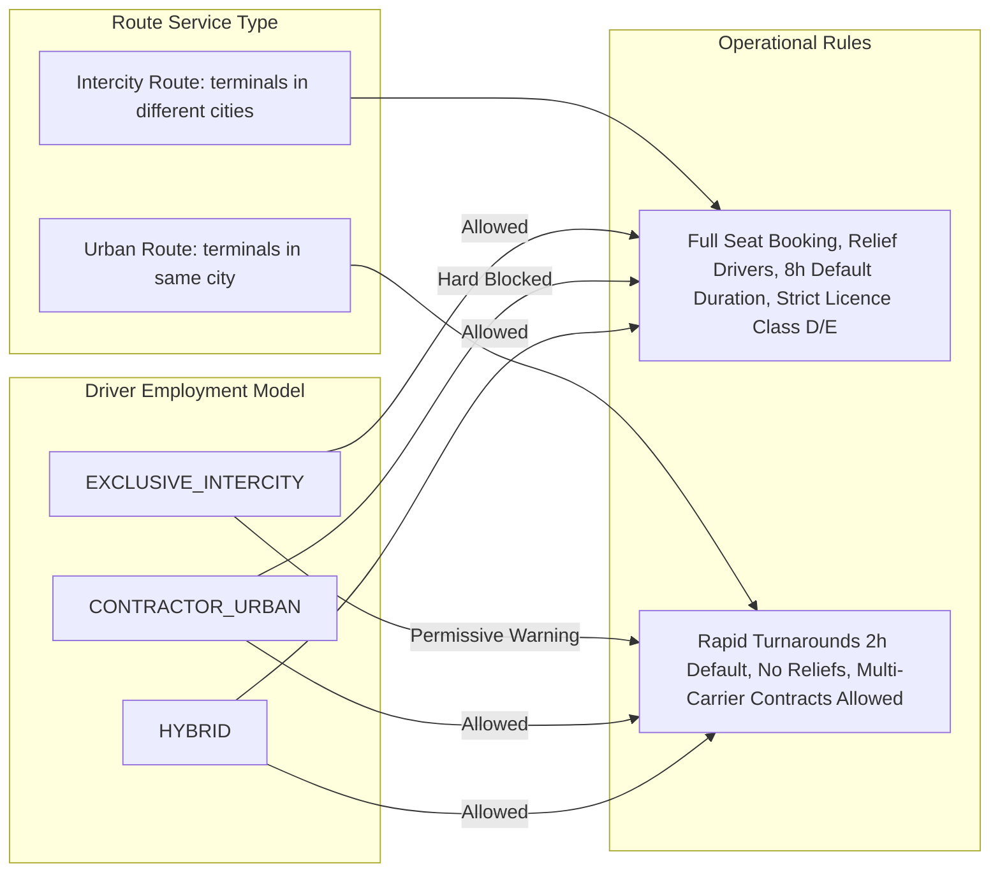

# Urban vs. Intercity Operations

## 1. Domain Separation Overview

The Moja Ride platform manages two distinct transportation paradigms in Côte d'Ivoire:
1. **Intercity Transportation (`INTERCITY`)**: Long-haul passenger coach lines connecting distinct regional cities and hub departments (e.g., Abidjan $\rightarrow$ Bouaké, Yamoussoukro $\rightarrow$ San-Pédro, Abidjan $\rightarrow$ Man).
2. **Urban Transportation (`URBAN`)**: High-frequency intra-city transit corridors and commuter loops within a single metropolitan territory (e.g., Abidjan communal lines between Cocody, Yopougon, and Plateau).



---

## 2. Exhaustive Architectural Comparison

| Architectural Dimension | Intercity Operations (`INTERCITY`) | Urban Operations (`URBAN`) | Implementation Reference |
| :--- | :--- | :--- | :--- |
| **Route Service Type Derivation** | Automatically set to `INTERCITY` when Origin Terminal and Destination Terminal belong to **different cities** (`origin.cityId !== dest.cityId`). | Automatically set to `URBAN` when Origin Terminal and Destination Terminal belong to the **same city** (`origin.cityId === dest.cityId`). | `apps/web/trpc/routers/routes.ts` |
| **Driver Employment Model** | `EXCLUSIVE_INTERCITY` or `HYBRID`. | `CONTRACTOR_URBAN` or `HYBRID`. | `packages/db/prisma/schema.prisma#L252-L256` |
| **Multi-Carrier Affiliations** | **Strictly prohibited** under the One-Active-Exclusive Rule. | **Permitted**. Urban contractors may hold active affiliations with multiple independent operators simultaneously. | `apps/web/trpc/routers/drivers.ts#L217-L280` |
| **Commercial License Class** | Strict Class D or E requirement. Class B/C holders are hard-blocked during assignment. | Class D standard, but lower commercial classes may be permitted for mini-bus/shuttle types if configured on `BusType`. | `packages/schemas/src/drivers.ts#L160-L172` |
| **Default Trip Duration Fallback** | `INTERCITY_TRIP_DEFAULT_MINUTES = 480` (8 hours). | `URBAN_TRIP_DEFAULT_MINUTES = 120` (2 hours). | `packages/schemas/src/drivers.ts#L154-L155` |
| **Crew Model** | Primary Driver, optional Relief Driver, optional Conductor. | Primary Driver and optional Conductor. Relief drivers are not utilized on short urban loops. | `apps/web/trpc/routers/trips.ts` |
| **Passenger Booking & Boarding** | Reserved numbered seat booking (`Booking.seatId`), fixed scheduled departure time, formal QR ticket issuance. | High-cadence boarding, walk-up mobile check-in, rapid ticket validation at gates or on-board. | `apps/web/features/driver/services/driver-check-in-service.ts` |
| **Mobile App Mode Switcher** | `ModeSwitcher` component (`apps/driver-app/features/trips/components/mode-switcher.tsx`) filters driver trip views between `INTERCITY` and `URBAN`. | Filter parameter passed to `drivers.getMyTrips({ serviceType: "URBAN" \| "INTERCITY" })`. | `apps/driver-app/features/trips/screens/trips-view.tsx` |

---

## 3. Mode Compatibility Rules & Guard Matrix

When assigning drivers to departures in `trips.assignDriver` (`apps/web/trpc/routers/trips.ts#L1862-L1877`), the backend enforces **Asymmetric-Permissive Mode Compatibility**:

```typescript
const employmentType = driver.companyAffiliations?.[0]?.employmentType ?? null;

if (employmentType === "CONTRACTOR_URBAN" && trip.serviceType === "INTERCITY") {
  throw new TRPCError({
    code: "BAD_REQUEST",
    message: "Cannot assign an urban contractor to an intercity trip. Change the driver's employment type or choose a different driver.",
  });
}
```

### Compatibility Matrix:

| Driver Employment Type | Intercity Trip (`INTERCITY`) | Urban Trip (`URBAN`) | Rationale & Enforcement Level |
| :--- | :---: | :---: | :--- |
| **`EXCLUSIVE_INTERCITY`** | **Allowed** | **Permissive Soft-Warning** | Intercity drivers have high commercial credentials and may cover urban surge routes if their operator deploys them, but the UI alerts the dispatcher. |
| **`CONTRACTOR_URBAN`** | **HARD BLOCKED** | **Allowed** | Urban contractors lack the exclusive contractual guarantees, insurance endorsements, or rest protocols required for long-haul highway transit. |
| **`HYBRID`** | **Allowed** | **Allowed** | Explicitly hired to bridge both operations. |

---

## 4. Scheduling & Cadence Differences

1. **Intercity Departure Timetables**:
   * Fixed schedules with explicit `departureTime` (e.g. `"06:00"`, `"14:30"` UTC).
   * Backed by `ServiceCalendar` specifying day-of-week operation (`monday` through `sunday`) and date boundaries (`validFrom` / `validUntil`).
   * Service exceptions handle religious and national holidays (`ServiceException` with `ExceptionType.MODIFIED` or `CANCELLED`).
2. **Urban Continuous Cadence**:
   * Stored in `Schedule.departureTimes` as an array of sorted departure slots (e.g. `["06:00", "06:30", "07:00", "07:30", ...]`).
   * High turnaround frequency with 45-minute minimum de-confliction buffers between runs for the same driver.
