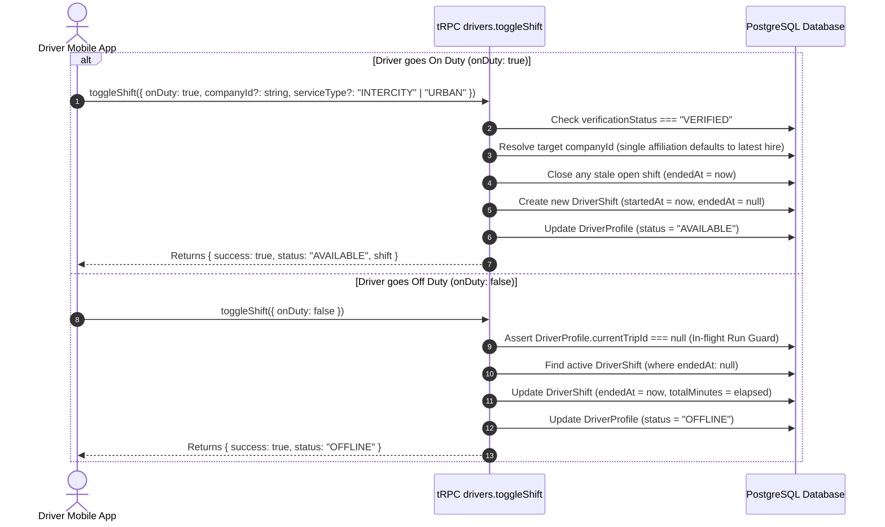
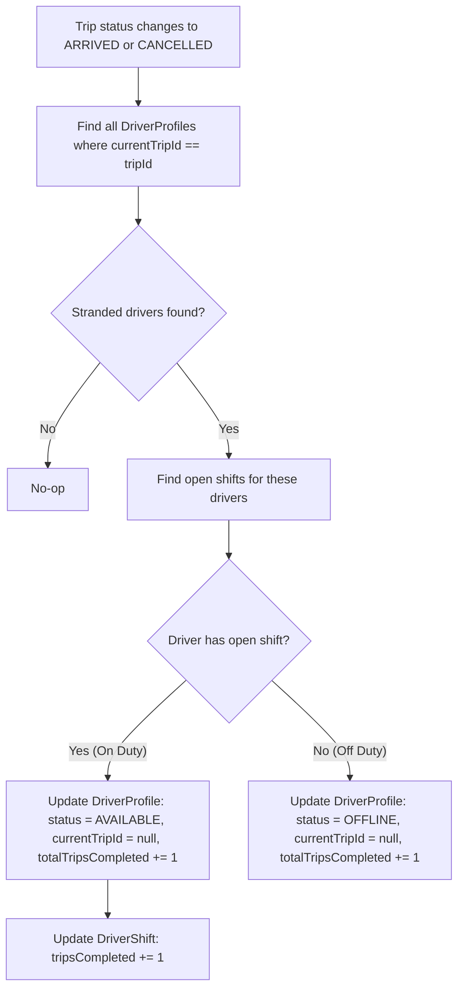

# Driver Shifts & Run-State Convergence

## 1. Shift System Architecture

Driver duty shifts track the active working hours of commercial drivers for labor compliance, live operational visibility, and earnings accrual. Shifts are modeled in `DriverShift` (`packages/db/prisma/schema.prisma#L2428-L2446`):

```prisma
model DriverShift {
  id              String        @id @default(cuid())
  driverProfileId String
  driverProfile   DriverProfile @relation(fields: [driverProfileId], references: [id], onDelete: Cascade)
  companyId       String
  company         Company       @relation(fields: [companyId], references: [id], onDelete: Cascade)

  startedAt       DateTime      @default(now())
  endedAt         DateTime?     // null indicates an OPEN, active shift
  totalMinutes    Int?          // computed on shift closure
  serviceType     ServiceType   @default(INTERCITY)
  tripsCompleted  Int           @default(0)

  createdAt       DateTime      @default(now())

  @@index([driverProfileId, startedAt])
  @@index([companyId, startedAt])
  @@map("driver_shift")
}
```

---

## 2. Shift Lifecycle & Toggling Protocol

Drivers toggle their duty status on mobile using `drivers.toggleShift` (`apps/web/trpc/routers/drivers.ts#L2621-L2737`):



### 2.1 Multi-Affiliation Shift Resolution
For drivers affiliated with multiple operators (e.g. urban contractors):
* The driver selects the operator they are clocking in for (`companyId` is supplied).
* For single-affiliation drivers, `companyId` is optional: the backend deterministically defaults to their latest active hire (`apps/web/trpc/routers/drivers.ts#L2640-L2655`).

### 2.2 In-Flight Run Protection
A driver cannot end their shift while actively driving a run:
```typescript
if (!onDuty && driver.currentTripId) {
  throw new TRPCError({
    code: "BAD_REQUEST",
    message: "Cannot go off-duty while currently on an active trip. Complete or cancel the trip first.",
  });
}
```

---

## 3. Run-State Convergence Architecture

### 3.1 The "Ghost Bus" Problem
Prior to Phase 06, `DriverProfile.currentTripId` was only cleared when a driver tapped "Complete Trip" in their mobile app. If an operator marked a trip as `ARRIVED` or `CANCELLED` from the Web ERP dispatch board, or if a driver's credentials were administrative suspended mid-run, the driver profile remained permanently locked in `status = "ON_TRIP"` with `currentTripId` set. This generated "ghost buses" that hovered indefinitely on live fleet maps (`getLivePositions`).

### 3.2 Automated Run-End Convergence (`convergeDriversAfterRunEnd`)
Implemented in `apps/web/lib/driver-run-state.ts#L44-L92` and executed inside the database transaction whenever a trip finishes:



### 3.3 Post-Run Status Resolution Logic (`resolvePostRunStatus`)
Defined in `apps/web/lib/driver-run-state.ts#L27-L29`:
```typescript
export function resolvePostRunStatus(hasOpenShift: boolean): "AVAILABLE" | "OFFLINE" {
  return hasOpenShift ? "AVAILABLE" : "OFFLINE";
}
```

---

## 4. Operational Teardown on Suspension / Rejection

When an admin or operator suspends a driver or rejects their compliance credentials, the system executes **Immediate Operational Teardown** via `suspendDriverOperationalState` (`apps/web/lib/driver-run-state.ts#L100-L130`):

```typescript
export async function suspendDriverOperationalState(
  db: PrismaClient,
  driverProfileId: string,
  finalStatus: "AVAILABLE" | "OFFLINE" | "SUSPENDED",
): Promise<void> {
  const now = new Date();

  // 1. Close any open shift immediately so wages stop accruing
  const openShift = await db.driverShift.findFirst({
    where: { driverProfileId, endedAt: null },
    orderBy: { startedAt: "desc" },
  });

  if (openShift) {
    await db.driverShift.update({
      where: { id: openShift.id },
      data: {
        endedAt: now,
        totalMinutes: Math.max(0, Math.round((now.getTime() - openShift.startedAt.getTime()) / 60000)),
      },
    });
  }

  // 2. Clear in-flight trip pointer and park profile at final status
  await db.driverProfile.update({
    where: { id: driverProfileId },
    data: { status: finalStatus, currentTripId: null },
  });
}
```
