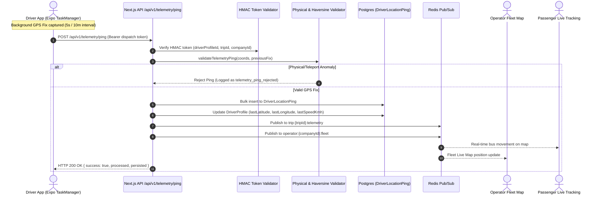

# Real-Time GPS Telemetry & Ingestion Pipeline

## 1. Architecture Overview

The Moja Ride telemetry subsystem captures, validates, persists, and broadcasts high-frequency GPS vehicle coordinates from active commercial drivers to passenger tracking views, operator fleet management dashboards, and safety evaluation engines.



> **Transport**: The primary high-frequency path is now the deployed WebSocket gateway (`TelemetryWebSocketGateway`, `server/telemetry-ws.ts`) reached at `wss://{host}/api/ws/telemetry`, with `POST /api/v1/telemetry/ping` as the HTTP fallback. Both paths converge on `persistPingBatch` (`telemetry-flush.ts:105`) and the same Redis rooms (`trip:{tripId}:telemetry`, `operator:{companyId}:fleet`).

---

## 2. Mobile Collection & Adaptive Tracking

Implemented in `apps/driver-app/lib/telemetry.ts` and registered under the Expo TaskManager task `MOJA_DRIVER_LOCATION_TRACKING`:

### 2.1 Permissions Protocol
* **Foreground Permission**: `Location.requestForegroundPermissionsAsync()`. Required for general app operation.
* **Background Permission**: `Location.requestBackgroundPermissionsAsync()`. Required for background tracking during trips. Shows persistent native Android foreground notification (`"Moja Driver — Live Telemetry Active"`).

### 2.2 Battery-Optimized Adaptive Sampling
The mobile client adjusts telemetry transmission frequency based on instantaneous speed:
* **Stationary Mode ($\text{Speed} < 5\text{ km/h}$)**: Throttled to 30-second cadence unless an anomaly occurs. Conserves driver phone battery during terminal layovers and heavy traffic stalls.
* **In-Motion High-Rate Mode ($\text{Speed} \ge 5\text{ km/h}$)**: 5-second sampling interval / 10-meter minimum distance displacement for smooth highway tracking.

### 2.3 Offline Queuing & Chunked Flush
* **Queue Storage**: Offline pings are stored in `AsyncStorage` under `driver_offline_pings_queue`.
* **Queue Cap**: `OFFLINE_QUEUE_CAP = 500` pings. Oldest pings are dropped with warning logs if dead zones persist.
* **Chunked Draining**: Drained in sequential batches of `OFFLINE_FLUSH_CHUNK_SIZE = 100` pings (`apps/driver-app/lib/telemetry-core.ts#L12`). A background sweep runs every 60 seconds (`FLUSH_SWEEP_INTERVAL_MS = 60_000`).

---

## 3. Stateless HMAC Dispatch Tokens

To avoid costly database session lookups on the high-volume telemetry ingest route, the platform uses **Stateless HMAC Dispatch Tokens** (`apps/web/lib/telemetry-token.ts`):

### 3.1 Token Minting (`mintTelemetryDispatchTokenWithCompany`)
Minted when a driver starts a trip in `drivers.startTrip` (`apps/web/trpc/routers/drivers.ts#L2015-L2030`):
```typescript
const claims: TelemetryDispatchClaims = {
  role: "driver",
  d: driverProfileId,
  t: tripId,
  c: companyId,
  exp: Date.now() + 24 * 60 * 60 * 1000, // 24-hour TTL
};
```
Encoded as `base64url(claims).base64url(hmacSha256(secret, claims))`.

### 3.2 Verification on Ingestion
In `POST /api/v1/telemetry/ping` (`apps/web/app/api/v1/telemetry/ping/route.ts#L50-L63`):
* Verified in memory using `timingSafeEqual` in $O(1)$ time.
* If `isTelemetryAuthEnforced()` is true, requests without a valid token are rejected with `HTTP 401 Unauthorized`.
* Spoofed `driverProfileId` or `tripId` inside the JSON payload that mismatch the cryptographic claims are rejected.

---

## 4. Ingestion Validation Gates

Incoming coordinates are validated by `validateTelemetryPing` (`apps/web/server/telemetry-validator.ts`):

```mermaid
flowchart TD
    PING[Incoming GPS Ping] --> G1{Lat in [-90,90] & Lon in [-180,180]?}
    G1 -- No --> REJ1[Reject: Geographical bounds error]
    G1 -- Yes --> G2{Speed <= 200 km/h?}
    G2 -- No --> REJ2[Reject: Physical bus speed exceeded]
    G2 -- Yes --> G3{Previous Ping Exists?}
    G3 -- No --> PASS[Accept Ping]
    G3 -- Yes --> G4{Haversine Jump Speed <= 220 km/h?}
    G4 -- No --> REJ3[Reject: Implausible GPS jump / Teleport]
    G4 -- Yes --> G5{Horizontal Accuracy > 50m?}
    G5 -- Yes --> FLAG[Flag as LOW_ACCURACY anomaly: Unscored, skipped for last-position]
    G5 -- No --> PASS
```

### 4.1 Physical Validation Rules
1. **Coordinate Bounds**: Latitude $[-90.0, 90.0]$, Longitude $[-180.0, 180.0]$.
2. **Instantaneous Velocity Cap**: `MAX_SPEED_KMH = 200` km/h. Exceeding this triggers immediate rejection.
3. **Haversine Teleportation Jump Gate**: Computes great-circle distance $d$ between previous valid fix $(lat_1, lon_1, t_1)$ and current fix $(lat_2, lon_2, t_2)$. If $\frac{d}{\Delta t} \times 3.6 > \text{MAX\_JUMP\_SPEED\_KMH} (220\text{ km/h})$, the ping is rejected as a GPS multipath jump.
4. **Horizontal Accuracy Gate (`MAX_PING_ACCURACY_METERS = 50`)**: Pings with accuracy $> 50$ meters are **not** rejected (preserving urban canyon history), but are flagged as `LOW_ACCURACY` (`apps/web/lib/driver-scoring.ts#L80-L97`). They are persisted but **excluded from safety scoring penalties** and **do not update `DriverProfile.last*` coordinates**.

---

## 5. Persistence, Batching & Redis Pub/Sub

Implemented in `apps/web/server/telemetry-flush.ts` and `apps/web/app/api/v1/telemetry/ping/route.ts`:

### 5.1 Atomic, Lock-Free Batch Persistence (`persistPingBatch`)
Implemented in `apps/web/server/telemetry-flush.ts:105` (shared by the HTTP ping route and the WebSocket gateway `processTelemetryFrame`):
1. Classifies anomalies server-authoritatively (`OVERSPEED`, `HARSH_BRAKING`, `LOW_ACCURACY`, `DELAY`).
2. **Calculates safety penalties capped at $-20$ per UTC day per driver** via an atomic Redis `INCRBY` counter (`getAndIncrementDailyPenalty`, `telemetry-flush.ts:54`) — **no `SELECT ... FOR UPDATE` lock** is taken on `driver_profile`. A 48-hour key TTL auto-resets the daily bucket. *(Removes the P0-2 telemetry row-lock storm.)*
3. Bulk-inserts records into `DriverLocationPing` via `createMany` (append-only, no row locks).
4. Applies the capped penalty to `DriverProfile.safetyScore` with a lock-free `UPDATE ... SET safetyScore = GREATEST(0, safetyScore - N) WHERE id = ?` only when `applicablePenalty > 0` (`telemetry-flush.ts:157`).
5. Updates `DriverProfile` latest coordinates (`lastLatitude`, `lastLongitude`, `lastHeading`, `lastSpeedKmh`, `lastPingAt`) using **non-locking** `prisma.driverProfile.update` for trustworthy fixes only (`isGoodReferencePing`), in parallel across drivers.

### 5.2 Real-Time Redis Broadcasting
For each valid ping associated with a trip:
* **Trip Room**: Published to Redis channel `trip:{tripId}:telemetry` for passenger live tracking.
* **Operator Fleet Room**: Published to Redis channel `operator:{companyId}:fleet` for operator dispatch live maps.

### 5.3 Retention & Data Pruning
The `DriverLocationPing` table grows rapidly. The `/api/cron/prune-telemetry` cron job runs nightly, deleting raw pings older than `RETENTION_DAYS = 180` in batches of 2,000 rows (`apps/web/app/api/cron/prune-telemetry/route.ts`).
