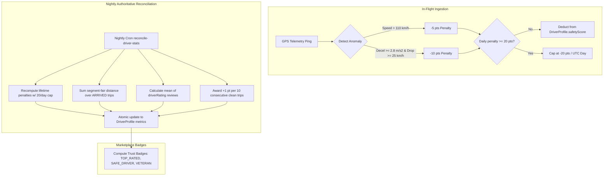
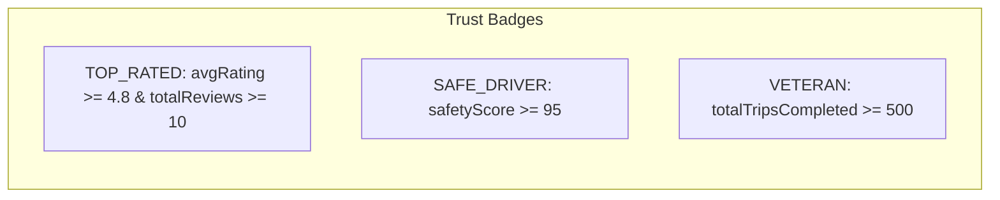

# Driver Safety Scoring, Analytics & Trust Badges

## 1. Architecture Overview

Driver safety and performance analytics are continuously evaluated across in-flight telemetry ingestion, 3-way passenger reviews, and nightly background reconciliation jobs. The core algorithms are centralized in `apps/web/lib/driver-scoring.ts`.



---

## 2. Safety Scoring Algorithm

The driver safety score is an integer metric bounded between $0$ and $100$:
* **Initial Baseline**: `SAFETY_SCORE_START = 100`.
* **Ceiling & Floor**: `SAFETY_SCORE_CEILING = 100`, `SAFETY_SCORE_FLOOR = 0`.
* **Lifetime Continuity**: The score does not reset at month-end; it reflects continuous career safety.

### 2.1 Anomaly Classifications & Penalties
Defined in `apps/web/lib/driver-scoring.ts#L18-L59`:

| Anomaly Reason | Detection Criteria | Safety Penalty | Scoring Status |
| :--- | :--- | :---: | :--- |
| **`OVERSPEED`** | Server-recomputed: $\text{Speed} > \text{OVERSPEED\_LIMIT\_KMH} (110\text{ km/h})$. Client flag is untrusted. | **$-5$ points** | **Scored** |
| **`HARSH_BRAKING`** | Evaluated per deceleration severity: $\text{Drop} \ge 25\text{ km/h} \land \frac{\text{Drop}}{3.6 \times \Delta t} \ge 2.8\text{ m/s}^2 \land \Delta t \le 8\text{ s}$. | **$-10$ points** | **Scored** |
| **`LOW_ACCURACY`** | Horizontal GPS accuracy $> 50$ meters (`MAX_PING_ACCURACY_METERS = 50`). Fix is flagged to prevent poisoned scoring. | **$0$ points** | **Unscored** (Informational only) |
| **`DELAY`** | Driver submitted a delay incident report (`drivers.reportTripDelay`). | **$0$ points** | **Unscored** (Operational only) |

### 2.2 Daily Loss Cap (Catastrophe Guard)
To prevent a temporary GPS glitch or a single difficult run from destroying a driver's career score, deductions are capped at:
$$\text{Max Daily Penalty} = 20\text{ points per UTC Day}$$

### 2.3 Clean-Streak Recovery Credits
Drivers recover lost points through consistent safe driving:
* **Rule**: For every **10 consecutive completed trips** with **zero penalized anomalies** and **at least one valid telemetry ping**, the driver earns $+1$ safety point (`CLEAN_TRIPS_PER_CREDIT = 10`, `CLEAN_TRIP_CREDIT = 1`).
* **Silent Trip Guard**: Zero-ping trips (where telemetry was disabled) do **not** mint free clean-streak credits.

$$\text{Safety Score} = \text{clamp}\left(100 - \sum \text{DailyCappedPenalties} + \left\lfloor \frac{\text{CleanTripStreak}}{10} \right\rfloor, 0, 100\right)$$

---

## 3. Marketplace Trust Badges

Computed on read in `apps/web/lib/driver-scoring.ts#L101-L133` and rendered in the Operator ERP and Driver Mobile App:

```typescript
export const BADGE_THRESHOLDS = {
  TOP_RATED_RATING: 4.8,
  TOP_RATED_MIN_REVIEWS: 10,
  SAFE_DRIVER_MIN_SCORE: 95,
  VETERAN_MIN_TRIPS: 500,
} as const;
```



---

## 4. Nightly Authoritative Stats Reconciliation

The cron endpoint `/api/cron/reconcile-driver-stats` runs nightly at 03:00 UTC (`apps/web/app/api/cron/reconcile-driver-stats/route.ts`):

1. **Daily Penalty Aggregation**:
   Groups `DriverLocationPing` rows from the past 180 days by driver and UTC day (`date_trunc('day', recordedAt)`), applying the $-20$ cap per day, and summing lifetime deductions.
2. **Segment-Fair Distance Summation**:
   Scans all `ARRIVED` trip assignments. Uses `computeSegmentDistanceKm` to scale partial spans for relief drivers via the stop chain ratio.
3. **Passenger Review Averages**:
   Computes `AVG(rv.driverRating)` and `COUNT(*)` over non-null `Review.driverRating` records.
4. **Clean Streak Evaluation**:
   Iterates through historical completed trips in descending arrival order. Counts consecutive anomaly-free trips until a dirty trip breaks the streak.
5. **Atomic Profile Update**:
   Updates `DriverProfile` columns (`averageRating`, `totalReviews`, `totalDistanceKm`, `safetyScore`) in an atomic transaction.
