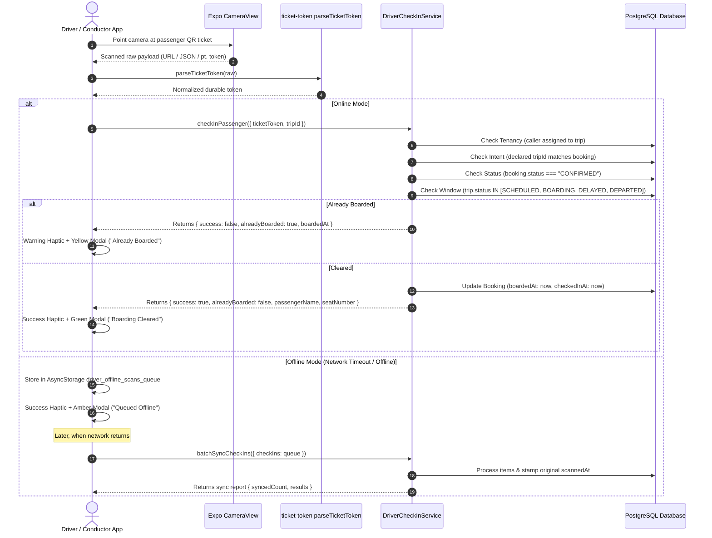

# QR Ticket Scanning, Passenger Boarding & Manifest Management

## 1. Domain Overview

The Passenger Boarding subsystem enables commercial bus drivers and conductors to authenticate passenger tickets, manage the live passenger manifest, prevent duplicate boarding, and operate seamlessly in offline rural bus terminals.



---

## 2. Ticket Token Normalization (`parseTicketToken`)

Passenger tickets can be rendered as dynamic URLs, JSON payloads, or presentation tokens. Implemented in `packages/schemas/src/ticket-token.ts`:

```typescript
export function parseTicketToken(raw: string): string {
  const trimmed = raw.trim();
  if (!trimmed) return trimmed;

  // 1. JSON-wrapped client payloads: {"ticketToken": "..."} or {"token": "..."}
  if (trimmed.startsWith("{") && trimmed.endsWith("}")) {
    try {
      const parsed = JSON.parse(trimmed);
      const inner = parsed.ticketToken ?? parsed.token;
      if (typeof inner === "string" && inner.trim()) return inner.trim();
    } catch {}
  }

  // 2. Query param extraction: ?token=cuid...
  const queryMatch = trimmed.match(/[?&]token=([^&]+)/);
  if (queryMatch?.[1]) return safeDecode(queryMatch[1]);

  // 3. Host-agnostic path extraction: /tickets/{token} (excluding /tickets/verify)
  const ticketPathMatch = trimmed.match(/\/tickets\/(?!verify(?:\?|$))([^/?#]+)/);
  if (ticketPathMatch?.[1]) return safeDecode(ticketPathMatch[1]);

  return trimmed;
}
```

The parser runs via `z.preprocess` in `driverCheckInPassengerSchema` (`packages/schemas/src/drivers.ts#L332-L343`), guaranteeing that the backend receives clean tokens regardless of QR generator variations.

---

## 3. The `DriverCheckInService` Guard Pipeline

All boarding operations (live scan, manual manifest tap, offline batch sync) are centralized in `DriverCheckInService` (`apps/web/features/driver/services/driver-check-in-service.ts`):

```typescript
private async assertBoardable(
  driverProfileId: string,
  booking: CheckInBookingView,
  sentTripId?: string,
): Promise<void> {
  // 1. Tenancy Binding: Caller must hold an active assignment on THIS trip
  const assignment = await this.prisma.tripDriverAssignment.findFirst({
    where: { driverProfileId, tripId: booking.tripId },
    select: { id: true },
  });
  if (!assignment) {
    throw new TRPCError({
      code: "FORBIDDEN",
      message: "You are not assigned to this trip.",
    });
  }

  // 2. Declared Intent: If client declared a tripId, it must match the booking's trip
  if (sentTripId && sentTripId !== booking.tripId) {
    throw new TRPCError({
      code: "BAD_REQUEST",
      message: "This ticket belongs to a different scheduled trip.",
    });
  }

  // 3. Status Guard: Only paid, confirmed tickets may board
  if (booking.status !== "CONFIRMED") {
    throw new TRPCError({
      code: "PRECONDITION_FAILED",
      message: booking.status === "PENDING_PAYMENT"
        ? "Payment for this ticket was not completed — it cannot be boarded."
        : "This ticket was cancelled or refunded and is not valid for travel.",
    });
  }

  // 4. Boarding Window: Trip must be open for boarding
  const BOARDABLE_TRIP_STATUSES = new Set(["SCHEDULED", "BOARDING", "DELAYED", "DEPARTED"]);
  if (!BOARDABLE_TRIP_STATUSES.has(booking.trip.status)) {
    throw new TRPCError({
      code: "BAD_REQUEST",
      message: `Boarding is closed for this trip (current status: ${booking.trip.status}).`,
    });
  }
}
```

---

## 4. Offline Scanning & Batch Synchronization

In rural regions with intermittent GSM connectivity, the mobile app operates offline (`apps/driver-app/features/scanner/screens/scanner-view.tsx`):

1. **Local Queue Storage**:
   When network fetch fails, the scan is pushed to `driver_offline_scans_queue` in `AsyncStorage`:
   ```typescript
   interface OfflineScanItem {
     ticketToken: string;
     tripId?: string;
     scannedAt: string; // ISO timestamp when scanned
   }
   ```
2. **Offline Banner UI**:
   The scanner header renders an amber banner displaying pending queue length (e.g. `12 scans en attente`).
3. **Batch Sync Flush (`batchSyncCheckIns`)**:
   When the driver taps "Sync" or network connectivity returns, `DriverCheckInService.batchSync` processes the array:
   * Each item is evaluated independently (errors do not abort other items).
   * Persists `boardedAt = item.scannedAt` preserving the **original physical scan time**.
   * Returns a detailed outcome report: `SYNCED`, `ALREADY_BOARDED`, `REJECTED`.

---

## 5. Passenger Manifest Management

Implemented in `apps/driver-app/features/trips/screens/manifest-view.tsx` and backed by `drivers.getMyTripManifest` (`apps/web/trpc/routers/drivers.ts#L1826-L1911`):

### 5.1 Manifest Data Structure
* **Summary Counters**: `totalBookings`, `boardedCount`, `pendingCount`, `totalCapacity`.
* **Passenger Details**: Full name, telephone number (with direct call button), assigned seat label (e.g. `"12A"`), pickup waypoint, dropoff waypoint.
* **Boarding Status**: Marked with green badge (`"Embarqué à 06:15"`) or grey pending badge (`"En attente"`).

### 5.2 Manual Boarding Fallback
If a passenger's phone screen is cracked or battery dead:
* Driver locates the passenger by name or seat number in the manifest.
* Taps "Embarquer manuellement".
* Calls `drivers.manualCheckInPassenger({ bookingId, tripId })` (`apps/web/features/driver/services/driver-check-in-service.ts#L204-L248`), clearing them for boarding.
