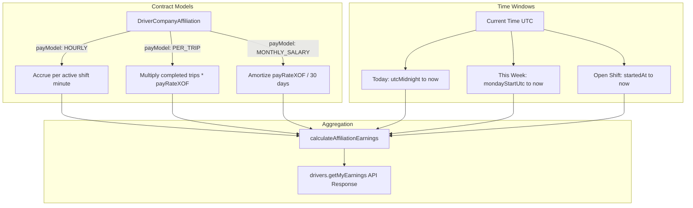

# Driver Earnings, Wages & Compensation Engine

## 1. Architecture Overview

The Driver Compensation subsystem models, accrues, and reports driver earnings across multiple contract models (`HOURLY`, `PER_TRIP`, `MONTHLY_SALARY`). Calculations are defined in `apps/web/lib/driver-earnings.ts` and queried via `drivers.getMyEarnings` (`apps/web/trpc/routers/drivers.ts#L2756-L2922`).



---

## 2. Timezone Discipline & Window Primitives

### 2.1 UTC+0 Production Alignment
Côte d'Ivoire operates in UTC+0 year-round without Daylight Saving Time (`Africa/Abidjan`). UTC timestamps in the database map directly to local time:

```typescript
/** Midnight UTC of the day containing `now` (= Abidjan midnight). */
export function utcMidnight(now: Date): Date {
  return new Date(Date.UTC(now.getUTCFullYear(), now.getUTCMonth(), now.getUTCDate()));
}

/** Monday 00:00 UTC of the week containing `now` (ISO 8601 standard). */
export function mondayStartUtc(now: Date): Date {
  const midnight = utcMidnight(now);
  const daysSinceMonday = (midnight.getUTCDay() + 6) % 7;
  return new Date(midnight.getTime() - daysSinceMonday * 86_400_000);
}
```

---

## 3. Compensation Calculation Strategies

Implemented in `apps/web/lib/driver-earnings.ts#L63-L105`:

```typescript
export function calculateAffiliationEarnings(
  config: AffiliationPayConfig,
  metrics: {
    minutes: number;
    tripsCompleted: number;
    daysInPeriod?: number;
  },
  fallbackRateXofPerMinute: number = DEFAULT_DRIVER_PAY_RATE_XOF_PER_MINUTE, // 50 XOF/min = 3,000 XOF/hr
): { amountXOF: number; isEstimated: boolean; rateDescription: string }
```

### 3.1 Monthly Salary Model (`MONTHLY_SALARY`)
* **Formula**: $\text{Daily Wage} = \frac{\text{payRateXOF}}{30}$. Total for period $= \text{Daily Wage} \times \text{DaysInPeriod}$.
* **Example**: $240,000\text{ XOF/month} \rightarrow 8,000\text{ XOF/day}$.

### 3.2 Per-Trip Compensation Model (`PER_TRIP`)
* **Formula**: $\text{Earnings} = \text{TripsCompleted} \times \text{payRateXOF}$.
* **Example**: $15,000\text{ XOF/trip} \times 4\text{ trips} = 60,000\text{ XOF}$.

### 3.3 Hourly / Minute Rate Model (`HOURLY`)
* **Formula**: $\text{Rate per Minute} = \frac{\text{payRateXOF}}{60}$. Total $= \text{TotalMinutes} \times \text{Rate per Minute}$.
* **Example**: $3,000\text{ XOF/hr} \rightarrow 50\text{ XOF/min} \times 420\text{ min} = 21,000\text{ XOF}$.
* **Fallback Rate**: If `payRateXOF` is null on legacy rows, defaults to platform baseline `DEFAULT_DRIVER_PAY_RATE_XOF_PER_MINUTE = 50` XOF/min ($3,000$ XOF/hr, marked as `isEstimated: true`).

---

## 4. Live Shift Accrual Engine

When a driver has an open, in-progress shift (`DriverShift.endedAt === null`), earnings accrue dynamically in real time:

```typescript
export function openShiftAccrualMinutes(startedAt: Date, now: Date): number {
  const elapsed = Math.floor((now.getTime() - startedAt.getTime()) / 60_000);
  return Math.max(0, elapsed); // Floors at 0 to prevent negative accrual under clock skew
}
```

The mobile app displays this live accrual counter on the Earnings tab (`apps/driver-app/features/earnings/screens/earnings-view.tsx`), updating every 30 seconds.

---

## 5. Mobile Driver Earnings View & Data Response

Backed by `drivers.getMyEarnings` (`apps/web/trpc/routers/drivers.ts#L2756-L2922`):

```json
{
  "todayEarnings": 21000,
  "todayTrips": 2,
  "todayMinutes": 420,
  "weekEarnings": 125000,
  "weekTrips": 11,
  "weekMinutes": 2500,
  "activeShift": {
    "shiftId": "cuid...",
    "companyName": "UTB Transport",
    "startedAt": "2026-08-31T06:00:00.000Z",
    "elapsedMinutes": 185,
    "accruedXOF": 9250
  },
  "affiliations": [
    {
      "companyId": "cuid...",
      "companyName": "UTB Transport",
      "employmentType": "EXCLUSIVE_INTERCITY",
      "payModel": "HOURLY",
      "rateDescription": "3,000 XOF / heure",
      "weekAmountXOF": 125000
    }
  ],
  "recentShifts": [
    {
      "id": "cuid...",
      "startedAt": "2026-08-30T06:00:00.000Z",
      "endedAt": "2026-08-30T14:30:00.000Z",
      "totalMinutes": 510,
      "tripsCompleted": 2,
      "companyName": "UTB Transport",
      "earnedXOF": 25500
    }
  ]
}
```
