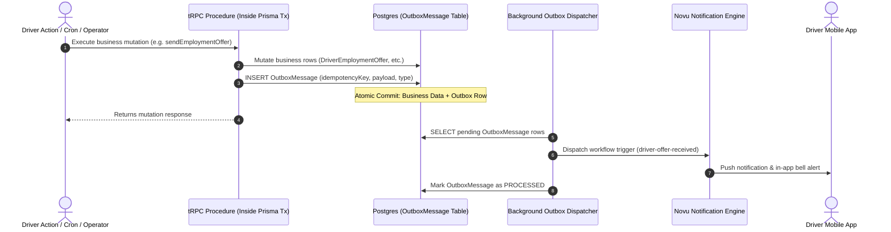

# Notifications & Transactional Outbox Events

## 1. Architecture Overview

The Driver Operations Domain uses the **Transactional Outbox Pattern** (`apps/web/features/notifications/outbox/`) to guarantee reliable delivery of push notifications, in-app alerts, and SMS messages without distributed transaction failures.



---

## 2. Driver Notification Workflows Catalog

The driver domain defines 14 distinct notification workflows across compliance, dispatch, and hiring:

| Workflow Identifier | Triggering Event | Sender $\rightarrow$ Recipient | Payload Attributes | Idempotency Key Structure |
| :--- | :--- | :--- | :--- | :--- |
| **`driver-offer-received`** | Operator sends job offer | Operator $\rightarrow$ Driver | `offerId`, `companyName`, `employmentType`, `salaryCFA`, `expiresAt` | `driver-offer-received-{offerId}` |
| **`operator-offer-countered`** | Driver counters offer | Driver $\rightarrow$ Operator | `offerId`, `driverName`, `counterSalaryCFA`, `counterStartDate`, `note` | `operator-offer-countered-{offerId}-{counterSalaryCFA}::{recipientId}` |
| **`driver-offer-countered`** | Operator counters back | Operator $\rightarrow$ Driver | `offerId`, `companyName`, `salaryCFA`, `startDate`, `note` | `driver-offer-countered-{offerId}-{salaryCFA}::{recipientId}` |
| **`driver-offer-counter-accepted`** | Operator accepts counter | Operator $\rightarrow$ Driver | `offerId`, `companyName`, `salaryCFA` | `driver-offer-counter-accepted-{offerId}-final::{recipientId}` |
| **`driver-offer-counter-declined`** | Operator declines counter | Operator $\rightarrow$ Driver | `offerId`, `companyName` | `driver-offer-counter-declined-{offerId}-final::{recipientId}` |
| **`operator-offer-accepted`** | Driver accepts offer | Driver $\rightarrow$ Operator | `offerId`, `driverName`, `salaryCFA`, `employmentType` | `operator-offer-accepted-{offerId}` |
| **`operator-offer-declined`** | Driver declines offer | Driver $\rightarrow$ Operator | `offerId`, `driverName`, `note` | `operator-offer-declined-{offerId}` |
| **`driver-offer-withdrawn`** | Operator cancels offer | Operator $\rightarrow$ Driver | `offerId`, `companyName` | `driver-offer-withdrawn-{offerId}` |
| **`driver-offer-expiring-soon`** | Offer expiring in 24h | System $\rightarrow$ Driver | `offerId`, `counterpartyName`, `hoursLeft` | `offer-expiring-soon-{offerId}-driver::{recipientId}` |
| **`operator-offer-expiring-soon`** | Offer expiring in 24h | System $\rightarrow$ Operator | `offerId`, `counterpartyName`, `hoursLeft` | `offer-expiring-soon-{offerId}-operator::{recipientId}` |
| **`driver-offer-expired`** | Offer expired unanswered | System $\rightarrow$ Both | `offerId`, `counterpartyName` | `offer-expired-{offerId}-{role}::{recipientId}` |
| **`driver-affiliation-ended`** | Displaced by exclusive offer | System $\rightarrow$ Displaced Operator | `offerId`, `driverName`, `newCompanyName` | `driver-affiliation-ended-{offerId}-{companyId}::{recipientId}` |
| **`driver-roster-removed`** | Operator removes driver | Operator $\rightarrow$ Driver | `driverName`, `companyName` | `driver-roster-removed-{affiliationId}-{companyId}` |
| **`driver-trip-assigned`** | Operator assigns to trip | Operator $\rightarrow$ Driver | `tripId`, `companyName`, `originName`, `destinationName`, `departureTime` | `driver-trip-assigned-{tripId}-{recipientId}` |
| **`driver-dispatch-urgent`** | Assigned to trip $<2$h away | Operator $\rightarrow$ Driver | `tripId`, `companyName`, `originName`, `destinationName`, `departureTime` | `driver-trip-assigned-{tripId}-{recipientId}` |
| **`driver-license-status`** | License expiring $\le 30$d or expired | System $\rightarrow$ Driver + Operator | `kind: EXPIRING_SOON \| EXPIRED`, `driverName`, `expiryDate` | `driver-license-{kind}-{driverId}-{YYYY-MM}` |
| **`driver-verification-outcome`** | Admin verification result | Admin $\rightarrow$ Driver | `kind: APPROVE \| REJECT \| SUSPEND`, `driverName`, `reason` | `driver-verification-outcome-{kind}-{driverProfileId}-{YYYY-MM-DD}` |
| **`operator-driver-assignment-conflict`** | Delay shifts trip into overlap | System $\rightarrow$ Operator | `tripId`, `conflictTripId`, `driverName`, `delayedRoute`, `conflictRoute` | `driver-assignment-conflict-{tripId}-{conflictTripId}-{YYYY-MM-DD}::{recipientId}` |

---

## 3. Recipient-Scoped Idempotency Keys (`txIdWithRecipient`)

### 3.1 Multi-Operator Delivery Fix
Prior to Phase 14, outbox idempotency keys were formatted without recipient identifiers (e.g. `operator-offer-countered-{offerId}`). In companies with multiple operator staff members, only the **first** operator received the alert; subsequent recipients were deduplicated by the database unique index.

### 3.2 Implementation (`apps/web/features/notifications/outbox/tx-id.ts`)
```typescript
export function txIdWithRecipient(baseKey: string, recipient: { subscriberId: string }): string {
  return `${baseKey}::${recipient.subscriberId}`;
}
```
This guarantees that **every staff member** belonging to the target company receives their individual push notification.
