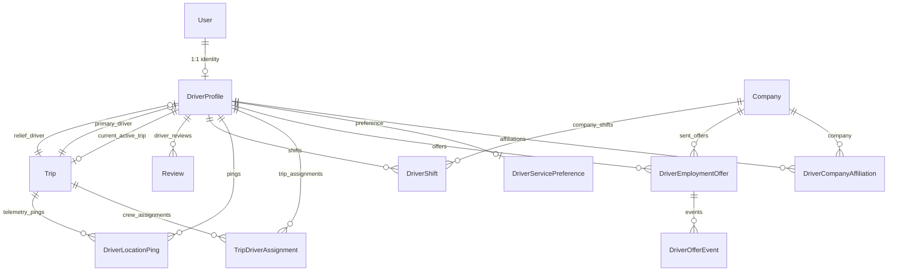

# Database Models & Schema Reference

## 1. Schema Overview

The Driver Operations Domain involves 10 primary Prisma models in `packages/db/prisma/schema.prisma`.

---

## 2. Core Driver Entities

### 2.1 `DriverProfile`
Defined in `packages/db/prisma/schema.prisma#L2287-L2347`:

| Column Name | Type | Modifiers / Default | Description & Invariants |
| :--- | :--- | :--- | :--- |
| `id` | `String` | `@id @default(cuid())` | Unique driver profile identifier. |
| `userId` | `String` | `@unique` | Foreign key to `User.id` (1:1 relation). |
| `licenseNumber` | `String` | `@unique` | Commercial driving license number. Unique across platform. |
| `licenseCategory` | `LicenseCategory` | `@default(D)` | Driving license class (`B`, `C`, `D`, `E`). |
| `licenseExpiryDate`| `DateTime?` | | License expiration date. Checked through trip arrival. |
| `licenseFrontUrl` | `String?` | | Storage key for front of license card. |
| `licenseBackUrl` | `String?` | | Storage key for back of license card. |
| `yearsOfExperience`| `Int` | `@default(1)` | Self-declared or verified commercial driving years. |
| `medicalClearanceDate` | `DateTime?` | | Date of last medical fitness exam. |
| `medicalDocUrl` | `String?` | | Storage key for medical fitness certificate. |
| `nationalIdNumber`| `String?` | | National ID (CNI) or passport number. |
| `verificationStatus` | `DriverVerificationStatus` | `@default(PENDING)` | Compliance state (`PENDING`, `VERIFIED`, `REJECTED`, `EXPIRED`, `SUSPENDED`). |
| `verifiedAt` | `DateTime?` | | Timestamp of latest verification approval. |
| `verifiedById` | `String?` | | User ID of operator/admin who verified credentials. |
| `rejectionReason` | `String?` | | Reason recorded when rejected or suspended. |
| `status` | `DriverStatus` | `@default(OFFLINE)` | Operational run-state (`OFFLINE`, `AVAILABLE`, `ON_DUTY`, `ON_TRIP`, `RESTING`, `SUSPENDED`). |
| `currentTripId` | `String?` | | Foreign key to `Trip.id` currently being driven. Null when idle. |
| `averageRating` | `Float` | `@default(5.0)` | Recomputed nightly from passenger `driverRating` reviews. |
| `totalReviews` | `Int` | `@default(0)` | Count of rated passenger reviews. |
| `totalTripsCompleted`| `Int` | `@default(0)` | Total finished runs incremented upon arrival. |
| `totalDistanceKm` | `Float` | `@default(0.0)` | Lifetime distance sum scaled across relief spans. |
| `safetyScore` | `Int` | `@default(100)` | Safety metric ($0–100$) evaluated over anomalies and clean streaks. |
| `lastPingAt` | `DateTime?` | | Timestamp of latest trustworthy GPS telemetry fix. |
| `lastLatitude` | `Float?` | | Latitude coordinate of latest GPS fix. |
| `lastLongitude` | `Float?` | | Longitude coordinate of latest GPS fix. |
| `lastHeading` | `Float?` | | Compass heading in degrees ($0–360^\circ$). |
| `lastSpeedKmh` | `Float?` | | Speed in km/h of latest GPS fix. |

---

### 2.2 `DriverCompanyAffiliation`
Defined in `packages/db/prisma/schema.prisma#L2350-L2373`:

| Column Name | Type | Modifiers / Default | Description |
| :--- | :--- | :--- | :--- |
| `id` | `String` | `@id @default(cuid())` | Unique affiliation identifier. |
| `driverProfileId`| `String` | | Foreign key to `DriverProfile.id`. |
| `companyId` | `String` | | Foreign key to `Company.id`. |
| `employmentType` | `DriverEmploymentType`| `@default(EXCLUSIVE_INTERCITY)` | Contract model (`EXCLUSIVE_INTERCITY`, `CONTRACTOR_URBAN`, `HYBRID`). |
| `payModel` | `DriverPayModel` | `@default(HOURLY)` | Wage model (`HOURLY`, `PER_TRIP`, `MONTHLY_SALARY`). |
| `payRateXOF` | `Int?` | | Contractual pay rate in CFA Francs (XOF). |
| `isActive` | `Boolean` | `@default(true)` | Active status in company fleet roster. |
| `isVerified` | `Boolean` | `@default(false)` | Company-level verification flag. |
| `badgeNumber` | `String?` | | Company-issued staff badge / driver number. |
| `hiredAt` | `DateTime` | `@default(now())` | Date of hire or contract re-activation. |
| `terminatedAt` | `DateTime?` | | Date of contract termination or exclusive replacement. |
| `notes` | `String?` | | Internal operator management notes. |

*Unique Index*: `@@unique([driverProfileId, companyId])`.

---

### 2.3 `TripDriverAssignment`
Defined in `packages/db/prisma/schema.prisma#L2375-L2400`:

| Column Name | Type | Modifiers / Default | Description |
| :--- | :--- | :--- | :--- |
| `id` | `String` | `@id @default(cuid())` | Unique assignment identifier. |
| `tripId` | `String` | | Foreign key to `Trip.id`. |
| `driverProfileId`| `String` | | Foreign key to `DriverProfile.id`. |
| `role` | `String` | `@default("PRIMARY")` | Crew role: `"PRIMARY"`, `"RELIEF"`, `"CONDUCTOR"`. |
| `startStopOrder` | `Int` | `@default(0)` | Waypoint stop order index where assignment begins. |
| `endStopOrder` | `Int?` | | Waypoint stop order index where assignment ends (null = trip end). |
| `distanceKm` | `Float?` | | Scaled segment distance in km. |
| `assignedByStaffId`| `String?` | | Operator user ID who performed assignment. |
| `urgentDispatchAckAt`| `DateTime?`| | Server timestamp when driver acknowledged urgent dispatch. |

*Unique Index*: `@@unique([tripId, driverProfileId, role])`.

---

### 2.4 `DriverLocationPing`
Defined in `packages/db/prisma/schema.prisma#L2402-L2426`:

| Column Name | Type | Modifiers / Default | Description |
| :--- | :--- | :--- | :--- |
| `id` | `String` | `@id @default(cuid())` | Unique ping record identifier. |
| `driverProfileId`| `String` | | Foreign key to `DriverProfile.id`. |
| `tripId` | `String?` | | Foreign key to `Trip.id` if ping captured during a trip. |
| `latitude` | `Float` | | Latitude coordinate. |
| `longitude` | `Float` | | Longitude coordinate. |
| `heading` | `Float?` | | Compass heading ($0–360^\circ$). |
| `speedKmh` | `Float?` | | Speed in km/h. |
| `accuracyMeters`| `Float?` | | Horizontal GPS accuracy estimate in meters. |
| `altitudeMeters`| `Float?` | | Altitude in meters above sea level. |
| `isAnomaly` | `Boolean` | `@default(false)` | Flagged if speed or braking exceeded safety limits. |
| `anomalyReason` | `String?` | | Reason: `OVERSPEED`, `HARSH_BRAKING`, `LOW_ACCURACY`, `DELAY`. |
| `recordedAt` | `DateTime` | `@default(now())` | Physical device capture timestamp. |

*Indexes*: `@@index([driverProfileId, recordedAt])`, `@@index([tripId, recordedAt])`.

---

### 2.5 `DriverShift`
Defined in `packages/db/prisma/schema.prisma#L2428-L2446`:

| Column Name | Type | Modifiers / Default | Description |
| :--- | :--- | :--- | :--- |
| `id` | `String` | `@id @default(cuid())` | Unique shift record identifier. |
| `driverProfileId`| `String` | | Foreign key to `DriverProfile.id`. |
| `companyId` | `String` | | Foreign key to `Company.id`. |
| `startedAt` | `DateTime` | `@default(now())` | Shift clock-in timestamp. |
| `endedAt` | `DateTime?` | | Shift clock-out timestamp (null = open shift). |
| `totalMinutes` | `Int?` | | Total duty duration in minutes. |
| `serviceType` | `ServiceType` | `@default(INTERCITY)` | Mode logged (`INTERCITY` or `URBAN`). |
| `tripsCompleted`| `Int` | `@default(0)` | Completed runs during this shift. |

---

### 2.6 `DriverServicePreference`
Defined in `packages/db/prisma/schema.prisma#L2450-L2480`:

| Column Name | Type | Modifiers / Default | Description |
| :--- | :--- | :--- | :--- |
| `id` | `String` | `@id @default(cuid())` | Unique preference record identifier. |
| `driverProfileId`| `String` | `@unique` | Foreign key to `DriverProfile.id` (1:1 relation). |
| `isAvailableForHire` | `Boolean` | `@default(false)` | Marketplace opt-in toggle. |
| `preferredType` | `DriverEmploymentType`| `@default(EXCLUSIVE_INTERCITY)` | Preferred model. |
| `cityBase` | `String?` | | Base city hub from `CIV_CITY_HUBS`. |
| `routeExperience`| `String[]`| | List of familiar corridors. |
| `bio` | `String?` | `@db.Text` | Professional statement. |
| `isFeatured` | `Boolean` | `@default(false)` | Admin promotional badge. |
| `isSuspended` | `Boolean` | `@default(false)` | Admin disciplinary marketplace block. |

---

### 2.7 `DriverEmploymentOffer` & `DriverOfferEvent`
Defined in `packages/db/prisma/schema.prisma#L2486-L2553`:

**`DriverEmploymentOffer`**:
* `id`, `companyId`, `driverProfileId`, `employmentType`.
* `initialSalaryCFA`, `initialStartDate`, `initialNote`.
* `currentSalaryCFA`, `currentStartDate`, `currentNote`.
* `status` (`PENDING`, `COUNTERED`, `ACCEPTED`, `DECLINED`, `EXPIRED`, `WITHDRAWN`).
* `expiresAt`, `firstViewedAt`, `respondedAt`, `resolvedAt`, `createdById`.

**`DriverOfferEvent`**:
* `id`, `offerId`, `eventType` (`SENT`, `VIEWED`, `COUNTERED_BY_DRIVER`, `COUNTERED_BY_OPERATOR`, `ACCEPTED`, `DECLINED`, `WITHDRAWN`, `EXPIRED`, `AFFILIATION_CREATED`, `EXCLUSIVE_ENDED`).
* `actorType` (`COMPANY`, `DRIVER`, `SYSTEM`), `actorUserId`, `salaryCFA`, `startDate`, `note`, `createdAt`.
