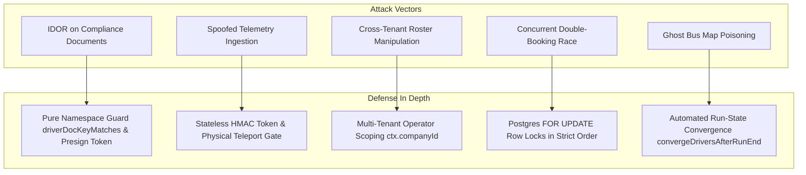
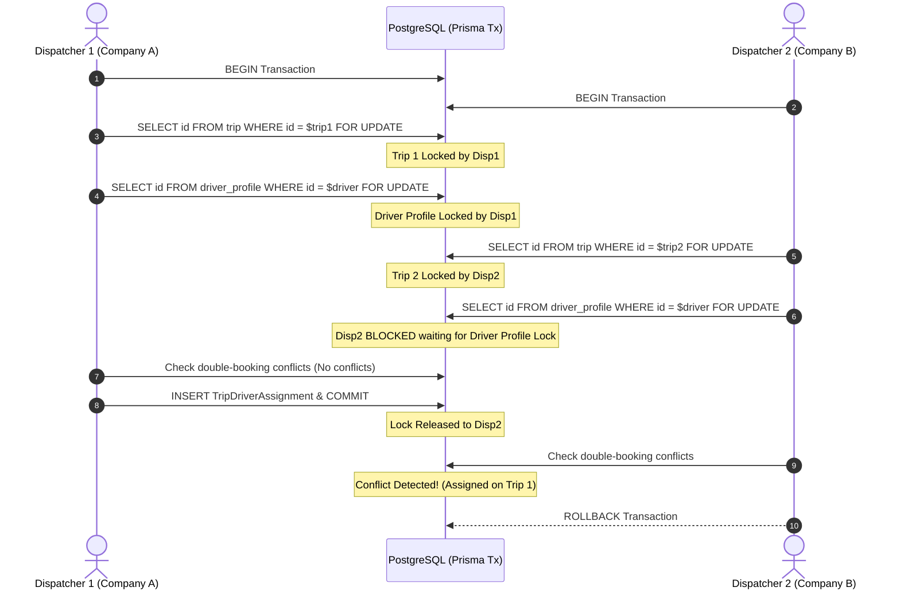

# Security Threat Model, Concurrency & Operational Edge Cases

## 1. Security Architecture & Threat Model

The Driver Operations Domain enforces strict zero-trust boundaries between drivers, competing bus operators, platform administrators, and anonymous API consumers.

---

## 2. Insecure Direct Object References (IDOR) & Document Privacy

### 2.1 Threat Scenario
An operator attempts to view private driving documents (such as medical certificates or national ID cards) belonging to an independent driver or a competitor's driver.

### 2.2 Mitigation: Driver Authorization Model
The system enforces **"Authorize the Driver, Not the Key"** (`apps/web/features/driver/lib/driver-doc-access.ts#L9-L58`):
1. **Tenancy Proof**:
   The procedure first asserts that the requested `driverProfileId` has an `isActive === true` affiliation with `ctx.companyId` (`apps/web/features/driver/lib/driver-doc-mint.ts#L29-L48`).
2. **Namespace Guard (`driverDocKeyMatches`)**:
   Proves that `objectKey` starts with `documents/drivers/{driverUserId}/{docSegment}/`.
   An operator cannot pass an arbitrary S3 key (e.g. platform financial reports or another company's license) to the presigning endpoint.

---

## 3. Concurrency Protection & Row-Level Locking

### 3.1 Trip Assignment Race Conditions
When multiple dispatchers attempt to assign the same driver to different trips at the exact same moment:

### 3.2 Deadlock Prevention: Deterministic Lock Hierarchy
To prevent database deadlocks across multi-table updates:
* **Trip Assignment Hierarchy**: Always lock `Trip` (`FOR UPDATE`), followed by `DriverProfile` (`FOR UPDATE`).
* **Telemetry Scoring Hierarchy**: When locking multiple drivers during batch scoring, IDs are always sorted alphabetically (`ORDER BY id FOR UPDATE`).

---

## 4. Telemetry Spoofing & Tamper Protection

### 4.1 Threat Scenario
A compromised mobile device or rogue actor attempts to forge bus GPS coordinates, fabricate high speeds to sabotage a driver's safety score, or stream coordinates for an unassigned trip.

### 4.2 Defenses:
1. **Stateless HMAC Dispatch Tokens**:
   `mintTelemetryDispatchTokenWithCompany` produces a cryptographic signature binding `driverProfileId`, `tripId`, and `companyId`. Mismatched payload claims are rejected with `HTTP 401`.
2. **Rate Limiting**:
   Two-tier rate limiting via `telemetryThrottle`:
   * Tier 1: IP-level gateway filter.
   * Tier 2: Driver-level ceiling (max 12 pings/minute).
3. **Haversine Teleportation Filter**:
   Velocity jumps $> 220$ km/h are rejected before reaching the database or Redis pub/sub.
4. **Accuracy Flagging**:
   Multipath reflections (accuracy $> 50$m) are tagged as `LOW_ACCURACY` and excluded from safety scoring deductions.

---

## 5. Operational Edge Cases & System Handlers

| Edge Case Scenario | System Vulnerability if Unhandled | Moja Ride Implementation & Handler |
| :--- | :--- | :--- |
| **Driver loses internet mid-route** | Passenger boarding stalls at remote rural terminal. | **Offline Scan Queue**: Scans stored locally in `AsyncStorage`. Boarding cleared locally; synchronized via `drivers.batchSyncCheckIns` upon reconnection using original scan timestamps. |
| **Operator marks trip ARRIVED while driver is on route** | Driver profile permanently locked in `status = "ON_TRIP"` ("Ghost Bus"). | **Anti-Strand Run Convergence**: `convergeDriversAfterRunEnd` automatically executes inside the arrival transaction, resetting driver status to `AVAILABLE` (if shift open) or `OFFLINE`. |
| **Driver's license expires during active trip** | Legal violation if trip continues under expired license. | **License Usability Gate**: `isLicenseUsableThrough` validates that `licenseExpiryDate` extends past `trip.estimatedArrival`. Assignment is blocked at dispatch time if the license expires mid-run. |
| **Driver accepts new exclusive offer while currently driving for another company** | Stranded passengers on highway if old contract terminates immediately. | **In-Flight Exclusive Switch Guard**: If driver has an active `currentTripId`, the offer acceptance is blocked until the active run finishes. |
| **Operator adds driver using already-registered passenger phone number** | Split duplicate user accounts or security breach. | **Binding Conflict Protocol**: Server throws `EXISTING_USER_BINDING_REQUIRED`. Operator must review masked credentials and explicitly confirm account binding. |
| **Cracked passenger phone screen prevents QR scanning** | Passenger cannot board despite holding a valid ticket. | **Manual Boarding Fallback**: Conductor taps passenger name on manifest to invoke `drivers.manualCheckInPassenger`. |
