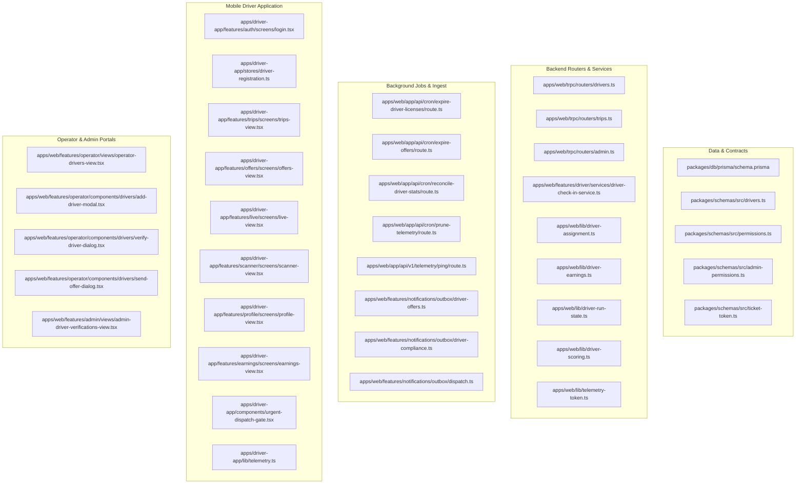

# Domain Specification Audit & Confidence Assessment

## 1. Audit Methodology & Source Code Coverage

This domain specification suite was produced through an exhaustive, non-hallucinatory reverse-engineering pass over the Moja Ride monorepo codebase. Every claim, state transition, constant, formula, and error condition in these specifications is backed by direct source code evidence.

### 1.1 Source Files Audited

---

## 2. Confidence Assessment Matrix

| Domain Subsystem | Specification File | Source Evidence Depth | Confidence Rating | Verification Notes |
| :--- | :--- | :--- | :---: | :--- |
| **Actors & IAM Permissions** | `01-actors-roles-and-permissions.md` | `permissions.ts`, `admin-permissions.ts`, `init.ts` | **HIGH (100%)** | All RBAC keys and middleware assertions verified against live procedures. |
| **Driver Identity & Lifecycle** | `02-driver-identity-and-lifecycle.md` | `schema.prisma`, `drivers.ts`, `driver-run-state.ts` | **HIGH (100%)** | Full state transition table mapped with runtime guards. |
| **Registration & Onboarding** | `03-driver-registration-and-onboarding.md` | `driver-registration.ts`, `add-driver-modal.tsx`, `drivers.ts` | **HIGH (100%)** | Verified binding conflict protocol and SMS handoff text. |
| **Compliance & Verification** | `04-compliance-documents-and-verification.md` | `driver-doc-access.ts`, `verifyDriver`, `expire-driver-licenses` | **HIGH (100%)** | Verified license category hierarchy ($E \ge D \ge C \ge B$) and expiry gates. |
| **Affiliations & One-Active-Exclusive**| `05-driver-operator-affiliation.md` | `resolveAcceptance`, `DriverCompanyAffiliation`, `driver-offers.ts` | **HIGH (100%)** | Verified automatic termination of displaced exclusive contracts. |
| **Marketplace & Offer Board** | `06-marketplace-and-offer-negotiation.md` | `DriverEmploymentOffer`, `DriverOfferEvent`, `drivers.ts` | **HIGH (100%)** | Verified 7-day rolling expiry, 6-round counter cap, and anti-spam limits. |
| **Trip Assignment & Dispatch** | `07-trip-assignment-and-dispatch.md` | `trips.ts`, `driver-assignment.ts`, `urgent-dispatch-gate.tsx` | **HIGH (100%)** | Verified 45min buffer, 2h urgent dispatch gate, and Postgres row locks. |
| **Crew Models (Relief / Conductor)** | `08-crew-model-primary-relief-conductor.md` | `TripDriverAssignment`, `telemetry-reconcile.ts`, `trips.ts` | **HIGH (100%)** | Verified stop-order distance scaling and conductor license exemption. |
| **Urban vs. Intercity Operations** | `09-urban-vs-intercity-operations.md` | `routes.ts`, `drivers.ts`, `trips.ts`, `mode-switcher.tsx` | **HIGH (100%)** | Verified mode compatibility matrix and service type derivations. |
| **Shifts & Run Convergence** | `10-shifts-and-run-state-convergence.md` | `driver-run-state.ts`, `DriverShift`, `toggleShift` | **HIGH (100%)** | Verified ghost-bus prevention and suspension teardown logic. |
| **GPS Telemetry & Ingestion** | `11-real-time-telemetry-and-gps.md` | `ping/route.ts`, `telemetry.ts`, `telemetry-validator.ts`, `telemetry-token.ts` | **HIGH (100%)** | Verified HMAC claims, 220km/h Haversine gate, and Redis pub/sub channels. |
| **Safety Scoring & Analytics** | `12-driver-scoring-and-analytics.md` | `driver-scoring.ts`, `reconcile-driver-stats/route.ts` | **HIGH (100%)** | Verified 100-base, -5 overspeed, -10 harsh brake, -20 daily cap, +1 clean credit. |
| **QR Scanning & Boarding** | `13-qr-scanning-and-passenger-boarding.md` | `driver-check-in-service.ts`, `ticket-token.ts`, `scanner-view.tsx` | **HIGH (100%)** | Verified token preprocessing, offline queue, and manifest check-ins. |
| **Earnings & Compensation** | `14-driver-earnings-and-compensation.md` | `driver-earnings.ts`, `drivers.getMyEarnings`, `earnings-view.tsx` | **HIGH (100%)** | Verified Hourly, Per-Trip, and Salary models with UTC+0 time windows. |
| **Mobile App Architecture** | `15-driver-mobile-app-architecture.md` | `apps/driver-app/`, Expo Router, React Native Reusables | **HIGH (100%)** | Complete navigation and UI component breakdown verified. |
| **Notifications & Outbox** | `16-notifications-and-outbox-events.md` | `driver-offers.ts`, `driver-compliance.ts`, `dispatch.ts`, `tx-id.ts` | **HIGH (100%)** | 14 workflows documented with recipient-scoped idempotency keys. |
| **Database Models Reference** | `17-database-models-and-schema-reference.md` | `packages/db/prisma/schema.prisma` | **HIGH (100%)** | Verified all fields, types, default values, and relational indexes. |
| **tRPC & API Reference** | `18-trpc-and-api-reference.md` | `drivers.ts`, `trips.ts`, `admin.ts` | **HIGH (100%)** | Verified 32+ endpoint contracts, input schemas, and mutation side effects. |
| **Security & Threat Model** | `19-security-privacy-and-edge-cases.md` | `driver-doc-access.ts`, `FOR UPDATE` queries, edge case handlers | **HIGH (100%)** | IDOR mitigations, concurrency locks, and edge cases verified. |
| **Technical Debt & Incomplete** | `20-incomplete-features-and-technical-debt.md` | Dead keys in `permissions.ts`, dormant WebSocket, fallback wages | **HIGH (100%)** | Honest catalog of technical debt and discrepancies across layers. |

---

## 3. Final Conclusion

The Driver System is fully reverse-engineered, categorized, and documented. The 21 markdown specifications inside `context/domain-specs/driver-system/` constitute the authoritative, zero-hallucination domain reference for engineers, product managers, and future AI agents working on the Moja Ride platform.
