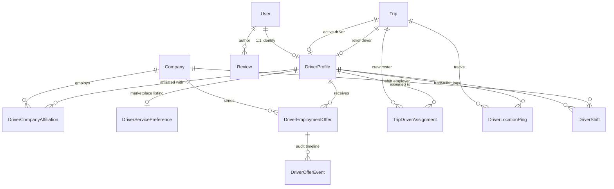

# Driver System Specification & Architecture Overview

The **Driver System / Driver Operations Domain** of the Moja Ride platform encompasses all business logic, data models, state machines, telemetry ingestion pipelines, mobile applications, operator ERP tools, and platform administration workflows responsible for driver onboarding, compliance verification, affiliation management, marketplace hiring, trip assignment, real-time GPS tracking, QR passenger boarding, and performance analytics.

This document serves as the canonical root and reading guide for the complete Driver Domain Specification.

---

## 1. Scope & Applications Involved

The Driver Domain spans across multiple workspaces in the Turborepo monorepo:

| Application / Package | Role & Responsibility in Driver Domain |
| :--- | :--- |
| **`apps/driver-app`** | React Native / Expo mobile application used by commercial bus drivers for authentication, profile setup, active run navigation, HUD speedometer telemetry, QR ticket scanning, offline boarding synchronization, shift management, offer review, counteroffering, and urgent dispatch response. |
| **`apps/web`** | Next.js App Router portal hosting the tRPC backend API (`routers/drivers.ts`, `routers/trips.ts`, `routers/admin.ts`), Operator ERP dashboard (`/dashboard/operator/drivers`), Platform Admin dashboard (`/dashboard/admin/drivers`), telemetry ingest HTTP API (`/api/v1/telemetry/ping`), Redis telemetry pub/sub, Outbox notification dispatchers, and nightly compliance crons (`expire-driver-licenses`, `expire-offers`, `reconcile-driver-stats`, `prune-telemetry`). |
| **`packages/db`** | Prisma ORM schema defining `User`, `DriverProfile`, `DriverCompanyAffiliation`, `TripDriverAssignment`, `DriverLocationPing`, `DriverShift`, `DriverServicePreference`, `DriverEmploymentOffer`, `DriverOfferEvent`, `Trip`, `Review`, `Booking`, and associated relational indexes. |
| **`packages/schemas`** | Shared Zod validation contracts, constants, license category rules, turnaround intervals, and parsing utilities (`src/drivers.ts`, `src/permissions.ts`, `src/admin-permissions.ts`, `src/ticket-token.ts`). |

---

## 2. Core Domain Entities & Relationships

---

## 3. Master Architectural Principles & Invariants

1. **Strict Verification Gate for Running Operations**:
   Only drivers with `verificationStatus === "VERIFIED"` may be assigned to trips, toggle duty shifts on, or start active runs (`canOperateRuns(status)` in `packages/schemas/src/drivers.ts`). Drivers with `PENDING`, `EXPIRED`, or `REJECTED` status maintain read access to the app but cannot begin operating runs.
2. **One-Active-Exclusive Affiliation Rule**:
   A driver holding an `EXCLUSIVE_INTERCITY` affiliation can only be affiliated with **one** operator at any time. Accepting an exclusive offer from a new company automatically terminates conflicting exclusive affiliations with audit logging and outbox notifications to displaced operators.
3. **Double-Booking Engine with Turnaround Buffer**:
   Cross-company overlap detection prevents double-booking a driver across trips. A mandatory `DRIVER_TURNAROUND_BUFFER_MINUTES = 45` buffer separates consecutive runs.
4. **Anti-Strand Run-State Convergence**:
   When a trip terminates outside the driver's own action (e.g., operator marks arrival on the dispatch board or cancels a trip), `convergeDriversAfterRunEnd` automatically clears `currentTripId` and transitions the driver to `AVAILABLE` (if an open shift exists) or `OFFLINE` (if no shift), preventing "ghost buses" on fleet live maps.
5. **Private Namespace Storage for Compliance Dossiers**:
   Compliance documents (licence front/back, medical certificate, selfie) are stored under user-scoped private storage paths (`documents/drivers/{userId}/{segment}/...`). Downloads are presigned on demand after validating operator affiliation or admin compliance permissions.
6. **Stateless HMAC Telemetry Authorization**:
   Telemetry streaming is authorized via short-lived HMAC tokens minted on trip start (`mintTelemetryDispatchTokenWithCompany`), validating `driverProfileId`, `tripId`, and `companyId` without database lookups on the hot ingest path.

---

## 4. Documentation Index

The Driver Operations Domain is exhaustively documented in the following 21 modular specifications:

| Spec File | Title & Core Topics Covered |
| :--- | :--- |
| [**`01-actors-roles-and-permissions.md`**](./01-actors-roles-and-permissions.md) | Actor definitions (Platform Admin, Operator Staff, Driver, Primary, Relief, Conductor), RBAC permission catalogs, and IAM authorization matrices. |
| [**`02-driver-identity-and-lifecycle.md`**](./02-driver-identity-and-lifecycle.md) | Complete driver lifecycle from onboarding to retirement, database representation, and live operational state machines. |
| [**`03-driver-registration-and-onboarding.md`**](./03-driver-registration-and-onboarding.md) | Self-registration mobile wizard, operator roster creation, binding conflict resolution, and invitation mechanics. |
| [**`04-compliance-documents-and-verification.md`**](./04-compliance-documents-and-verification.md) | Licence classes (B, C, D, E), validity through trip end, document upload pipeline, operator compliance review, and admin approval hub. |
| [**`05-driver-operator-affiliation.md`**](./05-driver-operator-affiliation.md) | Affiliation types (`EXCLUSIVE_INTERCITY`, `CONTRACTOR_URBAN`, `HYBRID`), one-active-exclusive enforcement, roster removal, and wage contracts. |
| [**`06-marketplace-and-offer-negotiation.md`**](./06-marketplace-and-offer-negotiation.md) | Public marketplace listing, structured employment offers, multi-round counteroffer negotiation engine, 7-day rolling expiry, and audit events. |
| [**`07-trip-assignment-and-dispatch.md`**](./07-trip-assignment-and-dispatch.md) | Trip assignment workflow, double-booking interval conflict detection, urgent dispatch alerts (<2h), and assignment acknowledgment. |
| [**`08-crew-model-primary-relief-conductor.md`**](./08-crew-model-primary-relief-conductor.md) | Crew architecture on trips: Primary Driver vs. Relief Driver vs. Conductor, permissions, handover semantics, and manifest ownership. |
| [**`09-urban-vs-intercity-operations.md`**](./09-urban-vs-intercity-operations.md) | Deep architectural comparison between Urban corridor loops and Intercity long-haul operations, mode compatibility rules, and constraints. |
| [**`10-shifts-and-run-state-convergence.md`**](./10-shifts-and-run-state-convergence.md) | Driver shift tracking (`DriverShift`), on/off duty toggling, in-flight state transitions, and run-state convergence algorithms. |
| [**`11-real-time-telemetry-and-gps.md`**](./11-real-time-telemetry-and-gps.md) | GPS collection pipeline, background tracking task, HMAC dispatch tokens, physical validation gates, Haversine teleport filter, and Redis pub/sub. |
| [**`12-driver-scoring-and-analytics.md`**](./12-driver-scoring-and-analytics.md) | Safety score algorithm (100 base, -5 overspeed, -10 harsh braking, -20 daily cap, +1 clean streak credit), trust badges, and nightly reconcile cron. |
| [**`13-qr-scanning-and-passenger-boarding.md`**](./13-qr-scanning-and-passenger-boarding.md) | QR ticket camera scanning, token normalization (`parseTicketToken`), check-in authorization pipeline, offline scan queue, and manifest management. |
| [**`14-driver-earnings-and-compensation.md`**](./14-driver-earnings-and-compensation.md) | Compensation engine supporting Hourly, Per-Trip, and Monthly Salary models, open shift live accruals, and timezone discipline (UTC+0). |
| [**`15-driver-mobile-app-architecture.md`**](./15-driver-mobile-app-architecture.md) | Mobile application structure, navigation hierarchy, tab screens, Zustand stores, React Native Reusables UI, and offline caching. |
| [**`16-notifications-and-outbox-events.md`**](./16-notifications-and-outbox-events.md) | Transactional Outbox pattern, driver notification workflows (offers, dispatches, delays, compliance alerts), and push notification contracts. |
| [**`17-database-models-and-schema-reference.md`**](./17-database-models-and-schema-reference.md) | Complete Prisma schema reference for all 10+ driver-participating database models, fields, types, constraints, and relational indexes. |
| [**`18-trpc-and-api-reference.md`**](./18-trpc-and-api-reference.md) | Comprehensive API catalog of all driver-related procedures across `driversRouter`, `tripsRouter`, and `adminRouter`. |
| [**`19-security-privacy-and-edge-cases.md`**](./19-security-privacy-and-edge-cases.md) | Security threat model, IDOR protections, cross-tenant isolation, concurrency locks (`FOR UPDATE`), and operational edge cases. |
| [**`20-incomplete-features-and-technical-debt.md`**](./20-incomplete-features-and-technical-debt.md) | Honest catalog of partial implementations, dormant WebSocket transport, dead permission keys, and architectural technical debt. |
| [**`99-documentation-audit.md`**](./99-documentation-audit.md) | Methodological audit report, codebase coverage log, discovered files list, and confidence assessment ratings. |

---

## 5. Recommended Reading Order

1. **For System Architects & Backend Engineers**:
   `01-actors-roles-and-permissions.md` → `02-driver-identity-and-lifecycle.md` → `05-driver-operator-affiliation.md` → `07-trip-assignment-and-dispatch.md` → `11-real-time-telemetry-and-gps.md` → `17-database-models-and-schema-reference.md` → `18-trpc-and-api-reference.md`.
2. **For Mobile & Frontend Developers**:
   `15-driver-mobile-app-architecture.md` → `03-driver-registration-and-onboarding.md` → `06-marketplace-and-offer-negotiation.md` → `11-real-time-telemetry-and-gps.md` → `13-qr-scanning-and-passenger-boarding.md`.
3. **For Product Managers & Operations Controllers**:
   `04-compliance-documents-and-verification.md` → `06-marketplace-and-offer-negotiation.md` → `08-crew-model-primary-relief-conductor.md` → `09-urban-vs-intercity-operations.md` → `12-driver-scoring-and-analytics.md` → `14-driver-earnings-and-compensation.md`.
4. **For QA & Security Auditors**:
   `19-security-privacy-and-edge-cases.md` → `20-incomplete-features-and-technical-debt.md` → `99-documentation-audit.md`.
