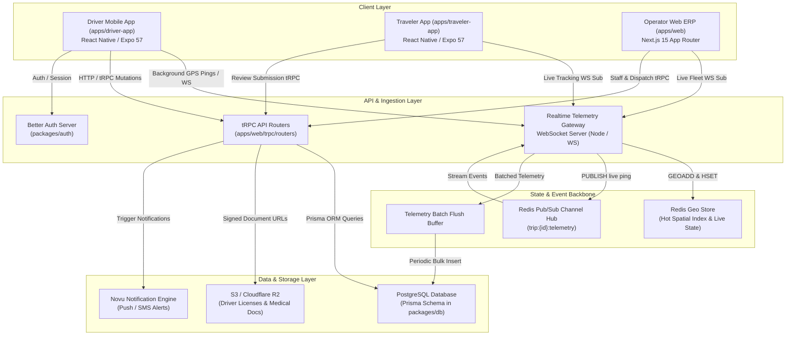
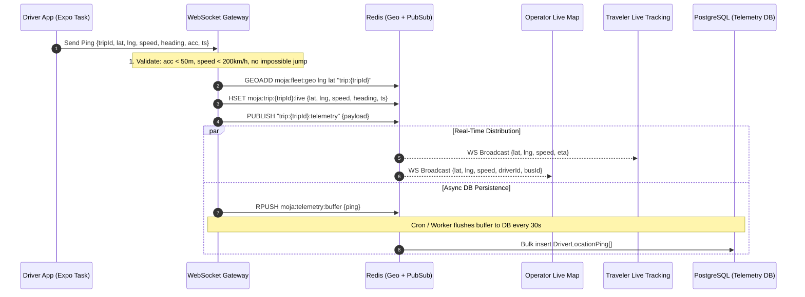

# Moja Bus Driver System & Real-Time Telemetry — Architecture

## 1. System Architecture Diagram



---

## 2. Tech Stack & Package Matrix

| Component | Framework / Technology | Version | Location |
| :--- | :--- | :--- | :--- |
| **Driver Mobile App** | React Native + Expo Router + NativeWind | Expo 57 / RN 0.86 / React 19 | `apps/driver-app` |
| **Traveler App (Integration)** | React Native + Expo Router + NativeWind | Expo 57 / RN 0.86 / React 19 | `apps/traveler-app` |
| **Operator Dashboard & ERP** | Next.js App Router + TypeScript + Tailwind CSS | Next.js 15 / React 19 | `apps/web` |
| **Backend Routers & APIs** | tRPC v11 + Zod v4 validation | tRPC 11 / Zod 4 | `apps/web/trpc/routers` |
| **Database & ORM** | PostgreSQL + Prisma ORM Client | Prisma 6 | `packages/db` |
| **Shared Schemas & Types** | Zod Schemas + TypeScript Definitions | TypeScript 6 | `packages/schemas`, `packages/types` |
| **Realtime Telemetry Ingestion** | WebSocket Server (`ws`) + Redis Geohash | Node.js `ws` / IORedis | `packages/realtime` / `apps/web/server` |
| **Background Location Engine** | `expo-location` + `expo-task-manager` | Expo 57 | `apps/driver-app/lib/location` |
| **Notifications** | Novu Framework (Push, SMS, In-App) | `@novu/framework` | `packages/shared`, `apps/web/lib/novu` |

---

## 3. Data Models (Prisma Extensions)

### A. Staff Role Enum Extension
```prisma
enum StaffRole {
  OWNER
  ADMIN
  MANAGER
  OPERATIONS
  FINANCE
  SUPPORT
  TREASURY
  DISPATCHER
  CONDUCTOR
  DRIVER         // <-- New driver role
}
```

### B. Driver Status & Verification Enums
```prisma
enum DriverStatus {
  OFFLINE
  AVAILABLE
  ON_DUTY
  ON_TRIP
  RESTING
  SUSPENDED
}

enum DriverVerificationStatus {
  PENDING
  VERIFIED
  REJECTED
  EXPIRED
  SUSPENDED
}

enum DriverEmploymentType {
  EXCLUSIVE_INTERCITY  // Single company exclusivity
  CONTRACTOR_URBAN     // Multi-company urban contractor pool
  HYBRID               // Allowed on both with company approval
}

enum LicenseCategory {
  B   // Light vehicle / small van
  C   // Heavy commercial vehicle
  D   // Large passenger bus (standard intercity coach)
  E   // Articulated / multi-trailer
}
```

### C. Core Models

```prisma
// Global portable Driver Profile (tied to User for life)
model DriverProfile {
  id                   String                   @id @default(cuid())
  userId               String                   @unique
  user                 User                     @relation(fields: [userId], references: [id], onDelete: Cascade)

  // Professional Credentials
  licenseNumber        String                   @unique
  licenseCategory      LicenseCategory          @default(D)
  licenseExpiryDate    DateTime
  licenseFrontUrl      String?
  licenseBackUrl       String?
  yearsOfExperience    Int                      @default(1)
  medicalClearanceDate DateTime?
  medicalDocUrl        String?
  
  // Platform Verification
  verificationStatus   DriverVerificationStatus @default(PENDING)
  verifiedAt           DateTime?
  verifiedById         String?
  verifiedBy           User?                    @relation("DriverVerifiedBy", fields: [verifiedById], references: [id], onDelete: SetNull)
  rejectionReason      String?

  // Current Live Operational State
  status               DriverStatus             @default(OFFLINE)
  currentTripId        String?
  currentTrip          Trip?                    @relation("DriverCurrentTrip", fields: [currentTripId], references: [id], onDelete: SetNull)
  lastPingAt           DateTime?
  lastLatitude         Float?
  lastLongitude        Float?
  lastHeading          Float?
  lastSpeedKmh         Float?

  // Career Reputation & Analytics (Aggregated across all employers)
  averageRating        Float                    @default(5.0)
  totalReviews         Int                      @default(0)
  totalTripsCompleted  Int                      @default(0)
  totalDistanceKm      Float                    @default(0.0)
  safetyScore          Int                      @default(100) // 0-100 scale

  // Relations
  companyAffiliations  DriverCompanyAffiliation[]
  assignedTrips        Trip[]                   @relation("TripAssignedDriver")
  reliefTrips          Trip[]                   @relation("TripReliefDriver")
  tripAssignments      TripDriverAssignment[]
  telemetryPings       DriverLocationPing[]
  reviews              Review[]                 @relation("DriverReviews")
  shifts               DriverShift[]

  createdAt            DateTime                 @default(now())
  updatedAt            DateTime                 @updatedAt

  @@index([status])
  @@index([verificationStatus])
  @@index([licenseNumber])
  @@map("driver_profile")
}

// Company-specific employment/affiliation contract
model DriverCompanyAffiliation {
  id              String               @id @default(cuid())
  driverProfileId String
  driverProfile   DriverProfile        @relation(fields: [driverProfileId], references: [id], onDelete: Cascade)
  companyId       String
  company         Company              @relation(fields: [companyId], references: [id], onDelete: Cascade)

  employmentType  DriverEmploymentType @default(EXCLUSIVE_INTERCITY)
  isActive        Boolean              @default(true)
  isVerified      Boolean              @default(false)
  badgeNumber     String?
  hiredAt         DateTime             @default(now())
  terminatedAt    DateTime?
  notes           String?

  createdAt       DateTime             @default(now())
  updatedAt       DateTime             @updatedAt

  @@unique([driverProfileId, companyId])
  @@index([companyId, isActive])
  @@map("driver_company_affiliation")
}

// Assignment junction supporting Primary Driver + Relief Driver + Conductor
model TripDriverAssignment {
  id              String        @id @default(cuid())
  tripId          String
  trip            Trip          @relation(fields: [tripId], references: [id], onDelete: Cascade)
  driverProfileId String
  driverProfile   DriverProfile @relation(fields: [driverProfileId], references: [id], onDelete: Cascade)

  role            String        @default("PRIMARY") // PRIMARY | RELIEF | CONDUCTOR
  assignedAt      DateTime      @default(now())
  assignedByStaffId String?
  
  // Duty shift segment on the trip
  startStopOrder  Int           @default(0)
  endStopOrder    Int?
  distanceKm      Float?

  @@unique([tripId, driverProfileId, role])
  @@index([tripId])
  @@index([driverProfileId])
  @@map("trip_driver_assignment")
}

// Real-time location breadcrumbs for audit, live playback & analytics
model DriverLocationPing {
  id              String        @id @default(cuid())
  driverProfileId String
  driverProfile   DriverProfile @relation(fields: [driverProfileId], references: [id], onDelete: Cascade)
  tripId          String?
  trip            Trip?         @relation(fields: [tripId], references: [id], onDelete: SetNull)

  latitude        Float
  longitude       Float
  heading         Float?        // 0 - 360 degrees
  speedKmh        Float?
  accuracyMeters  Float?
  altitudeMeters  Float?
  
  isAnomaly       Boolean       @default(false) // Triggered if speed > 200 or distance jump
  anomalyReason   String?
  recordedAt      DateTime

  createdAt       DateTime      @default(now())

  @@index([tripId, recordedAt])
  @@index([driverProfileId, recordedAt])
  @@map("driver_location_ping")
}

// Work shifts & duty logs
model DriverShift {
  id              String        @id @default(cuid())
  driverProfileId String
  driverProfile   DriverProfile @relation(fields: [driverProfileId], references: [id], onDelete: Cascade)
  companyId       String
  company         Company       @relation(fields: [companyId], references: [id], onDelete: Cascade)

  startedAt       DateTime      @default(now())
  endedAt         DateTime?
  totalMinutes    Int?
  serviceType     ServiceType   @default(INTERCITY)
  tripsCompleted  Int           @default(0)

  createdAt       DateTime      @default(now())

  @@index([driverProfileId, startedAt])
  @@index([companyId, startedAt])
  @@map("driver_shift")
}
```

### D. Extended Review Model
```prisma
model Review {
  id               String         @id @default(cuid())
  companyId        String
  company          Company        @relation(fields: [companyId], references: [id], onDelete: Cascade)

  // Overall Score (1 to 5)
  rating           Int
  content          String?        @db.Text
  authorId         String
  author           User           @relation(fields: [authorId], references: [id])

  // Multi-dimensional breakdown
  driverRating     Int?           // 1 to 5
  busRating        Int?           // 1 to 5 (cleanliness & comfort)
  punctualityRating Int?          // 1 to 5 (on-time performance)

  // Entity Links
  driverId         String?
  driver           DriverProfile? @relation("DriverReviews", fields: [driverId], references: [id], onDelete: SetNull)
  tripId           String?
  trip             Trip?          @relation(fields: [tripId], references: [id], onDelete: SetNull)
  busId            String?
  bus              Bus?           @relation(fields: [busId], references: [id], onDelete: SetNull)

  // Operator Public Response
  response         String?        @db.Text
  respondedAt      DateTime?

  bookingId        String?        @unique
  booking          Booking?       @relation(fields: [bookingId], references: [id], onDelete: SetNull)

  createdAt        DateTime       @default(now())
  updatedAt        DateTime       @updatedAt

  @@index([companyId])
  @@index([driverId])
  @@index([tripId])
  @@map("review")
}
```

---

## 4. Real-Time Telemetry Pipeline (Safarpay-Engineered)



### Safarpay Domain Filters Enforced on Ingest:
1. **Accuracy Threshold**: Discard readings with `accuracyMeters > 50.0m` to prevent erratic GPS drift.
2. **Speed Threshold**: Flag anomaly if `speedKmh > 200.0 km/h`.
3. **Haversine Jump Check**: Verify distance between consecutive pings against $\Delta t$ ($v = \Delta d / \Delta t$). If inferred velocity exceeds $220\text{ km/h}$, flag as anomaly.
4. **Offline Sync Buffer**: When moving through remote intercity corridors without GSM signal, Driver App buffers pings in SQLite / AsyncStorage and bulk-flushes upon reconnecting.

---

## 5. IAM Permissions & Security Invariants

### New Permission Keys (`packages/schemas/src/permissions.ts`):
- `"drivers:read"`: View driver roster, profiles, and live status.
- `"drivers:create"`: Onboard and invite new drivers.
- `"drivers:update"`: Edit driver details, license info, and documents.
- `"drivers:verify"`: Approve/reject driver compliance documents.
- `"drivers:assign"`: Allocate drivers to trips on dispatch board.
- `"telemetry:stream"`: Stream live telemetry data from vehicle.

### Invariants:
1. **Exclusive Intercity Assignment**: A driver cannot be assigned to two overlapping intercity trips.
2. **Driver Profile Sovereignty**: A company cannot delete a driver's global `DriverProfile`; they can only terminate their company affiliation (`DriverCompanyAffiliation`).
3. **Review Immutability**: Once submitted by a verified traveler for a completed booking, review ratings cannot be modified by operators or drivers.
4. **Trip Snapshot Freezing**: When a driver is assigned to a trip, the snapshot captures their name, license number, and phone number on the trip manifest.
