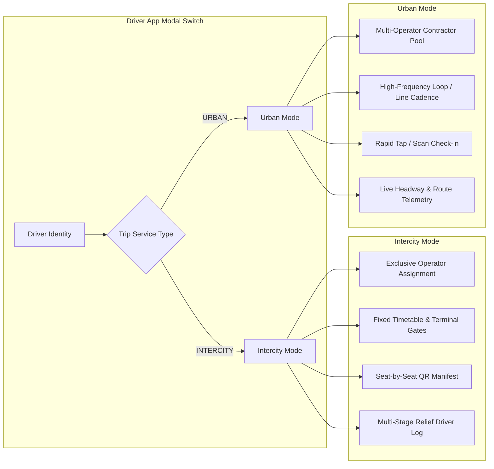

# Moja Bus Driver System & Real-Time Telemetry — Project Overview

## 1. Executive Summary & Vision
The **Moja Bus Driver System** is an enterprise-grade extension to the Moja Bus ERP and Traveler ecosystem. It elevates drivers from simple database records into first-class platform citizens with dedicated mobile tooling, real-time telemetry streaming, carrier-grade trip execution, and portable career progression.

Simultaneously, it empowers bus operators with complete operational visibility, accurate driver-trip allocation, and granular passenger review analytics.

---

## 2. Core Problem Statements & Solutions

| Problem | Solution |
| :--- | :--- |
| **No Real-Time Tracking**: Operators and travelers have no live visibility into bus positions during intercity or urban journeys. | **Safarpay-Grade Real-Time Telemetry**: Dual WebSocket + HTTP fallback ingestion with Redis Geo caching, anomaly filtering (speed/jump/accuracy gates), and real-time live map broadcasts to Operator Dashboard and Traveler App. |
| **Driver Accountability & Reviews**: Passenger reviews previously only rated the operator company, missing individual driver performance. | **Granular Multi-Criteria Reviews**: Reviews link directly to `driverId`, `tripId`, `busId`, and `bookingId` with separate ratings for Driver Behavior, Vehicle Cleanliness, and Punctuality. |
| **Fragmented Employment Models**: Intercity requires dedicated exclusive staff, whereas Urban relies on contractor drivers serving multiple fleets. | **Dual-Mode Architecture & Lifetime Career Identity**: Driver Profile stays with the driver for life (portable reputation, badges, safety records), while Company Affiliations model exclusive intercity contracts or multi-operator urban contractor access. |
| **Manual Dispatch & Boarding**: Drivers lack real-time digital manifests, stop check-ins, or reliable QR scanning tools. | **Dedicated Driver App (`apps/driver-app`)**: React Native + Expo app with offline-capable QR scanner, stop-by-stop departure/arrival checklist, turn-by-turn routing, delay reporter, and shift management. |

---

## 3. Urban vs. Intercity: Two Coexisting Operating Models

The system treats **Intercity** and **Urban** as two distinct operating modes coexisting seamlessly inside the same core data models and Driver App:

### A. Intercity Operations Mode (`serviceType: INTERCITY`)
1. **Employment Model**: Exclusive to one operator company at a time for intercity schedules.
2. **Trip Lifecycle**: Formal dispatch manifest $\rightarrow$ Pre-trip vehicle inspection $\rightarrow$ Terminal gate check-in $\rightarrow$ Departure $\rightarrow$ Waypoint arrivals/departures $\rightarrow$ Destination terminal arrival.
3. **Crew Assignments**: Primary Driver, optional Relief Driver (for long haul $>400\text{ km}$), and optional Conductor.
4. **Ticketing**: Seat-assigned QR validation with passenger manifest status (`Checked In`, `Boarded`, `No Show`).

### B. Urban Operations Mode (`serviceType: URBAN`)
1. **Employment Model**: Contractor / gig model where drivers can hold affiliations with multiple urban operators and pick up line shifts.
2. **Trip Lifecycle**: Shift start $\rightarrow$ Line selection $\rightarrow$ Continuous loop/segment tracking $\rightarrow$ Dynamic headway calculation $\rightarrow$ Shift end.
3. **Ticketing**: Rapid scan/tap for urban unreserved/open-seating tickets or pass validation.
4. **Telemetry**: High-cadence breadcrumbs for live passenger arrival estimations along dense urban corridors.

---

## 4. Key User Personas & Core Workflows

### Persona 1: The Commercial Driver (Driver App)
- **Morning Shift Start**: Logs in via Better Auth (Phone/OTP or Password), selects active operator context, toggles **On Duty**, and views assigned daily trips.
- **Trip Preparation**: Reviews route waypoints, gate/bay assignment, assigned bus registration plate, and passenger manifest.
- **Boarding & Scanning**: Uses built-in high-speed camera QR scanner to validate passenger tickets at the terminal gate.
- **In-Transit Telemetry**: Background location service automatically broadcasts GPS pings every 5–10 seconds with speed, heading, and accuracy.
- **Stop Execution**: Taps arrival and departure at each intermediate waypoint, logging delay reasons if delayed.
- **Trip Wrap-Up & Career Insights**: Closes trip, views passenger feedback score summary, and tracks lifetime career stats and achievements.

### Persona 2: The Fleet Operator Dispatcher (Operator Web ERP)
- **Driver Roster & Verification**: Onboards drivers, verifies driving license, category endorsements (Category C/D/E), medical clearance, and background checks.
- **Trip Assignment**: Pairs available drivers with buses and scheduled trips on the Dispatch Board (`/dashboard/operator/trips`).
- **Live Fleet Tracking Map**: Monitors all active buses on an interactive map with live speedometer, delay indicators, and off-route alerts.
- **Driver Performance & Analytics**: Evaluates driver ratings, safety metrics, on-time punctuality percentages, and passenger review trends.

### Persona 3: The Bus Traveler (Traveler App)
- **Live Bus Tracking**: Taps **Track Bus** on active booking to see the bus moving in real-time on the map with accurate ETA.
- **Post-Trip Review Prompt**: Automatically receives a Novu push notification and app launch modal to rate the trip across 3 dimensions:
  1. *Driver Professionalism & Safety* (1–5 Stars)
  2. *Vehicle Comfort & Cleanliness* (1–5 Stars)
  3. *Punctuality & Service Quality* (1–5 Stars)
- **Booking Review Management**: Can view and edit reviews from `apps/traveler-app/app/(tabs)/bookings.tsx` and `apps/traveler-app/app/reviews.tsx`.

---

## 5. Main Routes & Navigation Architecture

### Operator Web ERP (`apps/web`)
- `/dashboard/operator/drivers` $\rightarrow$ Driver Directory, KPI metrics, search, filters (Status, License Class, Mode).
- `/dashboard/operator/drivers/[id]` $\rightarrow$ Driver Profile details, license documents, career history, reviews list, and performance analytics.
- `/dashboard/operator/drivers/map` $\rightarrow$ Live full-screen fleet telemetry map with driver status overlays.
- `/dashboard/operator/trips` $\rightarrow$ Updated dispatch board with Driver allocation modal.
- `/dashboard/operator/staff` $\rightarrow$ Staff directory updated with `DRIVER` role filtering and permissions.

### Driver Mobile App (`apps/driver-app`)
- `/(auth)/login` $\rightarrow$ Phone OTP & Password authentication.
- `/(tabs)/trips` $\rightarrow$ Assigned trips list (Today, Upcoming, Completed).
- `/(tabs)/live-trip` $\rightarrow$ Active trip control center (Telematics, Stop checklist, Delay logger).
- `/(tabs)/scanner` $\rightarrow$ Dedicated high-speed ticket QR scanner with audio/haptic feedback.
- `/(tabs)/profile` $\rightarrow$ Career passport, lifetime stats, badges, earnings/shifts, and company affiliations.
- `/trip/[id]/manifest` $\rightarrow$ Full passenger passenger list with search, seat numbers, and boarding status.
