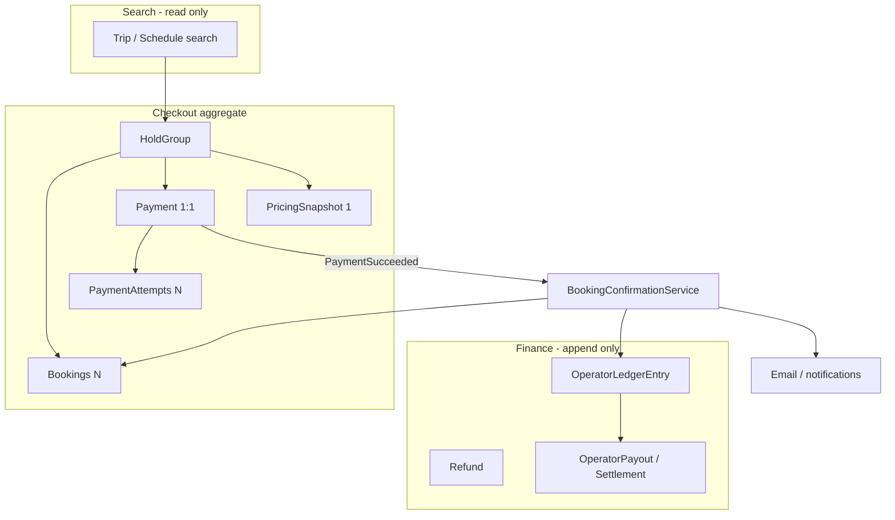

---
todos:
  - id: confirm-paystack-split-civ
    content: "Validate in Paystack test mode per-transaction dynamic split + refund debit behavior for CIV"
    status: pending
  - id: holdgroup-aggregate
    content: "Add HoldGroup entity as checkout aggregate root; migrate Booking off bare holdGroupId UUID; Payment 1:1 HoldGroup"
    status: pending
  - id: platform-fee-config
    content: "PlatformSettings defaults + admin CommissionDistanceTier bands (by route.distanceKm); no operator-facing commission config"
    status: pending
  - id: pricing-ledger-schema
    content: "PricingSnapshot, Payment, PaymentAttempt, immutable OperatorLedgerEntry, Refund, WebhookEvent, PaymentEvent tables"
    status: pending
  - id: payment-domain-boundary
    content: "PaymentProvider interface + Paystack impl; webhook→verify→save→PaymentSucceeded event→BookingConfirmationService (idempotent)"
    status: pending
  - id: checkout-single-payment
    content: "One Initialize per HoldGroup (fare + convenience); Popup v2; card + mobile_money; PaymentAttempt on retry"
    status: pending
  - id: launch-collect-main-account
    content: "v1 main merchant account + ledger credits; admin settlement consumes ledger only; per-operator export"
    status: pending
  - id: v2-auto-split
    content: "v2 Paystack subaccounts + dynamic split at Initialize when verified"
    status: pending
  - id: cancellation-refund-v1
    content: "Simple cancel (cash/voucher); append-only Refund records; ledger debits; boarding/no-show rules"
    status: pending
  - id: notifications-audit
    content: "Email receipts; webhook storage; payment state audit; admin reconciliation tools"
    status: pending
isProject: false
---

# Moja Ride — Paystack Payments, Fees, Settlement & Refunds Plan

**Status**: Design approved pending implementation. Updated 2026-07-05 with architecture review + admin distance-based commission tiers.

---

## Context

- **Market**: Côte d'Ivoire only (XOF); multi-currency later.
- **Merchant of record**: Moja Ride — **platform absorbs Paystack fees**.
- **Provider**: Paystack only (formal `PaymentProvider` abstraction retained).
- **Checkout**: Paystack Popup v2; **cards + mobile money** at launch.
- **Code today**: `holdGroupId` UUID on `Booking` (no entity); `Payment.bookingId` couples payment to single booking ([`packages/db/prisma/schema.prisma`](packages/db/prisma/schema.prisma)); mock adapter ([`apps/web/features/payments/registry.ts`](apps/web/features/payments/registry.ts)).

---

## A. Assessment of proposed additions (honest review)

### A.1 Admin distance-based commission tiers — **ADOPT**

**Your ask**: Admin sets different commission rates by route distance (e.g. 100 km → rate A, 200 km → rate B). Operators never configure this.

**Verdict: Good addition.** You already store `Route.distanceKm` on [`Route`](packages/db/prisma/schema.prisma). Distance **bands** (not per-operator overrides) match your example and stay admin-only.

**Design**:

```
CommissionDistanceTier (admin-only)
  minDistanceKm   Float   // inclusive lower bound
  maxDistanceKm   Float?  // null = no upper limit
  commissionRateBps Int
  convenienceFeeBps Int?  // optional override; null = use global default
  label           String  // e.g. "Short haul ≤100km"
  isActive        Boolean
```

**Resolution at checkout** (highest matching rule wins):

1. Load `Route.distanceKm` for the trip’s route.
2. If distance set → find active tier where `minDistanceKm ≤ distanceKm < maxDistanceKm` (or `maxDistanceKm` null).
3. Else → **global** `PlatformSettings.defaultCommissionRateBps` / `defaultConvenienceFeeBps`.
4. Snapshot result into `PricingSnapshot` (immutable) — never recalculate from live tiers later.

**Caveats** (why this isn’t free):

- Routes with **missing `distanceKm`** fall back to global default — admin dashboard should flag these.
- Bands must not overlap; validate on save.
- This replaces **per-operator commission overrides** in the plan — operators don’t touch fees; only you do via admin tiers + globals.

**Not adopting**: Per-route commission fields on `Route` itself — bands scale better unless you later need route-specific exceptions (add `CommissionRouteOverride` only if needed).

---

### A.2 Architecture review (9.5/10 feedback) — item-by-item

| # | Proposal | Verdict | Rationale |
|---|----------|---------|-----------|
| 1 | Payment must not own booking state | **ADOPT** | Current [`payment-service.ts`](apps/web/features/payments/payment-service.ts) is wrong direction. Payment reports success; `BookingConfirmationService` confirms tickets, ledger, email. |
| 2 | HoldGroup as first-class entity | **ADOPT** | `holdGroupId` UUID without entity is tech debt before Paystack. Checkout aggregate root. |
| 3 | Booking must not reference Payment | **ADOPT** | Move to `HoldGroup → Payment(s)` + `HoldGroup → Booking(s)`. Enables luggage/insurance later. Remove `Payment.bookingId`. |
| 4 | Immutable ledger (append-only) | **ADOPT** | Non-negotiable for accounting. Never UPDATE/DELETE ledger rows. |
| 5 | Webhooks don’t run business logic | **ADOPT** | Webhook → verify → persist → `PaymentSucceeded` event → confirmation (idempotent). |
| 6 | PaymentAttempt table | **ADOPT** | You keep seats on failure + allow retry — attempts are required for audit, not optional polish. |
| 7 | Booking must not store Paystack ref | **ADOPT** | Provider refs live on `Payment` / `PaymentAttempt` only. |
| 8 | Domain events | **ADOPT (simplified)** | In-process event handlers for v1 (`PaymentSucceeded`, `BookingConfirmed`, …). **Not** a message bus yet. |
| 9 | Separate Payment vs Booking status | **ADOPT** | Already conceptually separate; enforce in schema/docs. `PENDING_PAYMENT` booking + `FAILED` payment = retry OK. |
| 10 | Refunds append-only | **ADOPT** | `Refund` rows; don’t flip `Payment.status` to REFUNDED as sole record. |
| 11 | Settlement consumes ledger, not bookings | **ADOPT** | Settlement batches sum ledger entries — never recompute from bookings. |
| 12 | PricingSnapshot | **ADOPT** | Essential with distance tiers + future pricing changes. |
| 13 | Formal PaymentProvider interface | **ADOPT** | Extend existing registry stub with `initialize`, `verify`, `refund`, `parseWebhook`. |
| 14 | Search updates via events | **DEFER** | Correct long-term; out of payment MVP scope. Note in architecture only. |
| 15 | Idempotency table | **ADOPT** | Document keys per operation; enforce in code. |

**What we are NOT adopting for v1** (would slow launch without payoff):

- Async event bus / queue (SQS, etc.) — synchronous handlers + DB idempotency first.
- Full event sourcing — snapshots + append-only ledger are enough.
- Split payments / partial pay / vouchers in checkout v1 — design `HoldGroup` so they fit later, don’t build now.

**Overall**: The review is **directionally excellent**. Items 1–13 and 15 should be **foundation work bundled with Paystack integration**, not a “phase 3 refactor.” Item 14 waits.

---

## B. Domain architecture (target model)

### B.1 Aggregate boundaries



**Single responsibility**:

| Aggregate | Owns |
|-----------|------|
| **Search** | Finding journeys (no payment knowledge) |
| **HoldGroup** | Seat reservation during checkout |
| **Booking** | Confirmed travel rights after confirmation |
| **Payment** | Money movement + provider refs |
| **Ledger** | Immutable operator accounting |
| **Settlement** | Paying operators from ledger balance |

### B.2 Payment must not confirm bookings

```
HoldGroup created
      ↓
PaymentService.initialize(holdGroupId)   // money only
      ↓
Paystack Popup
      ↓
Webhook → Verify → Payment.status = SUCCESS
      ↓
emit PaymentSucceeded { paymentId, holdGroupId }
      ↓
BookingConfirmationService.confirm(holdGroupId)   // business only
      ├── idempotent: already CONFIRMED? return
      ├── bookings → CONFIRMED, issue tickets
      ├── PricingSnapshot → frozen
      ├── OperatorLedgerEntry CREDIT
      ├── email receipt
      └── emit BookingConfirmed (future: search index)
```

### B.3 Webhook pipeline (retry-safe)

```
POST /api/webhooks/paystack
  → persist WebhookEvent (raw, unique event id / reference)
  → if already processed: 200 OK
  → PaystackProvider.parseWebhook + verify signature
  → PaystackProvider.verify(reference)  // trust but verify
  → update Payment + PaymentAttempt
  → emit PaymentSucceeded (in-process)
  → mark WebhookEvent processed
```

Triple `charge.success` → one confirmation, two no-ops.

### B.4 Idempotency keys

| Operation | Key | Behavior on duplicate |
|-----------|-----|------------------------|
| Create hold | client request id / seat lock token | Same hold group or reject |
| Initialize payment | `paymentId` (one per HoldGroup) | Return existing access_code |
| Paystack reference | unique per PaymentAttempt | Reject duplicate SUCCESS |
| Confirm booking | `paymentId` | No-op if already confirmed |
| Refund | `refundRequestId` / booking cancel id | No second refund |
| Settlement batch | `settlementBatchId` | No double payout |
| Webhook | Paystack event id or reference+event | Skip if processed |

---

## C. Locked business decisions (Q&A summary)

### C.1 Fee structure

| Fee | Default | Configurable by |
|-----|---------|-----------------|
| Operator commission | 5% of base fare | **Admin only**: distance tiers + global default |
| Passenger convenience fee | 2.5% of base fare | **Admin only**: global default (optional per-tier override) |
| Paystack processing | 1.95%–3.8% + VAT on fee | Platform absorbs |

**Checkout formula** (unchanged):

```
baseFare         = sum seat fares
commissionRate   = resolveCommission(route.distanceKm)  // tier or default
convenienceRate  = resolveConvenience(route.distanceKm)
convenienceFee   = round(baseFare × convenienceRate / 10_000)
chargeAmount     = baseFare + convenienceFee
operatorCommission = round(baseFare × commissionRate / 10_000)
operatorNet      = baseFare - operatorCommission
platformGross    = operatorCommission + convenienceFee
```

Both rates can be set to **0** via admin tiers or globals.

### C.2 Settlement, merchant account, risk

- **v1**: Single Moja Ride merchant account; manual operator payouts from **ledger**.
- **v2**: Per-operator Paystack subaccount + dynamic split (confirmed supported per txn).
- Operator paid **on payment** (T+2 when auto-split).
- **Platform** absorbs chargebacks.
- Receipts: tax-inclusive, **no VAT line** for now.

### C.3 Checkout & holds

- Flow: reserve → pay → confirm.
- Hold: **10 minutes**; **payment failure does not release seats**; retry via new `PaymentAttempt`.
- One payment per HoldGroup; multi-seat/multi-passenger OK.
- Paystack Popup; card + MoMo (Orange, MTN, Wave).

### C.4 Cancellations (v1 — simple)

- Unused, before departure → refund **cash or voucher** after deducting platform + Paystack fees.
- Operator-cancelled trip → **auto-refund** passengers (recommended default).
- No-show → rebook with fare diff + rebooking fee (max 25% of original base fare).
- Check-in: day before → T-15min; boarding T-15min.

---

## D. Paystack (unchanged essentials)

**CIV fees (VAT exclusive)**: local card 3.2%, international 3.8%, MoMo 1.95%. Amount API = XOF × 100.

**Products**: Initialize, Popup, Verify, Webhooks, Refunds, Disputes, Subaccounts+Split (v2), Customers/authorization (saved cards).

**Skip**: Subscriptions for tickets, Terminal, DVA, direct Card API.

**Per-operator routing**: Pass different `subaccount` / dynamic `split` per Initialize — validate in test mode before v2.

---

## E. Data model (implementation sketch)

### E.1 New / changed entities

**HoldGroup** (new aggregate root):

```
id, userId?, status (ACTIVE|EXPIRED|CONFIRMED|CANCELLED)
expiresAt, companyId, tripId?, routeId?
createdAt, updatedAt
```

**Booking** — change:

- `holdGroupId` → FK to `HoldGroup.id` (not bare UUID string)
- Remove any direct payment FK
- Keep `farePaid` as display snapshot or derive from PricingSnapshot

**Payment** — change:

- `holdGroupId` FK (unique — 1:1 with HoldGroup at checkout)
- Remove `bookingId`
- `provider` = PAYSTACK
- `status`: INITIALIZED | PENDING | SUCCESS | FAILED | DISPUTED
- `chargeAmountXOF`, `baseFareXOF`, `convenienceFeeXOF`, `commissionXOF`
- `paystackFeeXOF`, `channel` (set after success)
- No REFUNDED status as sole truth — use Refund table

**PaymentAttempt** (new):

```
id, paymentId, providerReference (unique)
status, channel?, failureReason?
metadata Json?, createdAt
```

**PricingSnapshot** (new, immutable):

```
id, holdGroupId
baseFareXOF, convenienceFeeXOF, commissionXOF, operatorNetXOF
commissionRateBps, convenienceRateBps
commissionTierId?, routeDistanceKm?, pricingVersion
currency, createdAt
```

**CommissionDistanceTier** (new, admin-only):

```
id, label, minDistanceKm, maxDistanceKm?
commissionRateBps, convenienceFeeBps?
isActive, sortOrder, createdAt, updatedAt
```

**PlatformSettings** (new):

```
defaultCommissionRateBps, defaultConvenienceFeeBps
pricingVersion (increment when admin changes globals/tiers)
```

**OperatorLedgerEntry** (append-only):

```
id, companyId, type (CREDIT|DEBIT|ADJUSTMENT)
amountXOF, currency
sourceType (PAYMENT|REFUND|SETTLEMENT|ADJUSTMENT)
sourceId, holdGroupId?, paymentId?, refundId?, settlementId?
note, createdAt, createdByUserId?
// NO updatedAt — immutable
```

**Refund** (append-only):

```
id, paymentId, bookingId?, amountXOF
type (CASH|VOUCHER), status, paystackRefundId?
reason, idempotencyKey, createdAt
```

**WebhookEvent**, **PaymentEvent** — audit as previously planned.

**OperatorPayout / Settlement** — batch header; lines reference ledger entry IDs consumed.

### E.2 PaymentProvider interface

```typescript
interface PaymentProvider {
  initialize(input: InitializePaymentInput): Promise<InitializePaymentResult>
  verify(reference: string): Promise<VerifyPaymentResult>
  refund(input: RefundInput): Promise<RefundResult>
  parseWebhook(raw: Request): Promise<WebhookPayload>
}
// PaystackProvider implements; MockProvider for tests
```

---

## F. Admin: distance commission UI (operator setup unchanged)

- **Admin → Settings → Commission tiers**: CRUD distance bands, preview calculator (“route 150 km → 5%”).
- **Admin → Routes**: highlight routes missing `distanceKm`.
- **Operators**: see commission only in terms/legal copy (fixed or “per platform schedule”) — **no self-service commission config**.

---

## G. Settlement rule (ledger-first)

```
Payment SUCCESS
  → OperatorLedgerEntry +operatorNet (CREDIT)

Refund processed
  → OperatorLedgerEntry -operatorNet or -proportional (DEBIT)

Admin settlement batch
  → sum ledger balance for company
  → OperatorPayout record + ledger DEBIT (SETTLEMENT)
  → mark paid (manual v1 / Paystack split v2)
```

Never: `SUM(bookings.fare) - commission` at settlement time.

---

## H. Implementation order (revised)

1. **HoldGroup entity** + migrate booking holds off bare UUID.
2. **PricingSnapshot + CommissionDistanceTier + PlatformSettings** + admin UI.
3. **Payment + PaymentAttempt** schema; remove Payment→Booking coupling.
4. **PaymentProvider / PaystackProvider** — initialize, verify, webhook parse only.
5. **Webhook pipeline + PaymentSucceeded → BookingConfirmationService** (idempotent).
6. **Checkout UI** — pricing breakdown (fare + convenience); Popup; MoMo + card.
7. **OperatorLedgerEntry** on confirmation; admin export + manual settlement.
8. **Refund + cancellation** (append-only); operator-cancel auto-refund.
9. **Email receipts** + audit tables.
10. **Paystack split test** → v2 auto operator payout.

---

## I. Decision summary

| Topic | Decision |
|-------|----------|
| Commission config | **Admin distance tiers** + global default; **no operator setup** |
| Architecture | **HoldGroup aggregate**; payment ≠ booking; **immutable ledger**; **PaymentAttempt**; **PricingSnapshot** |
| Events | **In-process** domain events v1; async/search later |
| Operator commission default | 5%; convenience 2.5%; both can be 0 |
| Paystack fees | Platform absorbs |
| Merchant v1 | Single account + ledger + manual payout |
| Architecture review | **Adopt 14/15 items**; defer search-via-events only |


# Missing Things
### 1. Paystack API Refunds (Not Wired to Cancellation Flow)

• The Gap: While the  PaystackProvider.refund  method is fully implemented in paystack-provider.ts (ready to call  api.paystack.co/refund ), it is never actually invoked in the
application.
• How it is currently working: The cancellation-service.ts only supports  CASH  or  VOUCHER  refund channels. If a passenger cancels a booking paid online, it marks the status as
REFUNDED  locally in the database, but no refund request is sent to Paystack to return funds to the passenger's card or Mobile Money account.
• What is missing:
• Update  CancelBookingInput  to support a  PAYSTACK  (or  ONLINE ) refund channel.
• Call the  PaystackProvider.refund()  method inside  CancellationService.cancelBooking  for online refunds.
• Update the  Refund  record's  paystackRefundId  and status based on the Paystack API response.

──────
### 2. Auto-Provisioning of Operator Subaccounts (Completely Manual)

• The Gap: In payment-service.ts, the checkout flow dynamically splits payments if  Company.paystackSubaccountCode  exists. However, there is no code in the operator onboarding
or
registration flow to create these subaccounts.
• How it is currently working: Operators complete their onboarding profile with banking info, but the  paystackSubaccountCode  remains  null . The platform admin must manually
log into the Paystack Dashboard, register a subaccount for the operator, copy the code (e.g.  ACCT_xxxx ), and manually write it to the database.
• What is missing:
• A service that registers subaccounts programmatically via Paystack's Subaccount API ( POST https://api.paystack.co/subaccount ) when an operator is verified by the
platform admin.
• A backend worker or tRPC procedure to trigger this creation.

──────
### 3. Missing Admin UI (No Admin Dashboard Pages)

• The Gap: All the backend tRPC procedures to manage the payment system are fully implemented in payments.ts, but there are zero frontend views or pages for platform
administrators.
• What is missing:
• Commission Tiers Editor UI: A screen to create, update, and delete distance-based tiers ( CommissionDistanceTier ).
• Platform Settings UI: A page to configure global defaults ( defaultCommissionBps  and  defaultConvenienceFeeBps ).
• Ledger Audit UI: A dashboard to view and search operators' ledger history ( OperatorLedgerEntry ).
• Payouts UI: A system to record payouts/settlements ( recordSettlement ) and track remaining operator balances.

──────
### 4. Missing Operator Portal Payout & Balance UI

• The Gap: Operators have no way to view their financial state through the Operator Portal.
• What is missing:
• A dashboard page in the Operator Portal showing their current unpaid ledger balance, historical payout list, and split fee summaries (ledger logs with filter capability).

──────
### 5. CIV Sandbox Splitting Verification

• The Gap: The validation script validate-paystack-split.mjs is written but has not yet been executed in a real Paystack test setup with active subaccounts to verify split
commissions and
transaction fee absorption behaviors.
──────
### Summary Checklist of Gaps

   Component                               | Status                                  | Missing Logic / UI
  -----------------------------------------|-----------------------------------------|--------------------------------------------------------------------------------------------
   Paystack Online Refunds                 | Backend Stub Only                       | Link the cancellation service to the Paystack refund API.
   Operator Subaccount Creation            | No Automation                           | Auto-generate Paystack subaccounts programmatically upon admin approval.
   Admin Settings & Tiers UI               | Missing UI                              | Create admin pages for platform settings and distance tiers.
   Admin Ledger & Settlements UI           | Missing UI                              | Create admin ledger auditor and payout management pages.
   Operator Ledger UI                      | Missing UI                              | Build a dashboard page in the Operator Portal showing operator balance and payout history.
