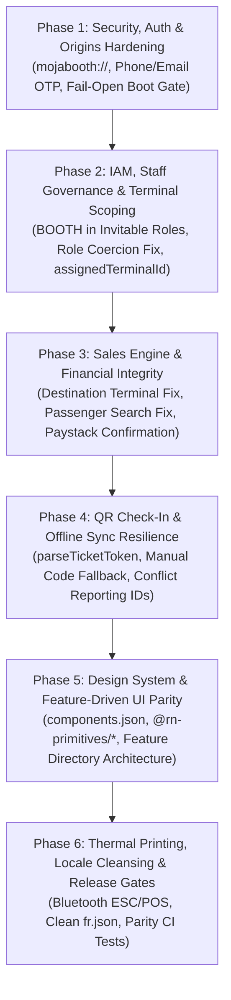

# Booth Ecosystem & Booth App — Master Remediation Plan

> **Plan Status**: Approved  
> **Directory**: `context/plans/booth-ecosystem-remediation/`  
> **Target Subsystems**: `apps/booth-app`, `apps/web`, `packages/db`, `packages/schemas`  
> **Reference Models**: `apps/traveler-app` & `apps/driver-app` (Golden Standard)  

---

## 1. Executive Summary

This blueprint outlines the complete remediation roadmap to transform the currently broken `apps/booth-app` and its backend operator/tRPC counterparts into a secure, robust, offline-capable POS terminal application.

The remediation is structured into **6 sequential, independently verifiable phases**:

---

## 2. Phase Breakdown Matrix

| Phase | Core Target | Primary Files Modified | Deliverable |
| :--- | :--- | :--- | :--- |
| **Phase 1** | Auth & Security | `apps/web/lib/trusted-origins.ts` `apps/booth-app/lib/auth-client.ts` `apps/booth-app/app/(auth)/login.tsx` `apps/booth-app/app/index.tsx` | Working Phone/Email OTP authentication; production origin acceptance; fail-open offline boot gate. |
| **Phase 2** | IAM & Operator ERP | `packages/schemas/src/permissions.ts` `apps/web/features/operator/components/staff/*` `packages/db/prisma/schema.prisma` `apps/web/trpc/routers/staff.ts` | Working staff invitations for `BOOTH` role; removal of role coercion bug; physical terminal scoping. |
| **Phase 3** | Sales & Payments | `apps/booth-app/app/sell/*` `packages/schemas/src/booth.ts` `apps/web/trpc/routers/booth.ts` | Working cash sales with resolved destination terminals; search by phone/email; zero Paystack ghost bookings. |
| **Phase 4** | Gate QR & Sync | `apps/web/trpc/routers/booth.ts` `apps/booth-app/app/(tabs)/checkin.tsx` `apps/booth-app/lib/offline-sync.ts` `apps/booth-app/hooks/use-network-status.ts` | Resilient QR scanner supporting URL/JSON tokens; manual token fallback; bug-free offline sync conflict reporting. |
| **Phase 5** | Design System & UI | `apps/booth-app/components.json` `apps/booth-app/components/ui/*` `apps/booth-app/features/*` `apps/booth-app/app/_layout.tsx` | 32 shadcn primitives ported from `traveler-app`; feature-driven directory modularization. |
| **Phase 6** | Hardware & i18n | `apps/booth-app/package.json` `apps/booth-app/lib/bluetooth-print.ts` `apps/booth-app/locales/*` `apps/booth-app/__tests__/i18n-parity.test.ts` | Bluetooth ESC/POS thermal printing; mojibake-free French translations; automated i18n parity testing. |

---

## 3. Plan Documents Index

- [`phase-01-security-auth-and-origins.md`](./phase-01-security-auth-and-origins.md)
- [`phase-02-iam-staff-and-terminal-scoping.md`](./phase-02-iam-staff-and-terminal-scoping.md)
- [`phase-03-sales-engine-and-financial-integrity.md`](./phase-03-sales-engine-and-financial-integrity.md)
- [`phase-04-qr-checkin-and-offline-sync.md`](./phase-04-qr-checkin-and-offline-sync.md)
- [`phase-05-design-system-and-ui-parity.md`](./phase-05-design-system-and-ui-parity.md)
- [`phase-06-hardware-printing-and-i18n-cleanup.md`](./phase-06-hardware-printing-and-i18n-cleanup.md)
