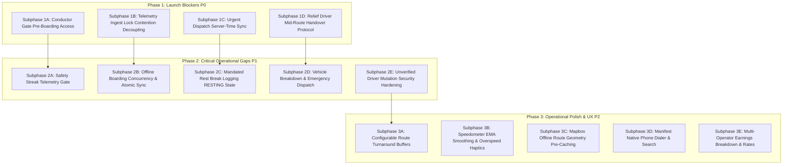

# Driver System Remediation Plan — Master Index

This directory contains the **actionable, phased engineering implementation blueprints** to resolve all findings from the [Driver System Audit](file:///C:/dev/moja-buss/context/audits/driver-system/README.md).

The remediation is organized into **3 primary phases** and **14 focused subphases**. Each subphase is isolated, self-contained, and scoped for high-quality, zero-regression execution.

---

## 1. Remediation Phases Overview

---

## 2. Complete Subphase Index

### [Phase 1: Launch Blockers (`P0`)](./phase-1-launch-blockers/README.md)
* [**`subphase-1a-conductor-preboarding.md`**](./phase-1-launch-blockers/subphase-1a-conductor-preboarding.md): Decouple mobile scanner from trip `DEPARTED` status to allow gate boarding on `SCHEDULED` / `BOARDING` departures.
* [**`subphase-1b-telemetry-lock-decoupling.md`**](./phase-1-launch-blockers/subphase-1b-telemetry-lock-decoupling.md): Eliminate Postgres `FOR UPDATE` row-lock storm in telemetry ingest pipeline.
* [**`subphase-1c-urgent-dispatch-time-sync.md`**](./phase-1-launch-blockers/subphase-1c-urgent-dispatch-time-sync.md): Immunize urgent dispatch modal against mobile device clock drift using server reference time.
* [**`subphase-1d-relief-handover-protocol.md`**](./phase-1-launch-blockers/subphase-1d-relief-handover-protocol.md): Implement mid-route relief driver takeover mutation, token re-minting, and mobile live HUD triggers.

### [Phase 2: Critical Operational Gaps (`P1`)](./phase-2-critical-operational-gaps/README.md)
* [**`subphase-2a-safety-streak-validation.md`**](./phase-2-critical-operational-gaps/subphase-2a-safety-streak-validation.md): Require active GPS fixes on completed trips before awarding clean streak recovery credits.
* [**`subphase-2b-offline-boarding-concurrency.md`**](./phase-2-critical-operational-gaps/subphase-2b-offline-boarding-concurrency.md): Atomic conditional updates on offline batch sync to prevent multi-crew timestamp overwrites.
* [**`subphase-2c-mandated-rest-tracking.md`**](./phase-2-critical-operational-gaps/subphase-2c-mandated-rest-tracking.md): Add `RESTING` state transitions and 30-minute mandatory rest break logging for intercity long-haul runs.
* [**`subphase-2d-emergency-breakdown-protocol.md`**](./phase-2-critical-operational-gaps/subphase-2d-emergency-breakdown-protocol.md): Create vehicle breakdown reporting, high-priority outbox alerts, and roadside assistance tracking.
* [**`subphase-2e-unverified-mutation-guards.md`**](./phase-2-critical-operational-gaps/subphase-2e-unverified-mutation-guards.md): Enforce `canOperateRuns` across all operational tRPC mutations in `driverProcedure`.

### [Phase 3: Operational Polish & UX (`P2`)](./phase-3-operational-polish-and-ux/README.md)
* [**`subphase-3a-custom-turnaround-buffers.md`**](./phase-3-operational-polish-and-ux/subphase-3a-custom-turnaround-buffers.md): Allow operators to configure custom turnaround intervals per route/terminal and adjust highway speed fallbacks.
* [**`subphase-3b-speedometer-smoothing.md`**](./phase-3-operational-polish-and-ux/subphase-3b-speedometer-smoothing.md): Low-pass exponential moving average filter for speedometer gauge and heavy tactile overspeed alerts.
* [**`subphase-3c-mapbox-route-precaching.md`**](./phase-3-operational-polish-and-ux/subphase-3c-mapbox-route-precaching.md): Pre-cache Mapbox route polylines in `AsyncStorage` on departure viewing.
* [**`subphase-3d-manifest-dialer-search.md`**](./phase-3-operational-polish-and-ux/subphase-3d-manifest-dialer-search.md): One-touch native telephone dialer and phone/seat search on mobile manifest.
* [**`subphase-3e-multi-operator-earnings.md`**](./phase-3-operational-polish-and-ux/subphase-3e-multi-operator-earnings.md): Granular multi-carrier earnings breakdown for urban contractors and cleanup of legacy fallback rates.
