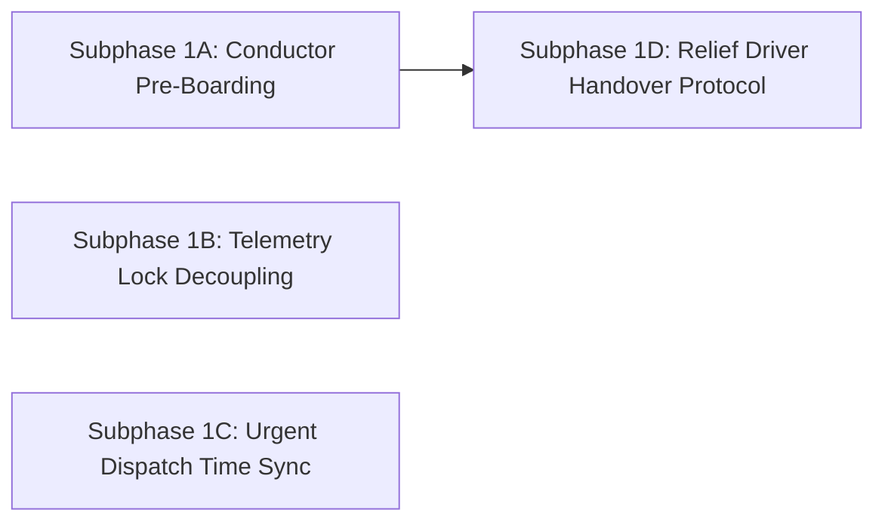

# Phase 1: Launch Blockers (`P0`) — Implementation Overview

## 1. Phase Objective

Phase 1 resolves the **4 Critical Launch Blockers (P0)** identified during the Driver System Audit. These defects cause terminal gate boarding deadlocks, database connection pool exhaustion under scale, urgent dispatch acknowledgment lockouts due to device clock skew, and inoperable relief driver handovers.

---

## 2. Subphase Summary

| Subphase | Title | Addressed Finding | Core Scope & Impact |
| :--- | :--- | :--- | :--- |
| [**Subphase 1A**](./subphase-1a-conductor-preboarding.md) | **Conductor Gate Pre-Boarding Access** | `DRV-P0-01` | Enable camera QR scanner and manifest access on `SCHEDULED` / `BOARDING` departures for assigned conductors & primary drivers. |
| [**Subphase 1B**](./subphase-1b-telemetry-lock-decoupling.md) | **Telemetry Ingest Lock Decoupling** | `DRV-P0-02` | Remove Postgres `FOR UPDATE` row locks from the 5-second telemetry hot path to prevent connection pool exhaustion under 500+ buses. |
| [**Subphase 1C**](./subphase-1c-urgent-dispatch-time-sync.md) | **Urgent Dispatch Server-Time Sync** | `DRV-P0-03` | Immunize the mobile urgent dispatch modal against local Android clock drift by anchoring countdowns to server-provided UTC timestamps. |
| [**Subphase 1D**](./subphase-1d-relief-handover-protocol.md) | **Relief Driver Handover Protocol** | `DRV-P0-04` | Implement `drivers.handoverTripControl` mutation, token re-minting, and mobile UI triggers to enable mid-route relief driver takeover. |

---

## 3. Dependency & Execution Order

* **Subphases 1A, 1B, and 1C** can be executed concurrently without code conflicts.
* **Subphase 1D** builds upon the Live Navigation HUD and trip state models.
