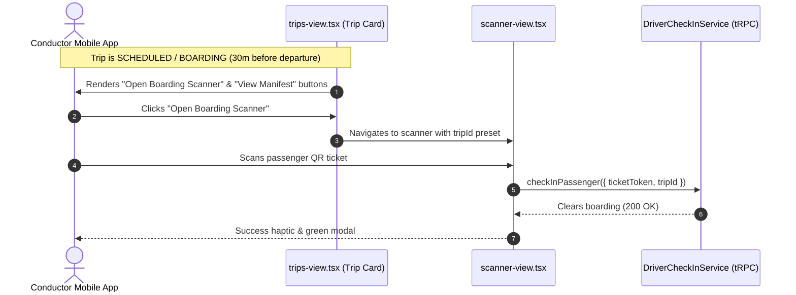

# Subphase 1A: Conductor Gate Pre-Boarding Access

## 1. Problem Statement & Findings Addressed

* **Finding Addressed**: `DRV-P0-01 (Conductor Pre-Trip Boarding Deadlock)`.
* **Current Defect**: While `DriverCheckInService` allows ticket check-in on trips with status `SCHEDULED`, `BOARDING`, `DELAYED`, or `DEPARTED`, the mobile app in `apps/driver-app/features/trips/screens/trips-view.tsx` only renders the scanner launcher and manifest actions when `Trip.status === "DEPARTED"`.
* **Operational Failure**: Conductors cannot board passengers at terminal gates 30 minutes before departure unless the primary driver prematurely starts the trip, corrupting departure time metrics and passenger tracking.

---

## 2. Architecture & Scope of Changes

---

## 3. Implementation Steps & File Checklist

### Step 1: Update Mobile Trips View (`apps/driver-app/features/trips/screens/trips-view.tsx`)
- [ ] Inspect trip card rendering in `renderTripCard`.
- [ ] Identify crew role (`PRIMARY` vs `CONDUCTOR` vs `RELIEF`) from `item.crewRole` or profile affiliations.
- [ ] Render **"Open Boarding Scanner"** button for trips with status `SCHEDULED`, `BOARDING`, or `DELAYED` when user is assigned to the trip.
- [ ] Render **"View Manifest"** button unconditionally for all assigned crew members.

### Step 2: Update Scanner View (`apps/driver-app/features/scanner/screens/scanner-view.tsx`)
- [ ] Accept route param `tripId` to lock scanner to a pre-departure scheduled trip if the driver is not currently `ON_TRIP`.
- [ ] Display active trip header showing route name and terminal (e.g. `"Boarding: Abidjan -> Bouaké (14:30)"`).

### Step 3: Backend Tenancy Revalidation (`apps/web/features/driver/services/driver-check-in-service.ts`)
- [ ] Confirm `assertBoardable` allows check-ins when `booking.trip.status` is `SCHEDULED`, `BOARDING`, `DELAYED`, or `DEPARTED`.
- [ ] Ensure `TripDriverAssignment` lookup verifies caller's assignment regardless of whether `Trip.status === "DEPARTED"`.

---

## 4. Verification & Testing Criteria

* [ ] Log in as a Conductor assigned to a `SCHEDULED` trip departing in 45 minutes.
* [ ] Verify that the trip card displays "Open Boarding Scanner" and "View Manifest".
* [ ] Tap "Open Boarding Scanner" and verify camera activates with pre-departure trip context.
* [ ] Scan a confirmed passenger ticket QR code. Verify check-in succeeds with green modal.
* [ ] Verify passenger `Booking.boardedAt` is set in the database while `Trip.status` remains `SCHEDULED`.
