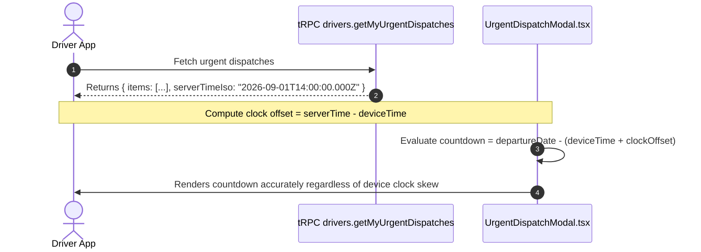

# Subphase 1C: Urgent Dispatch Server-Time Synchronization

## 1. Problem Statement & Findings Addressed

* **Finding Addressed**: `DRV-P0-03 (Clock Skew Lockout on Urgent Dispatch Acknowledgment)`.
* **Current Defect**: `apps/driver-app/features/dispatch/components/urgent-dispatch-modal.tsx#L45-L60` computes departure countdowns using `new Date(departureDate).getTime() - new Date().getTime()`.
* **Operational Failure**: If an Android phone's clock drifts by 15 minutes slow, an urgent departure occurring in 10 minutes evaluates as $-5$ minutes (already departed). The modal unmounts or suppresses the acknowledgment mutation, permanently locking the driver out of the trip view.

---

## 2. Architecture & Scope of Changes

---

## 3. Implementation Steps & File Checklist

### Step 1: Enrich Backend Response (`apps/web/trpc/routers/drivers.ts#L3871-L3977`)
- [ ] In `getMyUrgentDispatches`, include `serverTimeIso: new Date().toISOString()` in the return payload.

### Step 2: Update Mobile Urgent Dispatch Gate (`apps/driver-app/components/urgent-dispatch-gate.tsx`)
- [ ] Capture `serverTimeIso` from the query response.
- [ ] Pass `serverTimeIso` to `UrgentDispatchModal`.

### Step 3: Refactor Countdown Math in Modal (`apps/driver-app/features/dispatch/components/urgent-dispatch-modal.tsx`)
- [ ] Compute clock offset: `const clockOffsetMs = new Date(serverTimeIso).getTime() - Date.now()`.
- [ ] Calculate adjusted time remaining: `const remainingMs = new Date(dispatch.departureDate).getTime() - (Date.now() + clockOffsetMs)`.
- [ ] Guard against premature modal dismissal when remaining time is positive according to server truth.

---

## 4. Verification & Testing Criteria

* [ ] Set Android device clock 20 minutes into the past.
* [ ] Dispatch a driver to a trip departing in 45 minutes.
* [ ] Launch the driver mobile app. Verify the `UrgentDispatchModal` mounts immediately.
* [ ] Verify the countdown displays "Départ dans 45 min" (matching server truth, not the skewed device clock).
* [ ] Tap "Accept". Verify `drivers.acknowledgeUrgentDispatch` succeeds and transitions the driver to the trips view.
