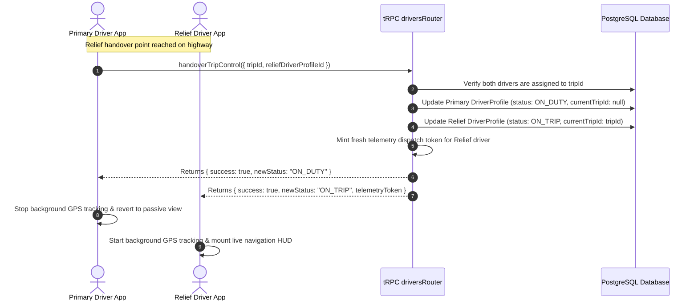

# Subphase 1D: Relief Driver Mid-Route Handover Protocol

## 1. Problem Statement & Findings Addressed

* **Finding Addressed**: `DRV-P0-04 (Missing Physical Relief Driver Handover Protocol)`.
* **Current Defect**: While the database models `TripDriverAssignment.role = "RELIEF"`, no runtime API endpoint or mobile interface exists for a primary driver to transfer active driving control (`currentTripId`) to a relief driver during a long-haul trip.
* **Operational Failure**: When relief drivers take the wheel on 8-hour highway runs, they cannot stream GPS coordinates or record waypoint arrivals from their own mobile phones.

---

## 2. Architecture & Scope of Changes

---

## 3. Implementation Steps & File Checklist

### Step 1: Create Backend Handover Procedure (`apps/web/trpc/routers/drivers.ts`)
- [ ] Define input schema `driverHandoverTripControlSchema = z.object({ tripId: z.string().cuid(), targetDriverProfileId: z.string().cuid() })`.
- [ ] Implement `drivers.handoverTripControl`:
  - Assert caller is currently `ON_TRIP` with `currentTripId === tripId`.
  - Assert `targetDriverProfileId` holds an active assignment on `tripId` as `RELIEF` or `PRIMARY`.
  - Assert target driver is `VERIFIED`.
  - Execute atomic transaction:
    - Set caller `currentTripId = null`, `status = "AVAILABLE"` (or `"ON_DUTY"`).
    - Set target driver `currentTripId = tripId`, `status = "ON_TRIP"`.
  - Mint new HMAC telemetry dispatch token for target driver.
  - Return `{ success: true, telemetryToken }`.

### Step 2: Update Mobile Live HUD (`apps/driver-app/features/live/screens/live-view.tsx`)
- [ ] For assigned relief drivers when trip is `DEPARTED` but active on primary:
  - Render "Take Over Driving Wheel" button.
- [ ] For active primary driver:
  - Render "Handover Control to Relief" button in options sheet.
- [ ] On handover confirmation:
  - Caller stops `stopBackgroundLocationTracking()`.
  - Receiver receives fresh telemetry token, initializes `setTelemetryAuthToken(token)`, and launches `startBackgroundLocationTracking()`.

---

## 4. Verification & Testing Criteria

* [ ] Assign Driver A as `PRIMARY` and Driver B as `RELIEF` on an intercity trip.
* [ ] Driver A starts the trip. Verify Driver A is `ON_TRIP` and streaming GPS.
* [ ] On Driver A's app, tap "Handover Control to Relief (Driver B)".
* [ ] Verify Driver A transitions to `AVAILABLE` / `ON_DUTY` and background GPS stops.
* [ ] On Driver B's app, verify the Live Navigation HUD mounts and starts streaming GPS with Driver B's newly minted telemetry token.
* [ ] Verify operator fleet map seamlessly continues tracking the bus without a disruption.
