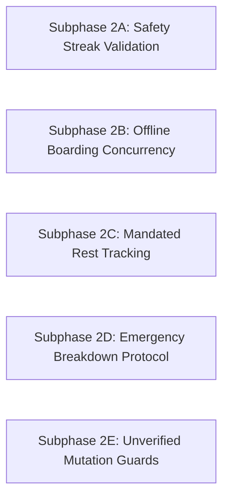

# Phase 2: Critical Operational Gaps (`P1`) — Implementation Overview

## 1. Phase Objective

Phase 2 addresses **5 Critical Operational Gaps (P1)** identified in the audit. These gaps create safety score gaming vulnerabilities, offline boarding timestamp corruption, labor compliance non-conformance for mandatory highway rest breaks, missing roadside emergency breakdown procedures, and unverified driver mutation authorization leaks.

---

## 2. Subphase Summary

| Subphase | Title | Addressed Finding | Core Scope & Impact |
| :--- | :--- | :--- | :--- |
| [**Subphase 2A**](./subphase-2a-safety-streak-validation.md) | **Safety Streak Telemetry Gate** | `DRV-P1-01` | Enforce $>0$ valid GPS fixes on completed trips before awarding clean streak recovery credits in nightly reconciliation. |
| [**Subphase 2B**](./subphase-2b-offline-boarding-concurrency.md) | **Offline Boarding Concurrency & Atomic Sync** | `DRV-P1-02` | Implement atomic conditional updates on offline batch sync flushes to prevent multi-crew timestamp corruption. |
| [**Subphase 2C**](./subphase-2c-mandated-rest-tracking.md) | **Mandated Rest Break Logging & RESTING State** | `DRV-P1-04` | Implement `RESTING` state transitions, 30-minute rest stop logging, and labor compliance tracking for intercity runs. |
| [**Subphase 2D**](./subphase-2d-emergency-breakdown-protocol.md) | **Vehicle Breakdown & Emergency Dispatch** | `DRV-P1-07` | Create emergency breakdown reporting, high-priority outbox alerts, and roadside rescue coordination. |
| [**Subphase 2E**](./subphase-2e-unverified-mutation-guards.md) | **Unverified Driver Mutation Security Hardening** | `DRV-P1-08` | Enforce `canOperateRuns` across all operational tRPC mutations in `driverProcedure` middleware. |

---

## 3. Dependency & Execution Order

All Subphases in Phase 2 are largely orthogonal and can be executed in parallel or sequential batches.
