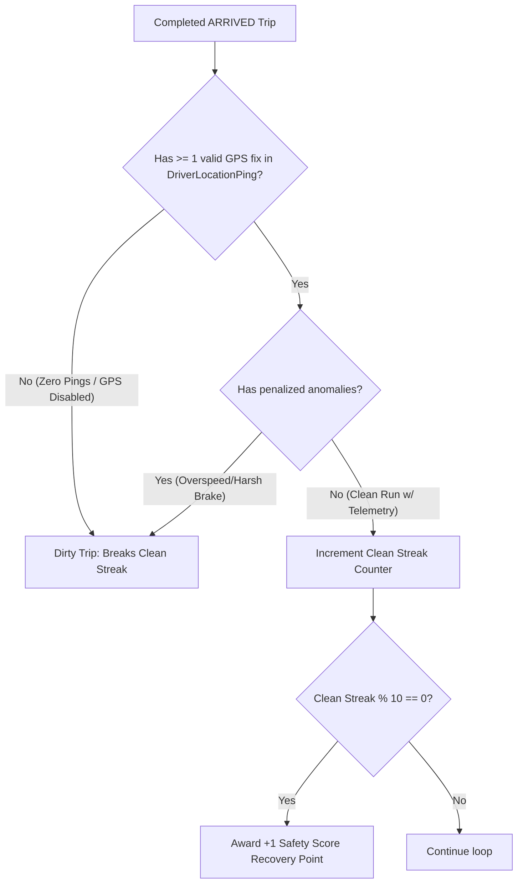

# Subphase 2A: Safety Streak Telemetry Gate & Anti-Gaming

## 1. Problem Statement & Findings Addressed

* **Finding Addressed**: `DRV-P1-01 (Zero-Ping Completed Trips Exploit in Safety Streak Algorithm)`.
* **Current Defect**: The nightly stats reconciliation cron (`/api/cron/reconcile-driver-stats`) counts consecutive completed trips with zero penalized anomalies. However, it fails to verify whether GPS telemetry was actually streaming during those runs.
* **Exploit**: A driver can disable location permissions, complete 10 trips with zero pings (and zero detected anomalies), and farm clean-streak recovery credits (+1 safety score point) artificially.

---

## 2. Architecture & Scope of Changes

---

## 3. Implementation Steps & File Checklist

### Step 1: Update Telemetry Reconcile Library (`apps/web/lib/telemetry-reconcile.ts`)
- [ ] In the clean streak evaluation query, join `DriverLocationPing` count on each completed trip.
- [ ] Assert `pingCount > 0` and `pingCount >= MIN_PINGS_FOR_CLEAN_STREAK` (e.g. at least 5 pings per run).
- [ ] If a completed trip has 0 pings, treat it as non-qualifying (breaks the consecutive clean streak).

### Step 2: Add Unit Tests (`apps/web/lib/__tests__/driver-scoring.test.ts`)
- [ ] Test streak calculation with 10 clean trips with pings $\rightarrow$ awards $+1$ point.
- [ ] Test streak calculation where trip #5 has zero pings $\rightarrow$ streak resets, zero points awarded.

---

## 4. Verification & Testing Criteria

* [ ] Seed 10 completed trips for Driver A with active telemetry fixes and 0 anomalies. Run reconciliation cron. Verify safety score increases by $+1$.
* [ ] Seed 10 completed trips for Driver B with zero telemetry fixes. Run reconciliation cron. Verify safety score does not increase.
