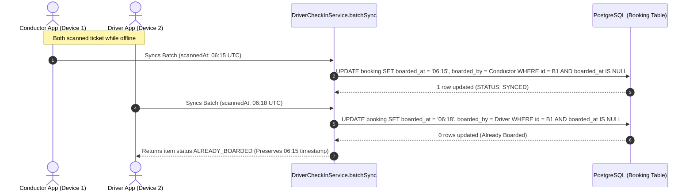

# Subphase 2B: Offline Boarding Concurrency & Atomic Sync

## 1. Problem Statement & Findings Addressed

* **Finding Addressed**: `DRV-P1-02 (Stale Offline Boarding Overwrite on Concurrent Crew Scans)`.
* **Current Defect**: When two crew members scan tickets in an offline bus terminal, both devices record physical scans. When reconnecting, `DriverCheckInService.batchSync` iterates over items and executes `UPDATE booking SET boarded_at = $1 WHERE id = $2` without checking if `boarded_at` is already set.
* **Data Corruption**: The later sync overwrites the earlier physical boarding timestamp, corrupting passenger boarding audit logs.

---

## 2. Architecture & Scope of Changes

---

## 3. Implementation Steps & File Checklist

### Step 1: Update `DriverCheckInService.batchSync` (`apps/web/features/driver/services/driver-check-in-service.ts#L150-L195`)
- [ ] Use atomic conditional updates or query existing `Booking.boardedAt` within a transaction.
- [ ] If `booking.boardedAt` is already set:
  - Do not overwrite `boardedAt`.
  - Mark result as `outcome: "ALREADY_BOARDED"`.
- [ ] If `booking.boardedAt` is null:
  - Update `boardedAt = item.scannedAt` and `checkedInAt = now()`.
  - Mark result as `outcome: "SYNCED"`.

### Step 2: Add Unit Tests (`apps/web/features/driver/services/__tests__/driver-check-in-service.test.ts`)
- [ ] Test batch synchronization with duplicate ticket tokens.
- [ ] Verify earliest physical timestamp is preserved.

---

## 4. Verification & Testing Criteria

* [ ] Create two offline scan payloads for the same booking ID with timestamps `06:10` and `06:20`.
* [ ] Execute `batchSyncCheckIns` for first payload. Verify `Booking.boardedAt` is `06:10`.
* [ ] Execute `batchSyncCheckIns` for second payload. Verify outcome is `ALREADY_BOARDED` and `Booking.boardedAt` remains `06:10`.
