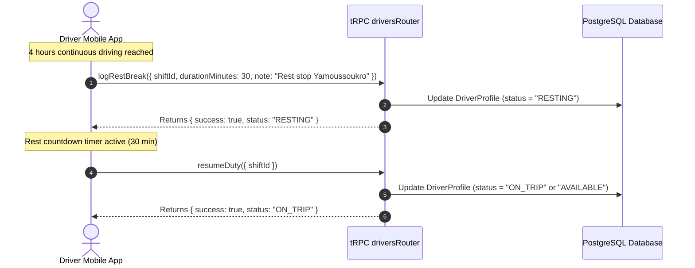

# Subphase 2C: Mandated Rest Break Logging & RESTING State

## 1. Problem Statement & Findings Addressed

* **Finding Addressed**: `DRV-P1-04 (Missing Break / Mandated Rest Tracking on Intercity Runs)`.
* **Current Defect**: `DriverStatus` defines the enum value `RESTING`, but no API endpoint or mobile action exists to log mandatory rest stops during long-haul highway journeys.
* **Compliance Failure**: Transport safety regulations mandate 30 minutes of rest after every 4 hours of continuous commercial coach driving. Operators currently cannot audit rest compliance.

---

## 2. Architecture & Scope of Changes

---

## 3. Implementation Steps & File Checklist

### Step 1: Create Rest Break Mutation (`apps/web/trpc/routers/drivers.ts`)
- [ ] Define input schema `logRestBreakSchema = z.object({ shiftId: z.string().cuid(), durationMinutes: z.number().int().min(5).max(120), note: z.string().optional() })`.
- [ ] Implement `drivers.logRestBreak`:
  - Assert caller holds active open shift.
  - Update `DriverProfile.status = "RESTING"`.
- [ ] Implement `drivers.resumeDuty`:
  - Reset `DriverProfile.status` to `"ON_TRIP"` (if `currentTripId !== null`) or `"AVAILABLE"`.

### Step 2: Update Mobile Live HUD (`apps/driver-app/features/live/screens/live-view.tsx`)
- [ ] Add "Log Rest Break" button in the Live HUD options sheet.
- [ ] Render a 30-minute rest countdown banner when `profile.status === "RESTING"`.
- [ ] Add "Resume Run" button to end the rest break.

---

## 4. Verification & Testing Criteria

* [ ] While on an active trip, tap "Log Rest Break (30 min)".
* [ ] Verify `DriverProfile.status` updates to `RESTING`.
* [ ] Verify the mobile HUD displays the resting timer.
* [ ] Tap "Resume Run". Verify `DriverProfile.status` transitions back to `ON_TRIP`.
