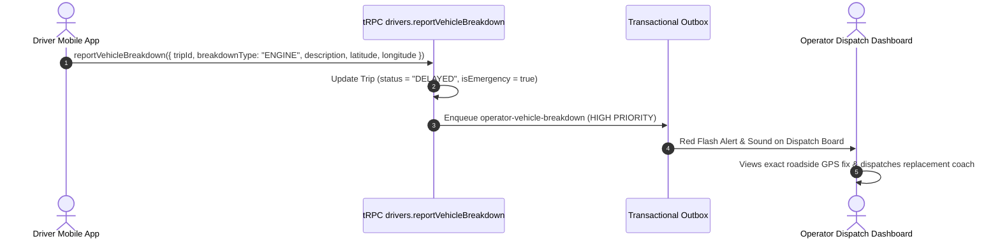

# Subphase 2D: Vehicle Breakdown & Emergency Dispatch Protocol

## 1. Problem Statement & Findings Addressed

* **Finding Addressed**: `DRV-P1-07 (Missing Vehicle Breakdown Emergency Protocol)`.
* **Current Defect**: When a bus suffers a mechanical engine failure on the highway, drivers can only submit a standard delay report.
* **Operational Failure**: Roadside breakdowns are treated as ordinary traffic delays rather than high-severity emergencies requiring rescue bus dispatch and passenger transfer coordination.

---

## 2. Architecture & Scope of Changes

---

## 3. Implementation Steps & File Checklist

### Step 1: Create Breakdown Reporting Endpoint (`apps/web/trpc/routers/drivers.ts`)
- [ ] Define `reportVehicleBreakdownSchema = z.object({ tripId: z.string().cuid(), breakdownType: z.enum(["ENGINE", "TIRE", "ELECTRICAL", "ACCIDENT", "OTHER"]), description: z.string().min(5), latitude: z.number(), longitude: z.number() })`.
- [ ] Implement `drivers.reportVehicleBreakdown`:
  - Mark trip as `DELAYED`.
  - Log `DriverLocationPing` with `isAnomaly = true` and `anomalyReason = "BREAKDOWN"`.
  - Enqueue outbox notification `operator-vehicle-breakdown` via `enqueueOperatorVehicleBreakdown`.

### Step 2: Create Outbox Notification Workflow (`apps/web/features/notifications/outbox/dispatch.ts`)
- [ ] Add `enqueueOperatorVehicleBreakdown` targeting all operator staff members with `trips:update` permission.

### Step 3: Add Breakdown Trigger to Mobile App (`apps/driver-app/features/live/components/delay-modal.tsx`)
- [ ] Add a prominent red "Report Roadside Breakdown" button.
- [ ] Capture device GPS fix and breakdown category.

---

## 4. Verification & Testing Criteria

* [ ] On active run, open Delay modal and select "Report Breakdown (Engine Failure)".
* [ ] Submit breakdown report.
* [ ] Verify outbox message is enqueued with exact GPS coordinates.
* [ ] Verify operator receives immediate emergency notification.
