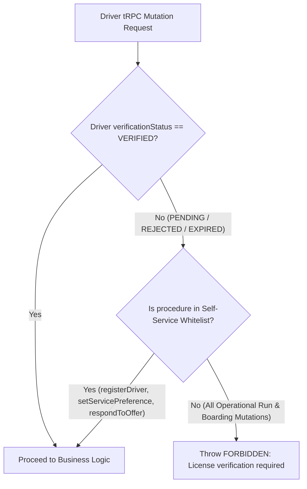

# Subphase 2E: Unverified Driver Mutation Security Hardening

## 1. Problem Statement & Findings Addressed

* **Finding Addressed**: `DRV-P1-08 (Unverified Driver Read Mutation Authorization Bypass)`.
* **Current Defect**: `driverProcedure` in `apps/web/trpc/init.ts#L335-L345` restricts unverified drivers (`PENDING`, `REJECTED`, `EXPIRED`) from invoking `startTrip` and `toggleShift`. However, other operational mutations (such as `reportTripDelay`, `recordStopArrival`, `recordStopDeparture`, `checkInPassenger`, and `manualCheckInPassenger`) are not listed in `NON_VERIFIED_DENIED_MUTATIONS`.
* **Security Risk**: If an unverified driver crafts a tRPC payload with a valid `tripId` or `bookingId`, they can mutate operational trip statuses without compliance verification approval.

---

## 2. Architecture & Scope of Changes



---

## 3. Implementation Steps & File Checklist

### Step 1: Harden `driverProcedure` Middleware (`apps/web/trpc/init.ts#L323-L350`)
- [ ] Refactor the guard to use an explicit **Allowlist for Unverified Drivers**:
  ```typescript
  const UNVERIFIED_ALLOWED_MUTATIONS = new Set([
    "registerDriver",
    "setServicePreference",
    "respondToOffer",
    "markMyOffersSeen",
    "acknowledgeUrgentDispatch",
  ]);
  ```
- [ ] For any mutation not in `UNVERIFIED_ALLOWED_MUTATIONS`, assert `canOperateRuns(ctx.driver.verificationStatus)`.
- [ ] If false, throw `TRPCError({ code: "FORBIDDEN", message: "Compliance verification required to perform operational actions." })`.

### Step 2: Add Security Unit Tests (`apps/web/features/driver/lib/__tests__/driver-doc-access.test.ts`)
- [ ] Test that an unverified driver cannot invoke `checkInPassenger` or `reportTripDelay`.

---

## 4. Verification & Testing Criteria

* [ ] Create a driver account with `verificationStatus = PENDING`.
* [ ] Attempt to call `drivers.checkInPassenger`. Verify server responds with `403 Forbidden`.
* [ ] Attempt to call `drivers.reportTripDelay`. Verify server responds with `403 Forbidden`.
* [ ] Verify the driver CAN still call `drivers.respondToOffer` and `drivers.registerDriver`.
