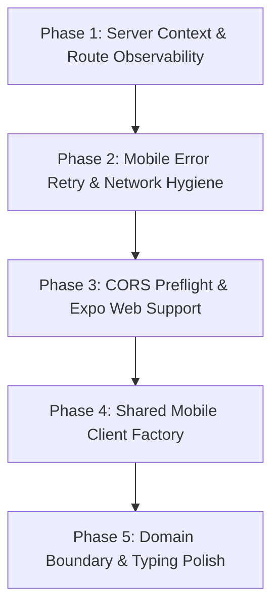

# tRPC Architecture Remediation (Track 2) — Master Plan

> **Authority:** Derived from [`context/audits/trpc-audit/`](file:///C:/dev/moja-buss/context/audits/trpc-audit/README.md)  
> **Benchmark:** Official tRPC v11.19.0 Standards ([`app-references/trpc`](file:///C:/dev/moja-buss/app-references/trpc))  
> **Target Workspaces:** `apps/web`, `apps/traveler-app`, `apps/driver-app`, `apps/booth-app`, `packages/shared`  
> **Directory:** `context/plans/trpc-remediation-v2/`

---

## 1. Executive Mission

Following the completion of the baseline Track 1 remediation (compiler unification to `~6.0.3`, monorepo boundary packaging, and scoped cache filters), this Track 2 remediation program resolves all remaining architectural gaps, mobile cellular bandwidth leaks, server context duplication, and code duplication identified in the comprehensive audit.

Upon completion of this plan:
1. React Server Component rendering will execute session resolution and context instantiation **strictly once per page request** rather than once per procedure call.
2. Route handler unhandled internal exceptions will be observed with procedure path and stack tracing in server logs.
3. Mobile applications will **never retry deterministic 4xx client errors**, eliminating mobile bandwidth waste and latency.
4. Mobile session keepalive will intelligently pause when apps are placed in the background.
5. All three mobile apps will consume a single, robust tRPC client factory from `@moja/shared`, eliminating ~400 lines of duplicated networking glue.
6. Push notification procedures will be decoupled into a dedicated `notificationsRouter`.

---

## 2. Phase Breakdown & Execution Sequence

---

## 3. Dedicated Plan Index

| Document | Phase | Primary Objective | Key Target Files |
| :--- | :---: | :--- | :--- |
| [phase-01-server-context-and-route-observability.md](file:///C:/dev/moja-buss/context/plans/trpc-remediation-v2/phase-01-server-context-and-route-observability.md) | **Phase 1** | Wrap `createServerContext` in React `cache()`, add `onError` logging to `fetchRequestHandler`, harden `getBaseUrl()` with `VERCEL_URL`. | `apps/web/trpc/server.tsx` `apps/web/app/api/trpc/[...trpc]/route.ts` `apps/web/trpc/client.tsx` |
| [phase-02-mobile-error-retry-and-network-hygiene.md](file:///C:/dev/moja-buss/context/plans/trpc-remediation-v2/phase-02-mobile-error-retry-and-network-hygiene.md) | **Phase 2** | Implement smart 4xx error non-retry predicate and `AppState`-aware keepalive pausing across Traveler, Driver, and Booth apps. | `apps/traveler-app/lib/trpc.tsx` `apps/driver-app/lib/trpc.tsx` `apps/booth-app/lib/trpc.tsx` |
| [phase-03-cors-preflight-and-expo-web-support.md](file:///C:/dev/moja-buss/context/plans/trpc-remediation-v2/phase-03-cors-preflight-and-expo-web-support.md) | **Phase 3** | Export `OPTIONS` handler in API route handler to support cross-origin preflight checks and `expo start --web`. | `apps/web/app/api/trpc/[...trpc]/route.ts` |
| [phase-04-shared-mobile-client-factory.md](file:///C:/dev/moja-buss/context/plans/trpc-remediation-v2/phase-04-shared-mobile-client-factory.md) | **Phase 4** | Extract duplicated mobile networking and auth cookie synchronization logic into `packages/shared/src/trpc/create-mobile-trpc.tsx`. | `packages/shared/src/trpc/*` `apps/*/lib/trpc.tsx` |
| [phase-05-domain-boundary-and-typing-polish.md](file:///C:/dev/moja-buss/context/plans/trpc-remediation-v2/phase-05-domain-boundary-and-typing-polish.md) | **Phase 5** | Create `notificationsRouter`, replace residual `any` annotations in `init.ts`, deprecate flat operator settings spread. | `apps/web/trpc/routers/notifications.ts` `apps/web/trpc/routers/public.ts` `apps/web/trpc/routers/_app.ts` `apps/web/trpc/init.ts` `apps/web/trpc/routers/operator.ts` |

---

## 4. Architectural Invariants (Non-Negotiables)

1. **Zero Downtime for Mobile Builds:** Any procedure renaming or router refactoring MUST maintain backwards-compatible alias re-exports so existing mobile app builds in the field continue functioning without interruption.
2. **Strict Compiler Type Safety:** `pnpm turbo typecheck` MUST exit with code 0 across all 12 monorepo packages at every stage of execution.
3. **No Redundant Network Retries on 4xx:** Client-side deterministic permission or parameter errors (`UNAUTHORIZED`, `FORBIDDEN`, `NOT_FOUND`, `BAD_REQUEST`) must fail immediately without secondary attempts.
4. **Clean Monorepo Boundaries:** No runtime JavaScript or Node built-ins from `apps/web` may ever be imported into mobile packages.
