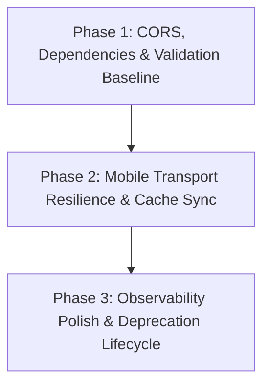

# tRPC Architecture Remediation (Track 3) — Master Blueprint

> **Authority:** Comprehensive tRPC Audit across `apps/web`, `apps/traveler-app`, `apps/driver-app`, `apps/booth-app`, and `packages/shared`  
> **Benchmark:** Official tRPC v11.19.0 Standards ([`app-references/trpc`](file:///C:/dev/moja-buss/app-references/trpc))  
> **Target Directory:** `context/plans/trpc-remediation-v3/`

---

## 1. Executive Summary

This Master Blueprint defines the exhaustive 3-phase implementation plan to eliminate all defects, architectural gaps, and package hygiene issues identified in the tRPC architecture audit.

---

## 2. Phase Breakdown

| Phase | Title | Primary Objectives | Target Files |
| :---: | :--- | :--- | :--- |
| **Phase 1** | **CORS, Monorepo Dependencies & Validation Baseline** | 1. Add `responseMeta` to `fetchRequestHandler` in `route.ts` to return CORS headers on actual `GET`/`POST` requests. 2. Declare missing `peerDependencies` in `packages/shared/package.json`. 3. Align Zod in `apps/booth-app/package.json` to `^4.4.3`. | `apps/web/app/api/trpc/[...trpc]/route.ts` `packages/shared/package.json` `apps/booth-app/package.json` |
| **Phase 2** | **Mobile Transport Resilience & Cache Sync** | 1. Handle HTTP `207 Multi-Status` containing `UNAUTHORIZED` (401) errors in `create-mobile-trpc.tsx`. 2. Guard `AuthSessionKeepAlive` so it only polls when an active session/cookie exists. 3. Migrate all mobile root layouts from deprecated `trpc.public.getNotificationToken` to `trpc.notifications.getNotificationToken`. 4. Add query invalidation on mutation success in `booth-app` cash sales. | `packages/shared/src/trpc/create-mobile-trpc.tsx` `apps/traveler-app/app/_layout.tsx` `apps/driver-app/app/_layout.tsx` `apps/booth-app/app/_layout.tsx` `apps/booth-app/app/sell/payment.tsx` |
| **Phase 3** | **Observability Polish & Deprecation Lifecycle** | 1. Rename misleading `x-trpc-source: "rsc"` to `"ssr"` during client component SSR in `apps/web/trpc/client.tsx`. 2. Audit and document deprecation lifecycle for server router aliases (`routers/public.ts`, `routers/operator.ts`), ensuring zero downtime for existing mobile deployments. | `apps/web/trpc/client.tsx` `apps/web/trpc/routers/public.ts` `apps/web/trpc/routers/operator.ts` `apps/web/context/trpc-router-map.md` |

---

## 3. Invariants & Guardrails

1. **Zero Downtime for Mobile Builds:** Server-side aliases in `public.ts` and `operator.ts` must remain available with `@deprecated` annotations.
2. **Strict Compiler Safety:** `pnpm turbo typecheck` must exit code 0 across all 14 workspaces after every modification.
3. **No Unhandled 4xx Retries:** Client-side deterministic errors (`UNAUTHORIZED`, `FORBIDDEN`, `NOT_FOUND`, `BAD_REQUEST`) must not trigger network retries.
4. **Clean Monorepo Boundaries:** No runtime dependencies from `apps/web` can be imported into mobile apps or shared utility packages.
