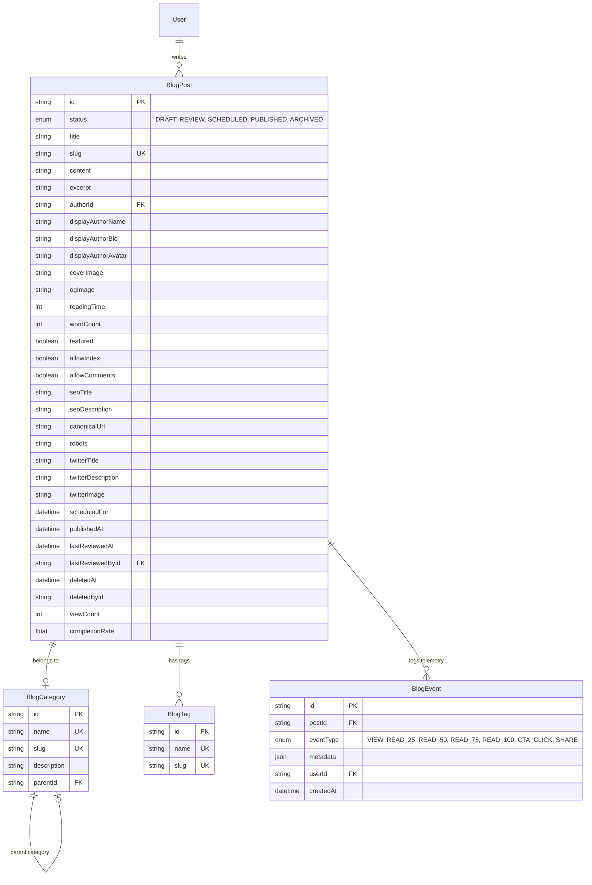

# Moja Ride Blog System Documentation

This document provides a comprehensive technical overview of the Moja Ride Blog System. It covers the system architecture, database schema, library dependencies, backend TRPC APIs, workflows, and optimization mechanisms.

---

## 1. System Architecture & Directory Map

The blog system is divided into two primary zones: **Public Pages** (optimized for SEO, performance, and fast initial server rendering) and the **Admin Portal** (optimized for taxonomy management, workflow editing, and publishing).

### Core Directories

- **Public Routing Layer** (`apps/web/app/blog/`)
  - [layout.tsx](file:///C:/Users/ubaid/OneDrive/Desktop/moja-buss/apps/web/app/blog/layout.tsx): Shared wrapper injecting the `HomeHeader` (with scroll-based transparent-to-solid transitions) and `HomeFooter`.
  - [page.tsx](file:///C:/Users/ubaid/OneDrive/Desktop/moja-buss/apps/web/app/blog/page.tsx): Main blog index page. Handles server-side prefetching of categories, tags, and posts for the active page offset.
  - [[slug]/page.tsx](file:///C:/Users/ubaid/OneDrive/Desktop/moja-buss/apps/web/app/blog/[slug]/page.tsx): Dynamic server-rendered blog detail page. Uses `React.cache()` to share Prisma queries during SSR and renders MDX.

- **Admin Portal Layer** (`apps/web/app/dashboard/admin/blog/`)
  - [page.tsx](file:///C:/Users/ubaid/OneDrive/Desktop/moja-buss/apps/web/app/dashboard/admin/blog/page.tsx): Admin list dashboard. Handles asynchronous `searchParams` parsing and parallel server-side prefetching.
  - [[id]/edit/page.tsx](file:///C:/Users/ubaid/OneDrive/Desktop/moja-buss/apps/web/app/dashboard/admin/blog/[id]/edit/page.tsx): Admin editor page, loading post details and lists for hydrated editing.

- **Feature Implementation Layer** (`apps/web/features/`)
  - `blog/`: Public components (`BlogTelemetry`, `BlogShareButtons`), public views (`BlogIndexView`, `BlogDetailView`), and URL param schemas.
  - `admin/`: Editor components (`MDXEditorWrapper`), taxomomy lists (`AdminCategoriesView`, `AdminTagsView`), and edit forms (`BlogEditView`).

- **TRPC API Layer** (`apps/web/trpc/routers/`)
  - [blog.ts](file:///C:/Users/ubaid/OneDrive/Desktop/moja-buss/apps/web/trpc/routers/blog.ts): Public API router.
  - [admin.ts](file:///C:/Users/ubaid/OneDrive/Desktop/moja-buss/apps/web/trpc/routers/admin.ts): Protected editorial and taxonomy manager mutations.

---

## 2. Database Models & Schema

The blog schema resides in `packages/db/prisma/schema.prisma` and consists of four main tables:



---

## 3. Libraries & Technologies Used

1. **`next-mdx-remote/rsc`**: Used in dynamic public routes to parse markdown contents into React elements at runtime entirely on the server. Injects custom components (e.g. `BookingCTA` for interactive ticket flows) directly inside blog posts.
2. **`nuqs` (Next.js URL Query State)**: Synchronizes browser query strings (`?q=`, `?page=`, `?status=`) with React state.
   - Awaits Next.js 15 `Promise<SearchParams>` objects inside Server Components using `createSearchParamsCache`.
   - Utilizes custom mapped page parsers to normalize page inputs (bounds check `page >= 1`).
   - Complies with `noPropertyAccessFromIndexSignature` rules via bracket-notation indexing (`params["page"]`).
3. **`@tanstack/react-query` (v5)**: Drives frontend state management. Admin tables utilize `useQuery` paired with `placeholderData: keepPreviousData` to preserve list render records during background debounced fetches, preventing focus/cursor loss.
4. **`date-fns`**: Drives date conversions and administrative workflow calendar representations.
5. **`sonner`**: Handles async operational toasts (e.g. clipboard confirmations, mutation alerts).

---

## 4. Key Workflows & Implementation Details

### A. Post Creation & Publishing Workflow
1. **Creation**: An administrator submits a title in `NewBlogPostDialog`. This calls `createBlogPostDraft` which uses a diacritics-safe `slugify` helper to build a unique URL path (e.g., `5-tips-for-travel-x7y8z2` by appending a random 6-character suffix).
2. **Form Validation**:
   - If the status is toggled to `SCHEDULED`, the form schema requires a valid `scheduledFor` datetime (checked via Zod `.refine()`).
3. **Saving vs Publishing**:
   - The form uses separate `onSubmit` and `onPublish` wrappers. 
   - When the user clicks **Publish**, the mutation runs with a status override of `PUBLISHED`. The form status field updates *only after* the mutation succeeds, avoiding inconsistent state if validation fails.

### B. Category Tree & Acyclic Cycle Checks
When editing or creating categories, administrators can set a `parentId` to build nested hierarchies. To prevent circular reference hierarchies (which cause downstream Breadcrumb or tree renders to crash with infinite loops/stack overflows), a cycle guard is implemented inside `updateBlogCategory`:

```typescript
// Traverse parents upward to check for cycles
let currentParentId: string | null = targetParentId;
while (currentParentId) {
  const parentCat: { parentId: string | null } | null = await ctx.prisma.blogCategory.findUnique({
    where: { id: currentParentId },
    select: { parentId: true },
  });
  if (parentCat?.parentId === id) {
    throw new TRPCError({
      code: "BAD_REQUEST",
      message: "Circular dependency detected: a category cannot be parented to its own descendant.",
    });
  }
  currentParentId = parentCat?.parentId || null;
}
```

### C. Security & Output Sanitization
Public API procedures (`getPublishedPosts`, `getPostBySlug`) use standard Prisma `include` blocks to query related authors and tags. To prevent leakage of internal-only moderation and analytics columns (`lastReviewedById`, `deletedById`, `robots`, `viewCount`, `completionRate`), the returned records are stripped via ES6 destructuring before serializing:

```typescript
const {
  lastReviewedById,
  deletedById,
  robots,
  viewCount,
  completionRate,
  ...publicPost
} = post;
return publicPost;
```

### D. Telemetry & View Tracking
- **Client Deduplication**: The `BlogTelemetry` component uses a `sessionStorage` guard keyed by `blog-viewed-${postId}` to ensure that multiple effect mounts (e.g. React 19 Strict Mode double effects, page refreshes, and back/forward navigations) trigger the view log API at most once per session.
- **Server Verification**: The `trackEvent` TRPC procedure validates that the `postId` corresponds to a valid, undeleted, `PUBLISHED` post before executing writes. Both the event creation and the post's total view count increment are fully awaited.

### E. Cron Publishing Engine
The system exposes a secure API endpoint at `/api/cron/publish-blogs` triggered by Vercel Cron:
1. **Authorization**: Validates that the request contains the `authorization: Bearer ${CRON_SECRET}` header. If `CRON_SECRET` is missing from the environment, the route returns `401 Unauthorized` instead of silently bypassing.
2. **Atomic Publish**: Finds all posts with `status: "SCHEDULED"` whose `scheduledFor` date has passed, and updates them to `PUBLISHED` while checking `status: "SCHEDULED"` in the update condition to prevent race conditions.
3. **On-Demand Revalidation**: Loops through the list of published posts and triggers Next.js path revalidations for both the main index `/blog` and the specific post paths `/blog/${post.slug}`.

---

## 5. Performance Optimizations

- **React Caching**: Wraps the Server Component post lookups in `React.cache()` to share a single DB fetch promise across metadata generation and page rendering, cutting page database queries in half.
- **SSR Hydration Sync**: Computes limit/page offsets on the server and prefetches queries under matching keys so that pages hydrate instantly without layout shifts.
- **Debounced Admin Queries**: Input fields delay state updates by 300ms, preventing the TanStack Query hook from re-fetching or re-suspending on every keystroke.
