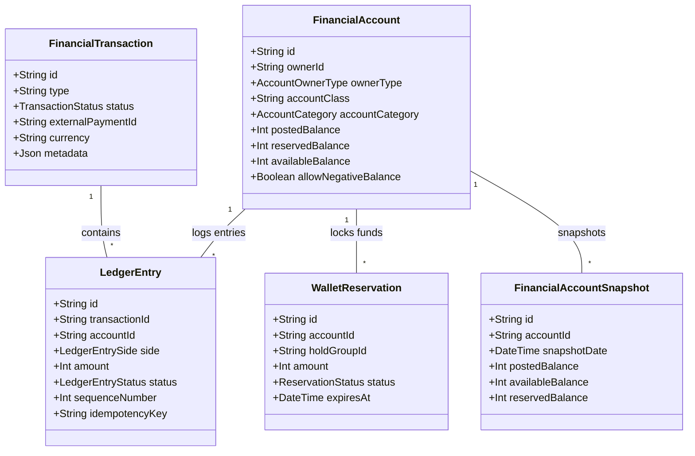
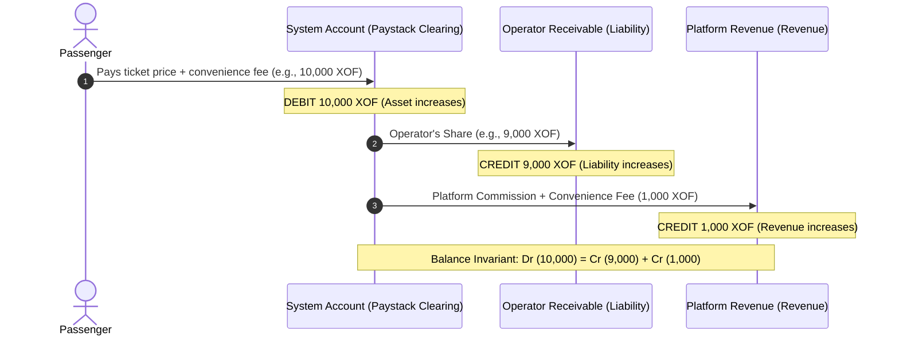
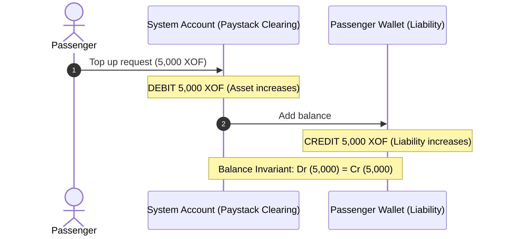
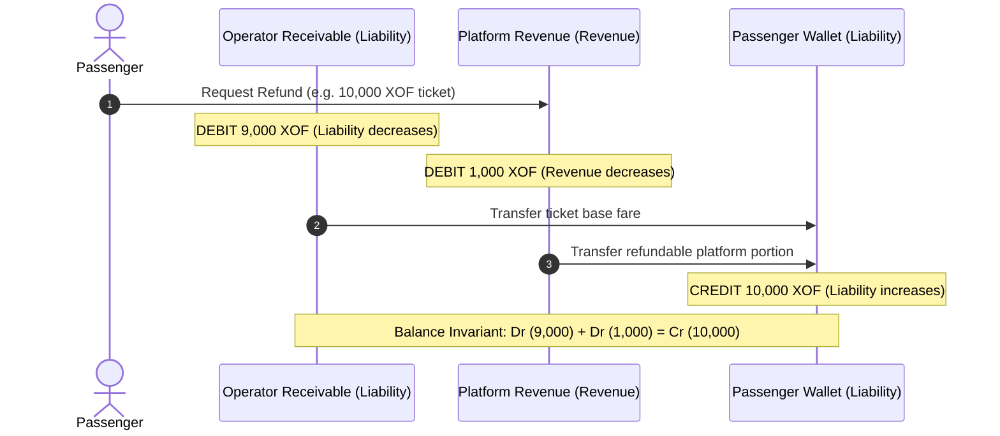
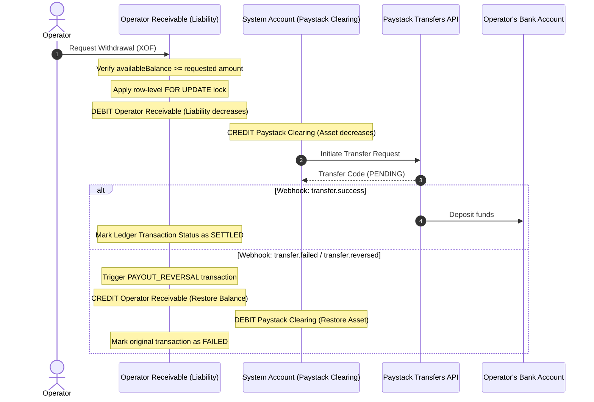

# Moja Ride: Complete Financial & Payment System Guide (Ledger-Driven Architecture)

This document serves as the comprehensive, end-to-end technical reference for Moja Ride's payment and financial ledger architecture. Following the migration from automated Paystack split accounts (Subaccounts) to a central Moja Treasury, the platform operates as a secure double-entry financial clearinghouse.

---

## 1. Architectural Overview & Core Philosophy

The Moja Ride platform uses a **Double-Entry Ledger System** to manage all cash, wallet, and ticket transaction movements. Rather than relying on simple state-based columns (e.g., updating a single `walletBalance` integer), every transaction is a balanced ledger journal containing equal debits and credits.

### Key Financial Principles
1. **The Double-Entry Invariant**: Every financial event represents a transfer of value. Money is never created or destroyed; it only moves between accounts. For every transaction, the sum of debits must exactly equal the sum of credits ($\sum \text{Debits} = \sum \text{Credits}$).
2. **Immutable Transaction History**: Ledger entries are strictly append-only. If a transaction needs to be corrected or refunded, the original entries remain untouched, and a compensating reversing transaction is committed.
3. **Treasury Consolidation**: All external payments (from direct checkouts and wallet top-ups) flow directly into Moja's central Paystack account. Operators are registered as **Paystack Transfer Recipients** rather than Subaccounts. This separates the instant checkout authorization flow from the operator settlement payout flow.
4. **Internal Escrow (Posted vs. Available Balance)**: Operator earnings from ticket sales are placed in a pending "posted" state. They clear into the "available" balance (ready for withdrawal) exactly 24 hours after successful trip completion (`clearedAt`).
5. **Strict Mutability Guardrails**: The `AccountingEngine` is the exclusive writer of financial records. Direct database queries that increment or decrement balance columns are strictly prohibited to prevent data corruption and race conditions.

---

## 2. Core Data Models & Schema

The ledger architecture is defined in `packages/db/prisma/schema.prisma` and is structured around five central models:

### Table Definitions

#### 1. `FinancialAccount`
Represents an individual pool of funds owned by a Passenger, Operator (Company), the Platform, or the Clearing System.
*   `postedBalance`: The absolute ledger balance representing all confirmed transactions.
*   `reservedBalance`: Funds currently locked in active checkouts or seat holds.
*   `availableBalance`: Ready-to-use funds. Mathematically derived as `postedBalance - reservedBalance`.
*   `accountCategory`: `ASSET` | `LIABILITY` | `EQUITY` | `REVENUE` | `EXPENSE`.
*   `accountClass`: String-based categorization (e.g. `"PASSENGER_WALLET"`, `"OPERATOR_RECEIVABLE"`, `"PAYSTACK_CLEARING"`, `"PLATFORM_FEES"`).

#### 2. `FinancialTransaction`
The parent record representing an atomic business event (e.g., `"BOOKING"`, `"TOP_UP"`, `"REFUND"`, `"OPERATOR_PAYOUT"`).
*   `status`: `CREATED` | `PENDING` | `POSTED` | `SETTLED` | `REVERSED` | `FAILED`.

#### 3. `LedgerEntry`
Individual debits or credits mapped to a specific transaction and account.
*   `side`: `DEBIT` | `CREDIT`.
*   `sequenceNumber`: Auto-incremented within the transaction to enforce ordering.
*   `idempotencyKey`: Unique hash preventing duplicate entry insertion.

#### 4. `WalletReservation`
The temporary holding mechanism for escrowed checkout sessions.
*   Deducts from the account's `availableBalance` (by increasing `reservedBalance`) without changing `postedBalance`.
*   Automatically cancelled or consumed by background workers upon booking completion/expiration.

#### 5. `PlatformSettings`
Stores global platform configuration parameters, now containing:
*   `minWithdrawalAmount`: Minimum XOF allowed per manual withdrawal.
*   `withdrawalFrequencyHours`: Rate limit on operator payout requests.

---

## 3. Account Taxonomy & Entry Rules

We use standard double-entry bookkeeping rules. Debits and Credits behave differently depending on the account's category:

| Account Category | Debit ($\text{Dr}$) Impact | Credit ($\text{Cr}$) Impact | Moja Account Class Example |
| :--- | :--- | :--- | :--- |
| **ASSET** | Increases Balance | Decreases Balance | `"PAYSTACK_CLEARING"` (Incoming funds) |
| **LIABILITY** | Decreases Balance | Increases Balance | `"PASSENGER_WALLET"`, `"OPERATOR_RECEIVABLE"` |
| **REVENUE** | Decreases Balance | Increases Balance | `"PLATFORM_FEES"` (Moja's commission) |
| **EXPENSE** | Increases Balance | Decreases Balance | Payout Transfer Fees |

*Note: From the platform's perspective, passenger wallets and operator receivables are liabilities (we owe them that money).*

---

## 4. Bounded Workflows & Lifecycles

This section details how money moves between actors and system accounts for various scenarios.

### 4.1 Passenger Direct Checkout (Paystack Card/MoMo)
Passenger books a ticket directly using their credit card or Mobile Money. The entire payment lands in Moja's central Paystack account.

#### Financial Flow
1. Passenger completes payment: Money is placed in the System Clearing account.
2. The transaction is instantly recorded in the ledger, splitting the gross value between Operator Receivables and Platform Revenue.

### 4.2 Passenger Wallet Top-Up
Passenger deposits funds into their Moja wallet via Paystack.

### 4.3 Ticket Cancellation & Wallet Refund
Passenger cancels their booking, and the refund is credited back to their internal Passenger Wallet. Platform fees are non-refundable.

### 4.4 Operator Self-Serve Withdrawal
Operators request their cleared `availableBalance` to be paid out to their verified default bank account.

---

## 5. Actors Breakdown & Capabilities

### 5.1 Passengers
*   **Balance & Wallet**: Passengers hold a `PASSENGER_WALLET` liability account. They can check available and pending (escrowed) balances.
*   **Holds & Reservations**: When booking seats, a `WalletReservation` locks passenger funds in a `reserved` state for 10 minutes. If checkout fails, a cron job cancels the reservation and restores the funds to their `available` balance.

### 5.2 Operators (Bus Companies)
*   **Receivable Ledger**: Each operator owns an `OPERATOR_RECEIVABLE` liability account.
*   **Escrow Clearing**: Ticket revenues are locked in the `postedBalance` of this account. Exactly 24 hours after the trip completes, a service clears these bookings, moving them into the operator's `availableBalance`.
*   **Self-Serve Withdrawals**: Operators request payouts directly through the dashboard. The system validates the withdrawal limits (minimum amount, daily frequency) and routes the request to the Paystack Payout API.

### 5.3 Admins (Moja Platform)
*   **Treasury Overview**: Admins monitor the master `PAYSTACK_CLEARING` account to ensure funds collected from card payments match expected bank settlements.
*   **Commission Tiers**: Admins configure commission rules based on distance tiers via `CommissionDistanceTier`.
*   **System Controls**: In case of emergency or offline bank payouts, admins can trigger manual ledger settlements, debiting operator accounts and crediting system assets to reconcile balances.

---

## 6. Financial Workflows & Verification

### 6.1 Transaction Safety (ACID)
The system uses Prisma's `$transaction` interface to execute all financial updates. Inside the transaction:
1.  **Row Locking**: Accounts are loaded using raw query `SELECT id, "postedBalance", "allowNegativeBalance" FROM "financial_account" WHERE id = $1 FOR UPDATE`.
2.  **Deadlock Prevention**: The `AccountingEngine` sorts account IDs alphabetically before applying locks. This guarantees that multiple concurrent requests updating the same accounts lock them in the exact same sequence.
3.  **Balance Integrity Check**: If the resulting balance of a locked account falls below zero and `allowNegativeBalance` is false, the transaction rolls back.

### 6.2 Idempotency
Webhooks and checkouts utilize unique idempotency keys:
*   Checkout payments generate unique reference patterns: `ref_[holdGroupId]_[attemptNumber]`.
*   Webhook event logs enforce a unique constraint on `idempotencyKey` formatted as `${payload.event}:${reference}:${payload.data.id}`.

---

## 7. Current System Implementation Status

### 7.1 Backend (100% Complete)
*   **Prisma Schema**: The double-entry ledger tables (`FinancialAccount`, `FinancialTransaction`, `LedgerEntry`, `WalletReservation`) are implemented and active in PostgreSQL.
*   **Accounting Engine**: The `AccountingEngine` is implemented and verified. All booking checkouts, wallet top-ups, cancellations, and payouts write exclusively through the engine.
*   **Settlement Integration**: Paystack Transfer APIs are wired to register operators as Transfer Recipients and automatically execute manual self-serve withdrawals.
*   **Payout Webhooks**: Webhook API routes verify signatures and process success, failure, and reversal events to update the ledger.
*   **Cron Jobs**: Operational crons for snapshotting balances and releasing expired reservations are running.
*   **Type Safety**: The entire backend compiles with zero TypeScript errors.

### 7.2 UI/Frontend (Partially Complete)
> [!IMPORTANT]
> The financial architecture's core business logic is fully functional and complete, but the user interface has only been partially implemented:

*   **Operator Dashboard (Complete)**:
    *   The self-serve withdrawal view (`/dashboard/operator/withdraw` & `OperatorWithdrawView`) is complete. It allows operators to check their available vs. pending balances and initiate bank payouts.
    *   The Bank Account settings view was refactored to sync and display the `paystackTransferRecipientCode`.
    *   The sidebar menu includes the new "Withdrawals" item.
*   **Admin Dashboard (Pending/Not Started)**:
    *   There is no admin UI panel to view Moja's central Paystack balance or audit system-wide treasury clearings.
    *   There is no interface for admins to trigger manual offline settlements or reconcile payment failures manually.
*   **Passenger Dashboard (Pending/Not Started)**:
    *   Passengers do not have a wallet interface showing their historical ledger transactions, top-up receipts, or reservation statuses.
